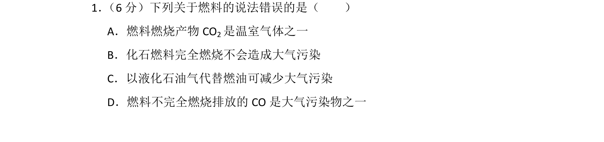
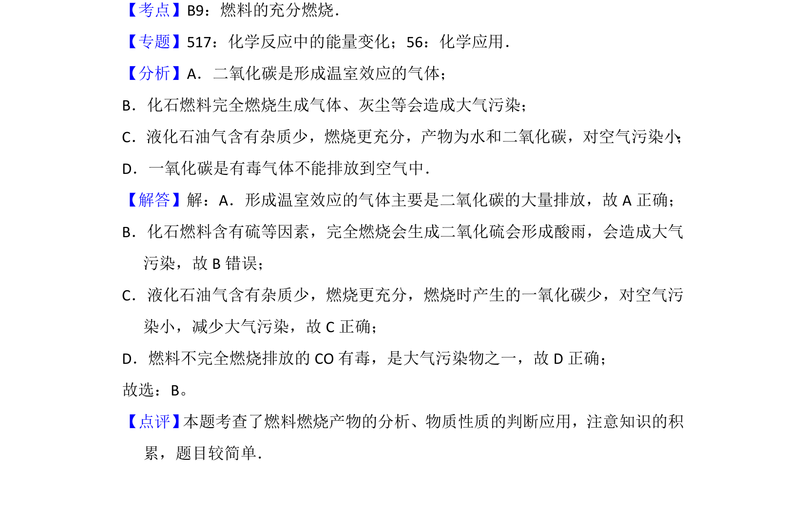

## 题面

## 摘要

燃料燃烧产物及对环境影响的判断

## 关联考点

- [[554-燃料燃烧|燃料燃烧]]
- [[071-大气污染|大气污染]]
- [[760-温室气体|温室气体]]

## 答案与解析

> 📄 原 PDF 第 1 页：`素材/真题/吉林/2008-2024·（吉林）化学高考真题/2016年高考化学试卷（新课标Ⅱ）（解析卷）.pdf`

<!-- 题干文本-start -->
## 题干文本
1． （6分）下列关于燃料的说法错误的是（　　）
A．燃料燃烧产物CO 2是温室气体之一
B．化石燃料完全燃烧不会造成大气污染
C．以液化石油气代替燃油可减少大气污染
D．燃料不完全燃烧排放的CO是大气污染物之一
<!-- 题干文本-end -->

<!-- 解析文本-start -->
## 解析文本
【考点】B9：燃料的充分燃烧．菁优网版权所有
【专题】517：化学反应中的能量变化；56：化学应用．
【分析】A．二氧化碳是形成温室效应的气体；
B．化石燃料完全燃烧生成气体、灰尘等会造成大气污染；
C．液化石油气含有杂质少，燃烧更充分，产物为水和二氧化碳，对空气污染小 ；
D．一氧化碳是有毒气体不能排放到空气中．
【解答】解：A．形成温室效应的气体主要是二氧化碳的大量排放，故A正确；
B．化石燃料含有硫等因素，完全燃烧会生成二氧化硫会形成酸雨，会造成大气
污染，故B错误；
C．液化石油气含有杂质少，燃烧更充分，燃烧时产生的一氧化碳少，对空气污
染小，减少大气污染，故C正确；
D．燃料不完全燃烧排放的CO有毒，是大气污染物之一，故D正确；
故选：B。
【点评】 本题考查了燃料燃烧产物的分析、物质性质的判断应用，注意知识的积
累，题目较简单．
<!-- 解析文本-end -->
