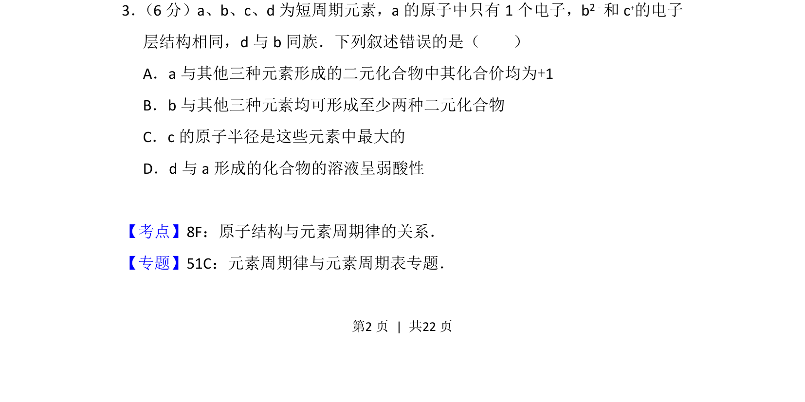
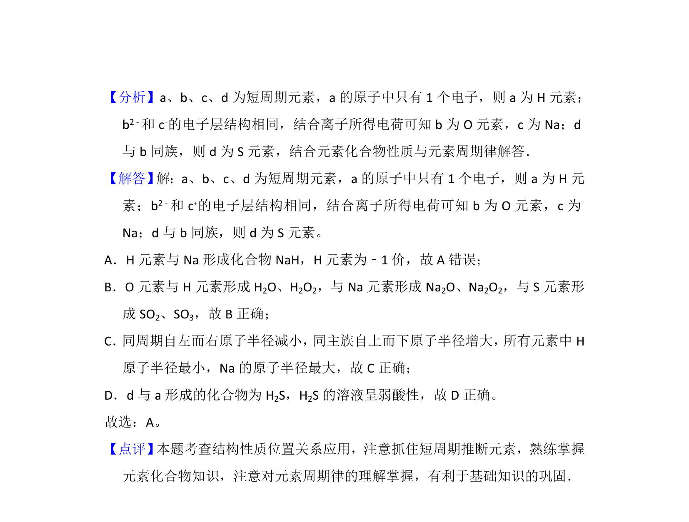

## 题面

## 摘要

该题考查短周期元素推断及元素周期律的应用，要求判断原子结构与化合物性质叙述的正误。

## 关联考点

- [[597-元素推断|元素推断]]
- [[426-原子结构|原子结构]]
- [[028-化合价|化合价]]
- [[588-二元化合物|二元化合物]]
- [[634-原子半径|原子半径]]

## 答案与解析

> 📄 原 PDF 第 2 页：`素材/真题/吉林/2008-2024·（吉林）化学高考真题/2016年高考化学试卷（新课标Ⅱ）（解析卷）.pdf`
