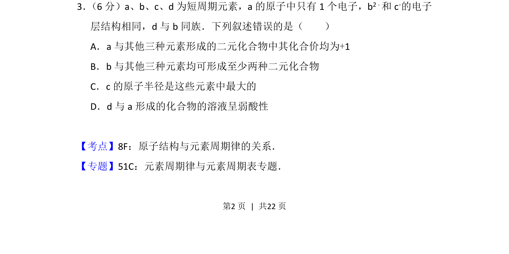
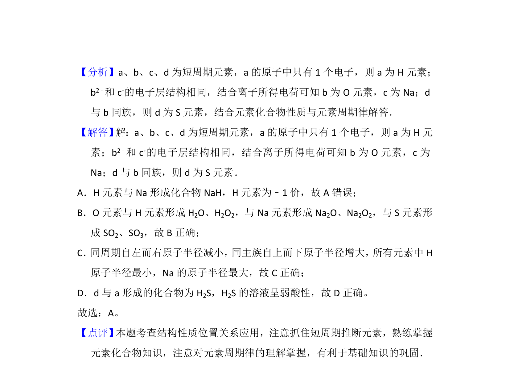

## 题面

## 摘要

该题考查短周期元素推断及元素周期律的应用，要求判断原子结构与化合物性质叙述的正误。

## 关联考点

- [[597-元素推断|元素推断]]
- [[426-原子结构|原子结构]]
- [[028-化合价|化合价]]
- [[588-二元化合物|二元化合物]]
- [[634-原子半径|原子半径]]

## 答案与解析

> 📄 原 PDF 第 2 页：`素材/真题/吉林/2008-2024·（吉林）化学高考真题/2016年高考化学试卷（新课标Ⅱ）（解析卷）.pdf`

<!-- 题干文本-start -->
## 题干文本
3． （6分）a、b、c、d为短周期元素，a的原子中只有1个电子，b2﹣和c +的电子
层结构相同，d与b同族．下列叙述错误的是（　　）
A．a与其他三种元素形成的二元化合物中其化合价均为+1
B．b与其他三种元素均可形成至少两种二元化合物
C．c的原子半径是这些元素中最大的
D．d与a形成的化合物的溶液呈弱酸性
<!-- 题干文本-end -->

<!-- 解析文本-start -->
## 解析文本
【考点】8F：原子结构与元素周期律的关系．菁优网版权所有
【专题】51C：元素周期律与元素周期表专题．
<!-- 解析文本-end -->
