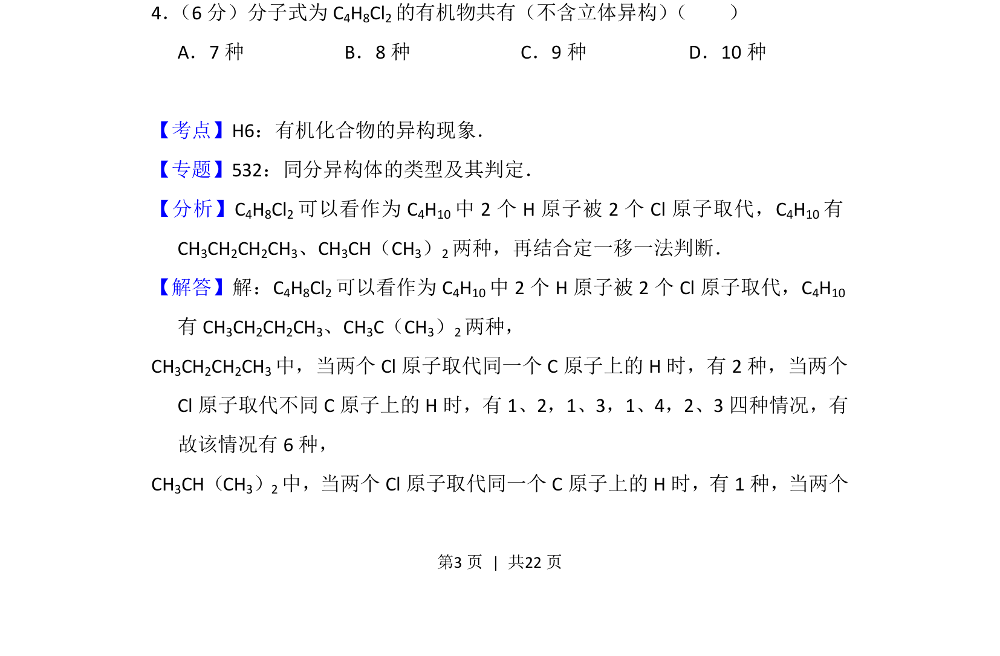
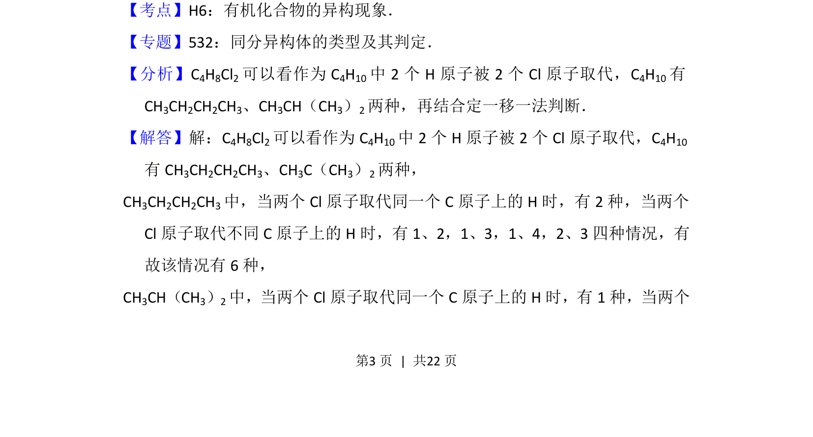
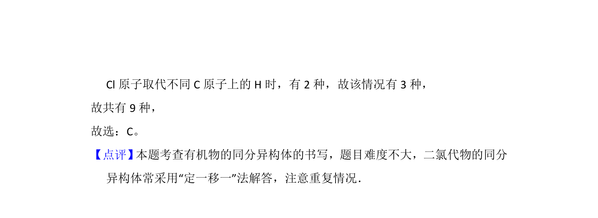

## 题面

## 摘要

考查有机物同分异构体数目判断，运用定一移一法。

## 关联考点

- [[705-有机化合物的异构现象|有机化合物的异构现象]]
- [[446-同分异构体|同分异构体]]
- [[665-定一移一法|定一移一法]]

## 答案与解析

> 📄 原 PDF 第 3 页：`素材/真题/吉林/2008-2024·（吉林）化学高考真题/2016年高考化学试卷（新课标Ⅱ）（解析卷）.pdf`

<!-- 题干文本-start -->
## 题干文本
4． （6分）分子式为C4H8Cl2的有机物共有（不含立体异构） （　　）
A．7种B．8种C．9种D．10种
<!-- 题干文本-end -->

<!-- 解析文本-start -->
## 解析文本
【考点】H6：有机化合物的异构现象．菁优网版权所有
【专题】532：同分异构体的类型及其判定．
【分析】C 4H8Cl2可以看作为C 4H10中2个H原子被2个Cl原子取代，C 4H10有
CH3CH2CH2CH3、CH3CH（CH3）2两种，再结合定一移一法判断．
【解答】解：C4H8Cl2可以看作为C 4H10中2个H原子被2个Cl原子取代，C 4H10
有CH 3CH2CH2CH3、CH3C（CH3）2两种，
CH3CH2CH2CH3中，当两个Cl原子取代同一个C原子上的H时，有2种，当两个
Cl原子取代不同C原子上的H时，有1、2，1、3，1、4，2、3四种情况，有
故该情况有6种，
CH3CH（CH3）2中，当两个Cl原子取代同一个C原子上的H时，有1种，当两个
<!-- 解析文本-end -->
