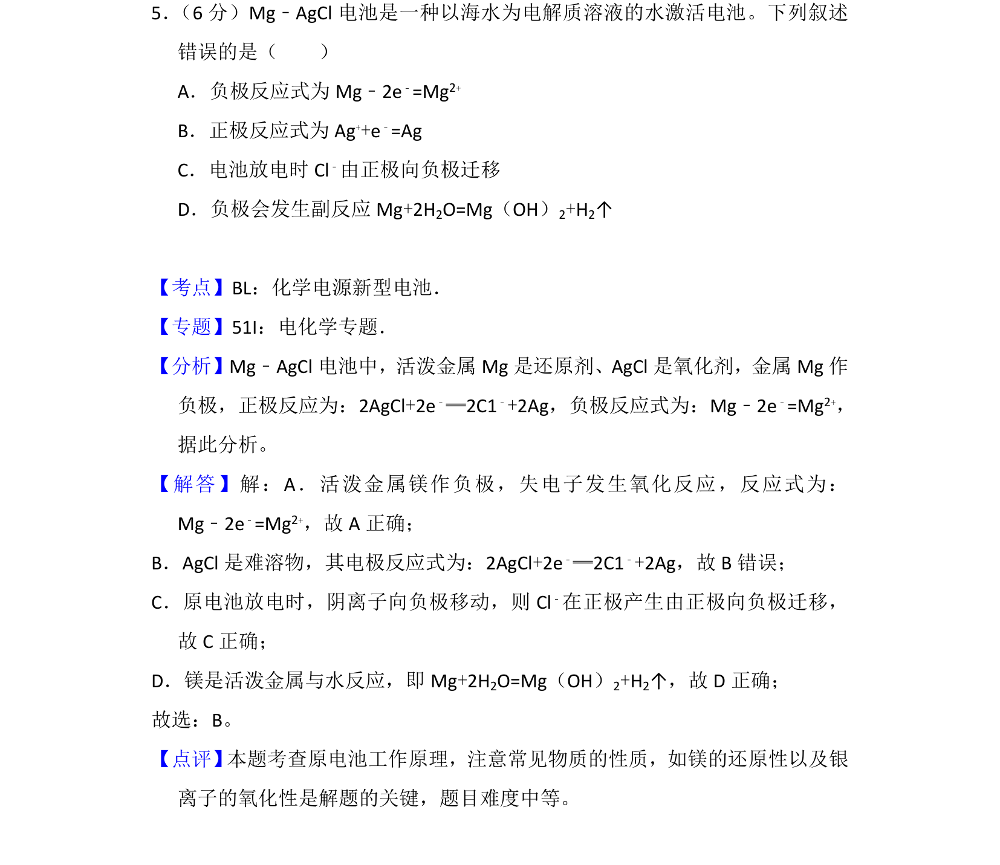
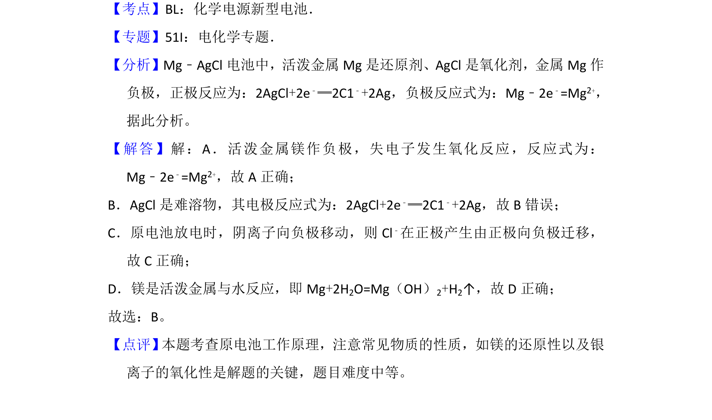

## 题面

## 摘要

该题考查 Mg-AgCl 海水电池的原电池原理，涉及电极反应式书写、离子迁移方向判断及副反应分析。

## 关联考点

- [[642-原电池工作原理|原电池工作原理]]
- [[794-电极反应式|电极反应式]]
- [[864-阴离子迁移|阴离子迁移]]
- [[858-金属腐蚀|金属腐蚀]]

## 答案与解析

> 📄 原 PDF 第 4 页：`素材/真题/吉林/2008-2024·（吉林）化学高考真题/2016年高考化学试卷（新课标Ⅱ）（解析卷）.pdf`
