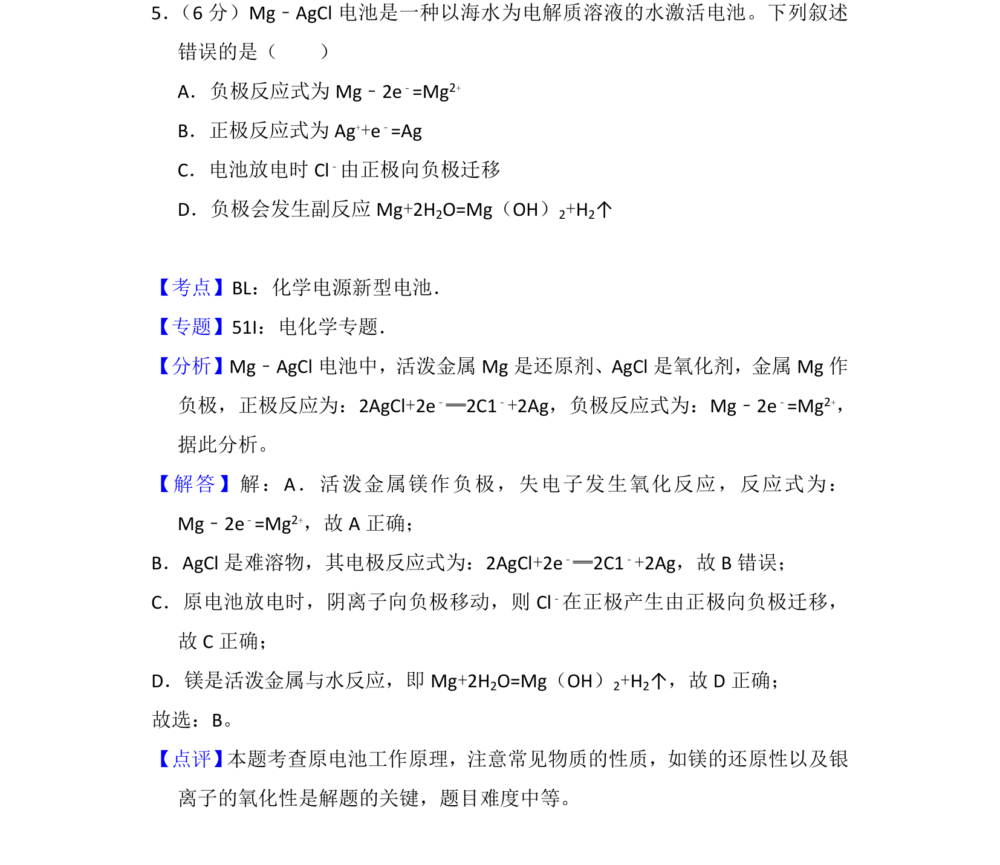
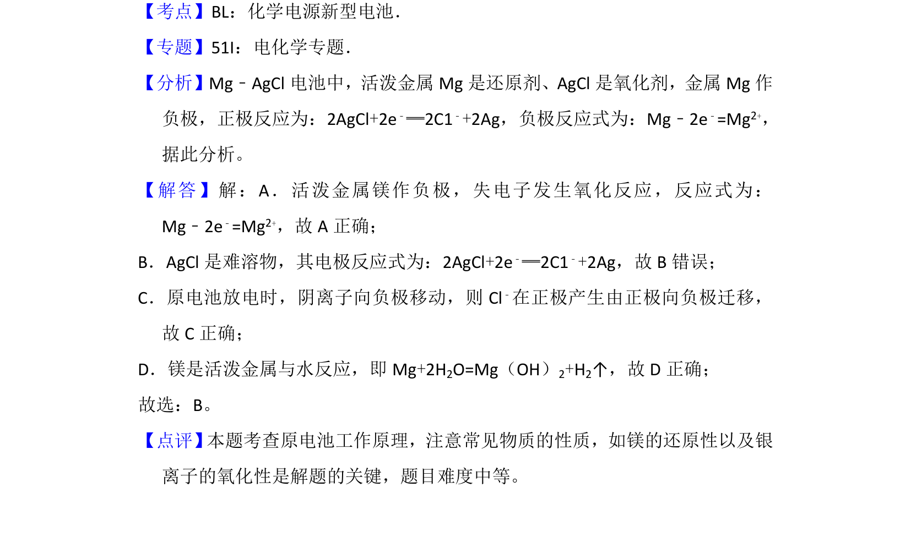

## 题面

## 摘要

该题考查 Mg-AgCl 海水电池的原电池原理，涉及电极反应式书写、离子迁移方向判断及副反应分析。

## 关联考点

- [[642-原电池工作原理|原电池工作原理]]
- [[794-电极反应式|电极反应式]]
- [[864-阴离子迁移|阴离子迁移]]
- [[858-金属腐蚀|金属腐蚀]]

## 答案与解析

> 📄 原 PDF 第 4 页：`素材/真题/吉林/2008-2024·（吉林）化学高考真题/2016年高考化学试卷（新课标Ⅱ）（解析卷）.pdf`

<!-- 题干文本-start -->
## 题干文本
5． （6分）Mg﹣AgCl电池是一种以海水为电解质溶液的水激活电池。下列叙述
错误的是（　　）
A．负极反应式为Mg﹣2e ﹣=Mg2+
B．正极反应式为Ag ++e﹣=Ag
C．电池放电时Cl ﹣由正极向负极迁移
D．负极会发生副反应Mg+2H 2O=Mg（OH）2+H2↑
<!-- 题干文本-end -->

<!-- 解析文本-start -->
## 解析文本
【考点】BL：化学电源新型电池．菁优网版权所有
【专题】51I：电化学专题．
【分析】Mg﹣AgCl电池中，活泼金属Mg是还原剂、AgCl是氧化剂，金属Mg作
负极，正极反应为：2AgCl+2e﹣═2C1﹣+2Ag，负极反应式为：Mg﹣2e﹣=Mg2+，
据此分析。
【解答】解：A．活泼金属镁作负极，失电子发生氧化反应，反应式为：
Mg﹣2e﹣=Mg2+，故A正确；
B．AgCl是难溶物，其电极反应式为：2AgCl+2e ﹣═2C1﹣+2Ag，故B错误；
C．原电池放电时，阴离子向负极移动，则Cl ﹣在正极产生由正极向负极迁移，
故C正确；
D．镁是活泼金属与水反应，即Mg+2H 2O=Mg（OH）2+H2↑，故D正确；
故选：B。
【点评】 本题考查原电池工作原理，注意常见物质的性质，如镁的还原性以及银
离子的氧化性是解题的关键，题目难度中等。
<!-- 解析文本-end -->
