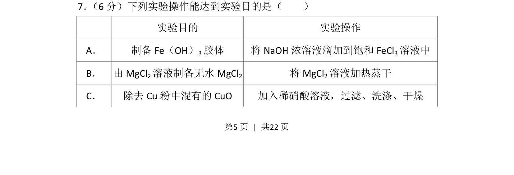
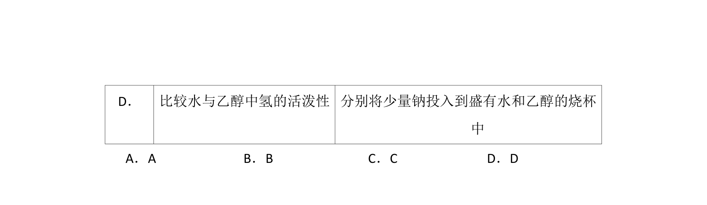
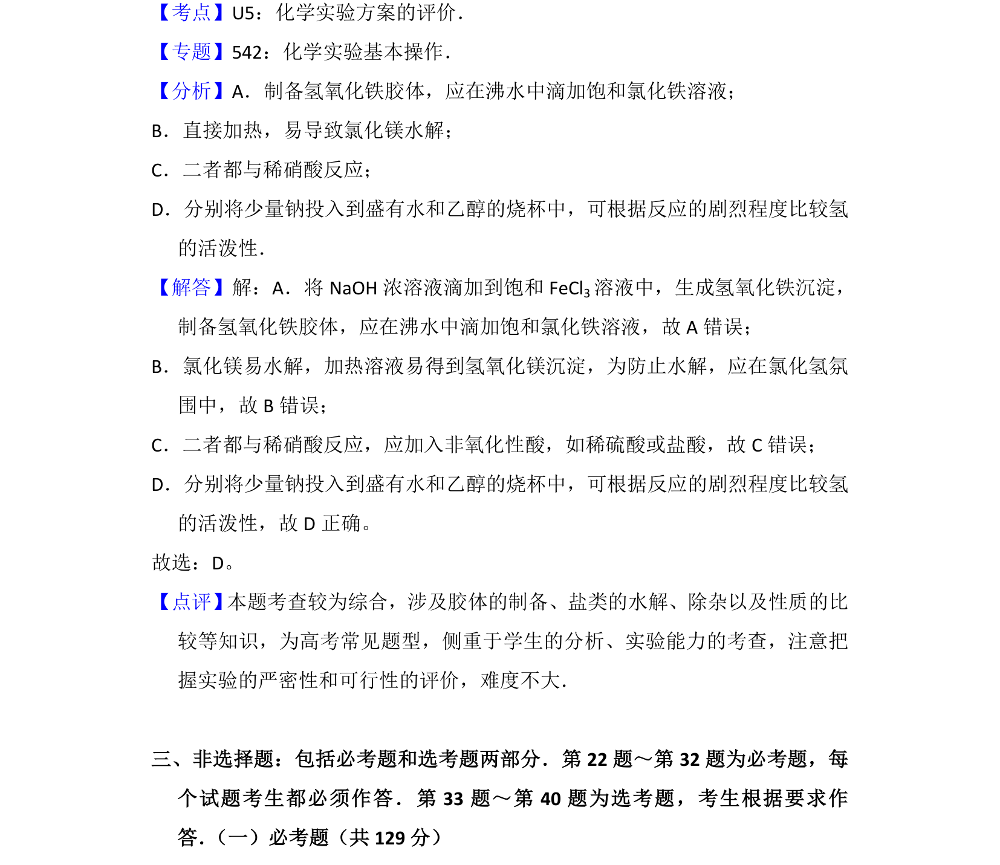

## 题面

## 摘要

本题为化学实验操作与目的匹配选择题，考查常见实验操作的正确性判断

## 关联考点

- [[827-胶体制备|胶体制备]]
- [[336-盐类水解|盐类水解]]
- [[859-金属除杂|金属除杂]]
- [[002-化学实验基本操作|实验操作规范]]

## 答案与解析

> 📄 原 PDF 第 5 页：`素材/真题/吉林/2008-2024·（吉林）化学高考真题/2016年高考化学试卷（新课标Ⅱ）（解析卷）.pdf`
