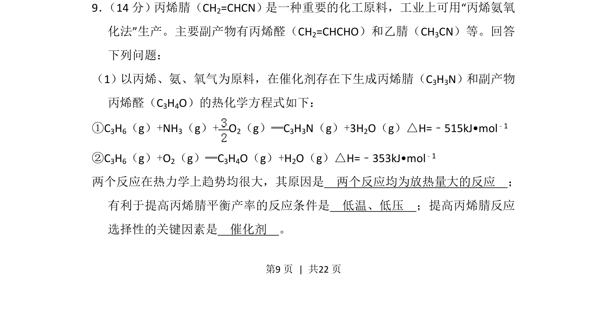
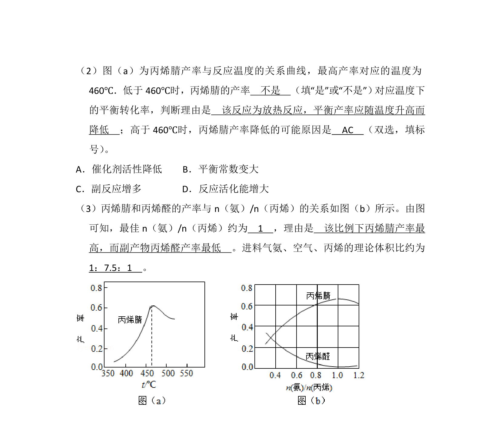
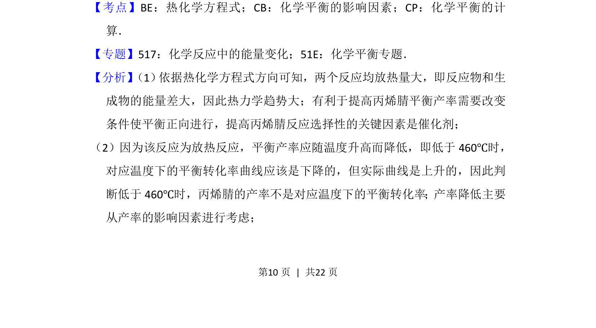
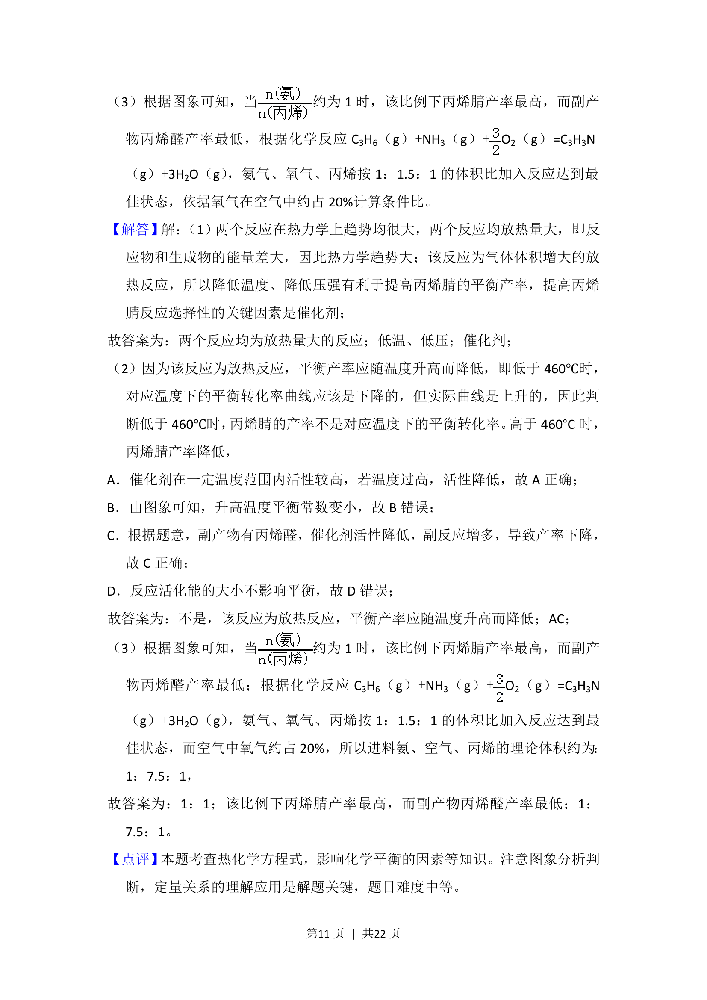

## 题面

## 摘要

丙烯氨氧化法制丙烯腈的热化学与反应条件分析

## 关联考点

- [[309-热化学方程式|热化学方程式]]
- [[620-化学平衡移动|化学平衡移动]]
- [[594-催化剂选择性|催化剂选择性]]

## 答案与解析

> 📄 原 PDF 第 9 页：`素材/真题/吉林/2008-2024·（吉林）化学高考真题/2016年高考化学试卷（新课标Ⅱ）（解析卷）.pdf`
