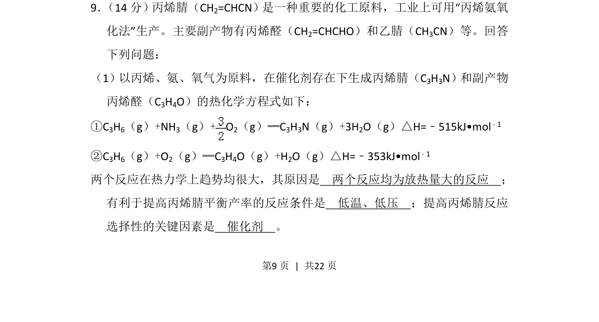
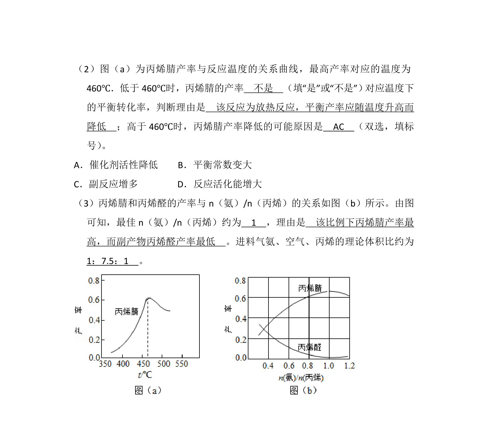
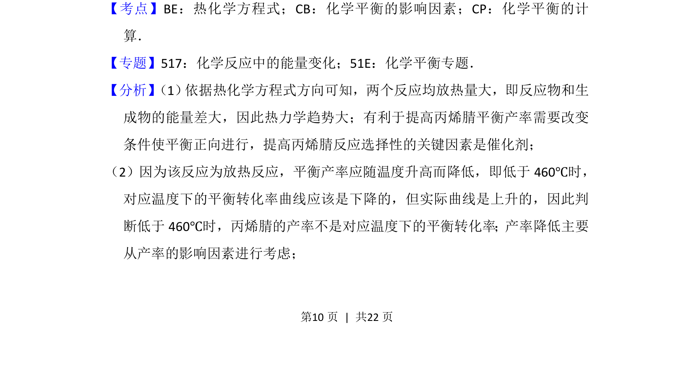
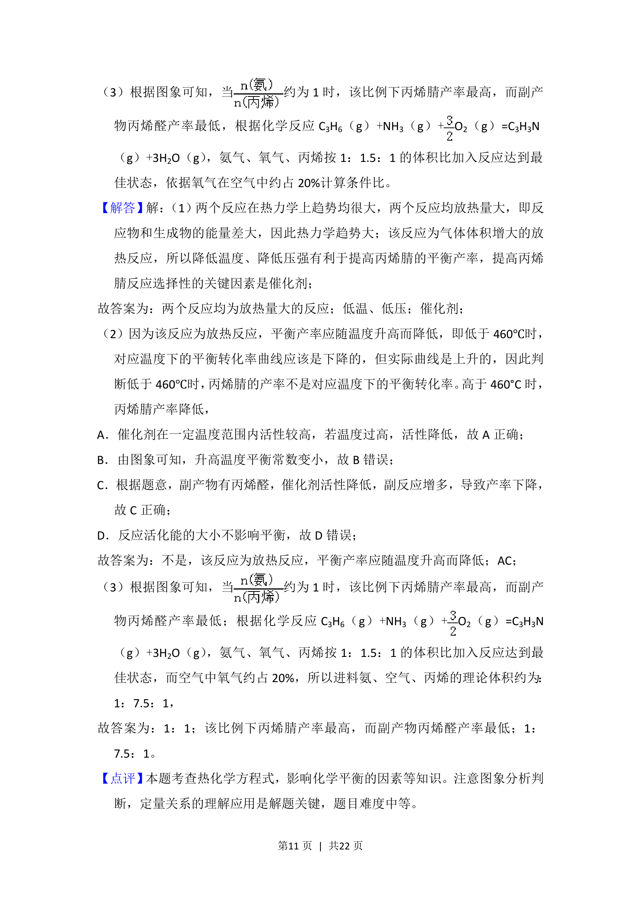

## 题面

## 摘要

丙烯氨氧化法制丙烯腈的热化学与反应条件分析

## 关联考点

- [[309-热化学方程式|热化学方程式]]
- [[620-化学平衡移动|化学平衡移动]]
- [[594-催化剂选择性|催化剂选择性]]

## 答案与解析

> 📄 原 PDF 第 9 页：`素材/真题/吉林/2008-2024·（吉林）化学高考真题/2016年高考化学试卷（新课标Ⅱ）（解析卷）.pdf`

<!-- 题干文本-start -->
## 题干文本
9． （14分）丙烯腈（CH2=CHCN）是一种重要的化工原料，工业上可用“丙烯氨氧
化法”生产。主要副产物有丙烯醛（CH 2=CHCHO）和乙腈（CH3CN）等。回答
下列问题：
（1）以丙烯、氨、氧气为原料，在催化剂存在下生成丙烯腈（C3H3N）和副产物
丙烯醛（C3H4O）的热化学方程式如下：
①C3H6（g）+NH3（g）+O 2（g）═C3H3N（g）+3H2O（g）△H=﹣515kJ•mol﹣1
②C3H6（g）+O2（g）═C3H4O（g）+H2O（g）△H=﹣353kJ•mol﹣1
两个反应在热力学上趋势均很大，其原因是　两个反应均为放热量大的反应　；
有利于提高丙烯腈平衡产率的反应条件是　低温、低压　；提高丙烯腈反应
选择性的关键因素是　催化剂　。
<!-- 题干文本-end -->

<!-- 解析文本-start -->
## 解析文本

<!-- 解析文本-end -->
