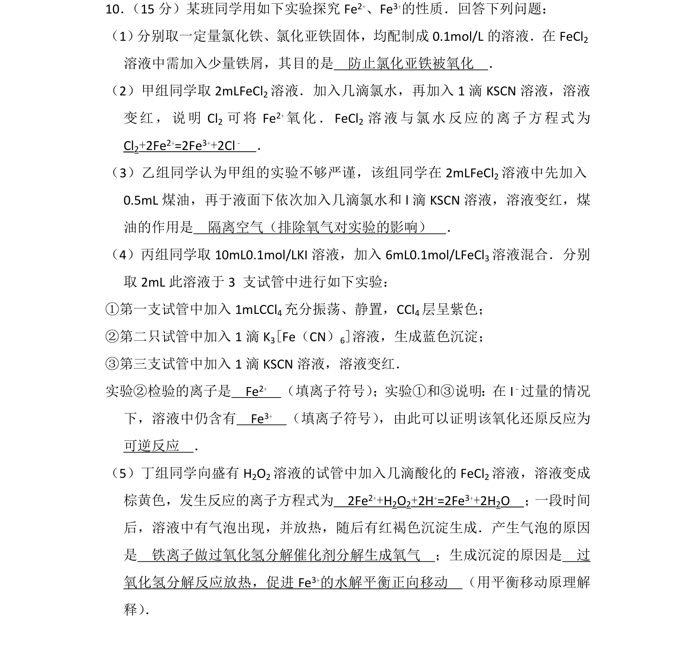
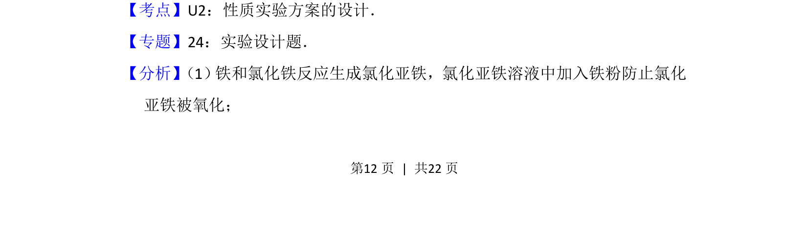
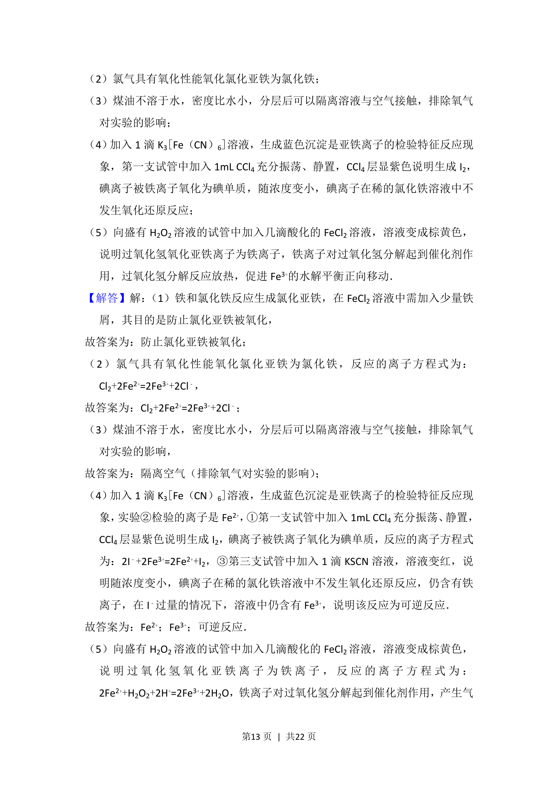
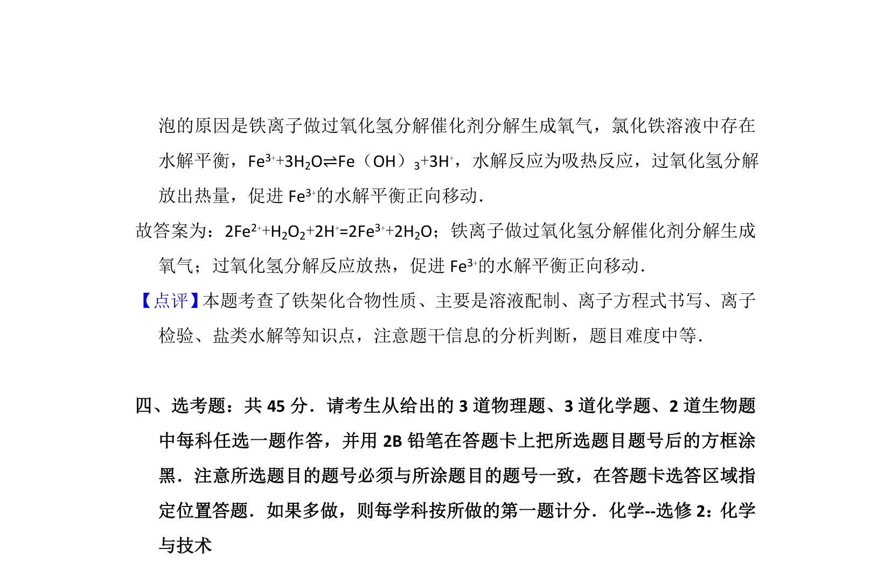

## 题面

## 摘要

考查铁离子与亚铁离子的性质实验方案设计与探究。

## 关联考点

- [[690-性质实验方案设计|性质实验方案设计]]
- [[162-氧化还原反应|氧化还原反应]]
- [[169-离子反应|离子反应]]

## 答案与解析

> 📄 原 PDF 第 12 页：`素材/真题/吉林/2008-2024·（吉林）化学高考真题/2016年高考化学试卷（新课标Ⅱ）（解析卷）.pdf`

<!-- 题干文本-start -->
## 题干文本
10． （15分）某班同学用如下实验探究Fe2+、Fe3+的性质．回答下列问题：
（1） 分别取一定量氯化铁、氯化亚铁固体，均配制成0.1mol/L的溶液．在FeCl2
溶液中需加入少量铁屑，其目的是　防止氯化亚铁被氧化　．
（2）甲组同学取2mLFeCl 2溶液．加入几滴氯水，再加入1滴KSCN溶液，溶液
变红，说明Cl 2 可将Fe 2+氧化．FeCl 2 溶液与氯水反应的离子方程式为　
Cl2+2Fe2+=2Fe3++2Cl﹣　．
（3）乙组同学认为甲组的实验不够严谨，该组同学在2mLFeCl 2溶液中先加入
0.5mL煤油，再于液面下依次加入几滴氯水和l滴KSCN溶液，溶液变红，煤
油的作用是　隔离空气（排除氧气对实验的影响）　．
（4）丙组同学取10mL0.1mol/LKI溶液，加入6mL0.1mol/LFeCl 3溶液混合．分别
取2mL此溶液于3 支试管中进行如下实验：
①第一支试管中加入1mLCCl 4充分振荡、静置，CCl4层呈紫色；
②第二只试管中加入1滴K 3[Fe（CN）6]溶液，生成蓝色沉淀；
③第三支试管中加入1滴KSCN溶液，溶液变红．
实验②检验的离子是　Fe2+　（填离子符号） ；实验①和③说明：在I﹣过量的情况
下，溶液中仍含有　Fe3+　（填离子符号） ，由此可以证明该氧化还原反应为　
可逆反应　．
（5）丁组同学向盛有H 2O2溶液的试管中加入几滴酸化的FeCl 2溶液，溶液变成
棕黄色，发生反应的离子方程式为　2Fe2++H2O2+2H+=2Fe3++2H2O　； 一段时间
后，溶液中有气泡出现，并放热，随后有红褐色沉淀生成．产生气泡的原因
是　铁离子做过氧化氢分解催化剂分解生成氧气　；生成沉淀的原因是　过
氧化氢分解反应放热，促进Fe 3+的水解平衡正向移动　（用平衡移动原理解
释） ．
<!-- 题干文本-end -->

<!-- 解析文本-start -->
## 解析文本
【考点】U2：性质实验方案的设计．菁优网版权所有
【专题】24：实验设计题．
【分析】 （1） 铁和氯化铁反应生成氯化亚铁，氯化亚铁溶液中加入铁粉防止氯化
亚铁被氧化；
<!-- 解析文本-end -->
