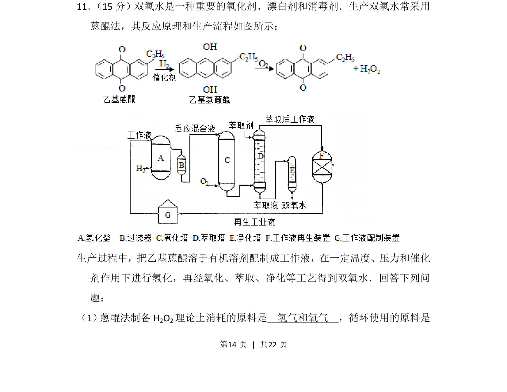
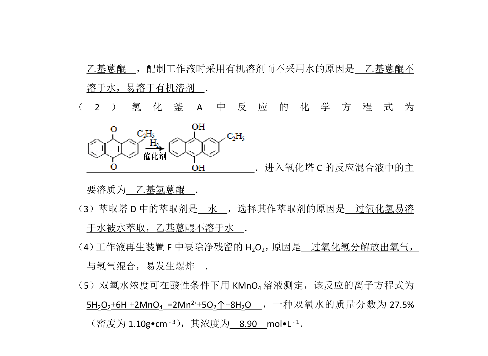
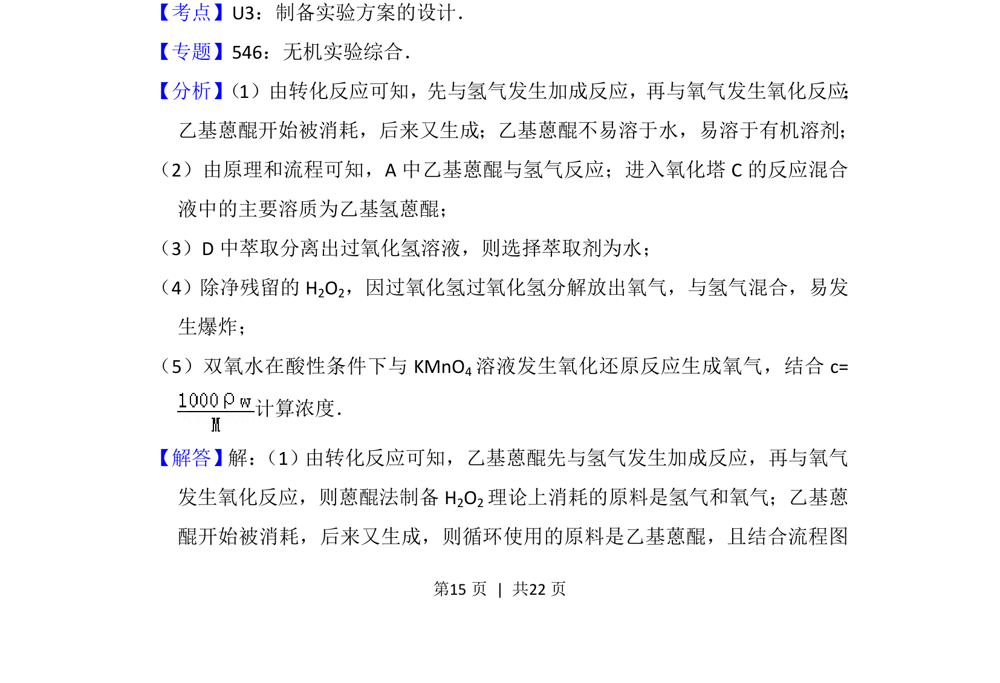
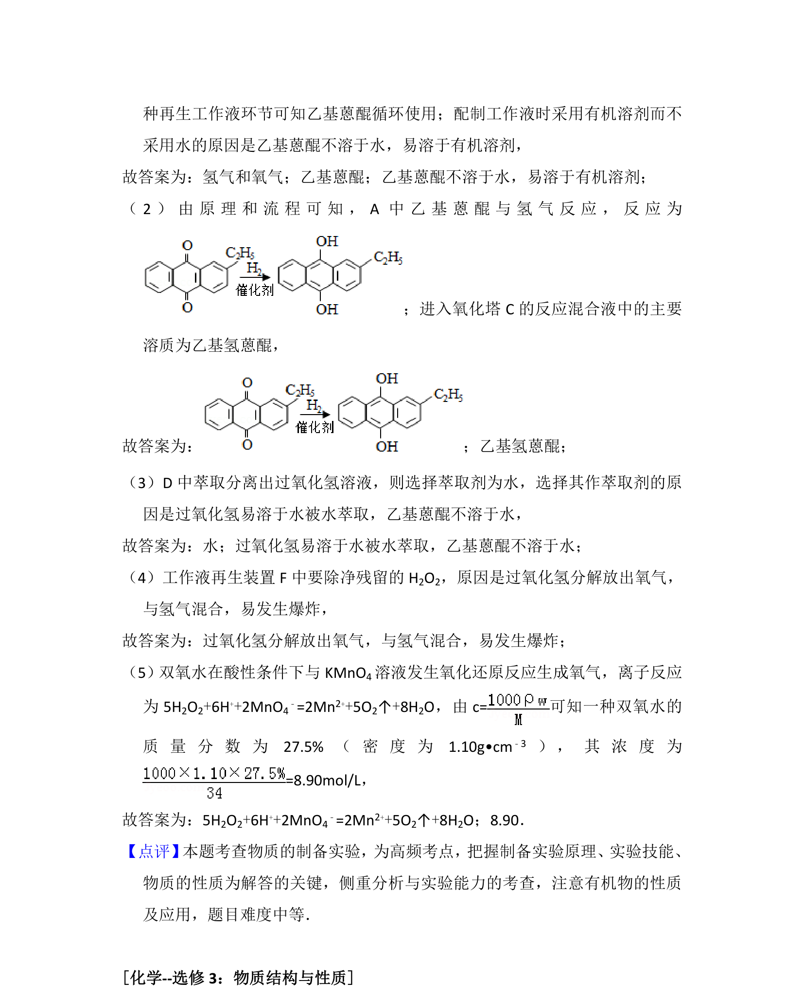

## 题面

## 摘要

该题考查工业制双氧水的蒽醌法流程与反应原理，要求分析原料及循环利用物质。

## 关联考点

- [[162-氧化还原反应|氧化还原反应]]
- [[678-工业流程分析|工业流程分析]]
- [[550-recycle|循环利用]]

## 答案与解析

> 📄 原 PDF 第 14 页：`素材/真题/吉林/2008-2024·（吉林）化学高考真题/2016年高考化学试卷（新课标Ⅱ）（解析卷）.pdf`

<!-- 题干文本-start -->
## 题干文本
11． （15分）双氧水是一种重要的氧化剂、漂白剂和消毒剂．生产双氧水常采用
蒽醌法，其反应原理和生产流程如图所示：
生产过程中，把乙基蒽醌溶于有机溶剂配制成工作液，在一定温度、压力和催化
剂作用下进行氢化，再经氧化、萃取、净化等工艺得到双氧水．回答下列问
题：
（1） 蒽醌法制备H2O2理论上消耗的原料是　氢气和氧气　，循环使用的原料是
<!-- 题干文本-end -->

<!-- 解析文本-start -->
## 解析文本

<!-- 解析文本-end -->
