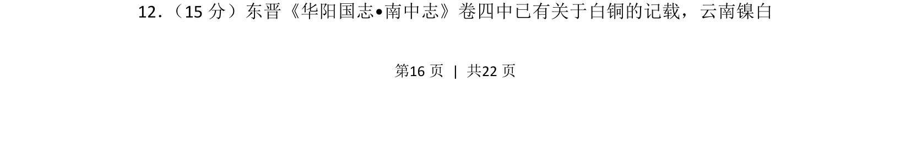
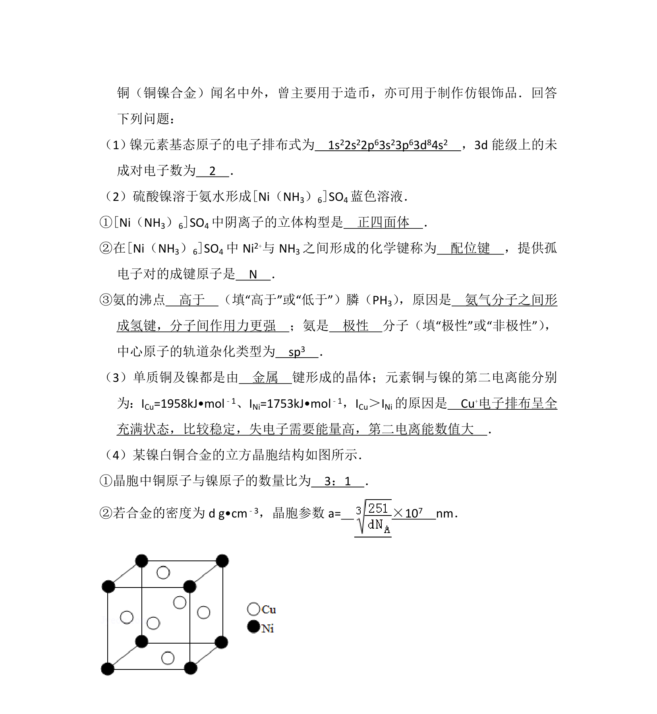
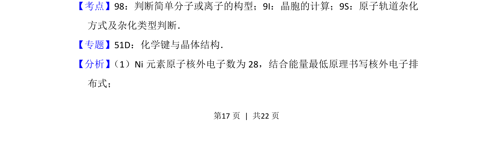
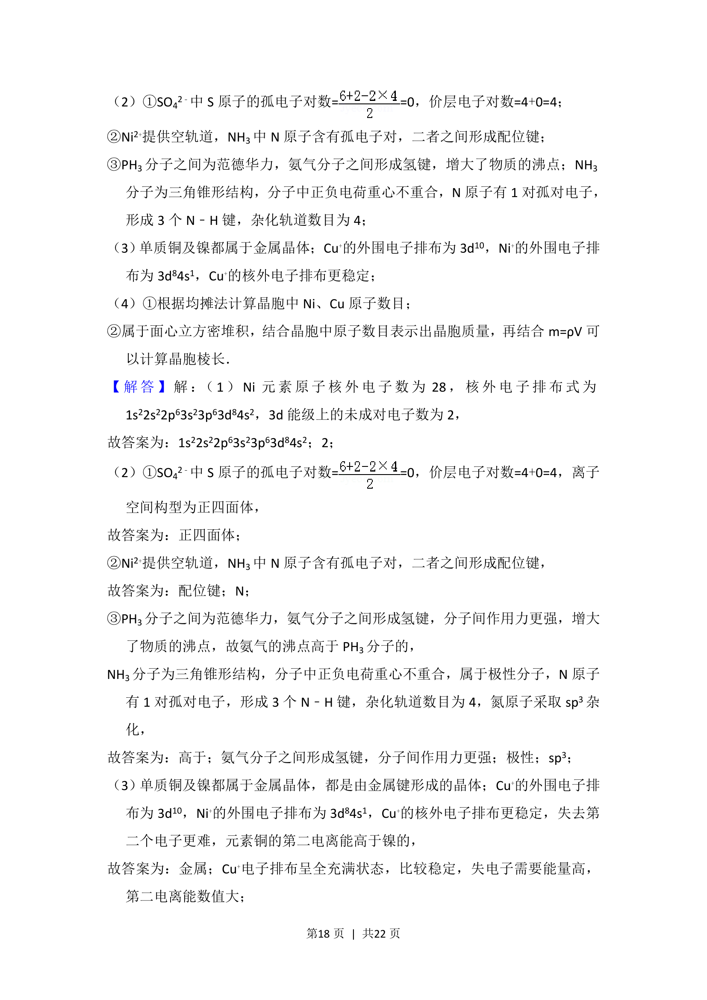
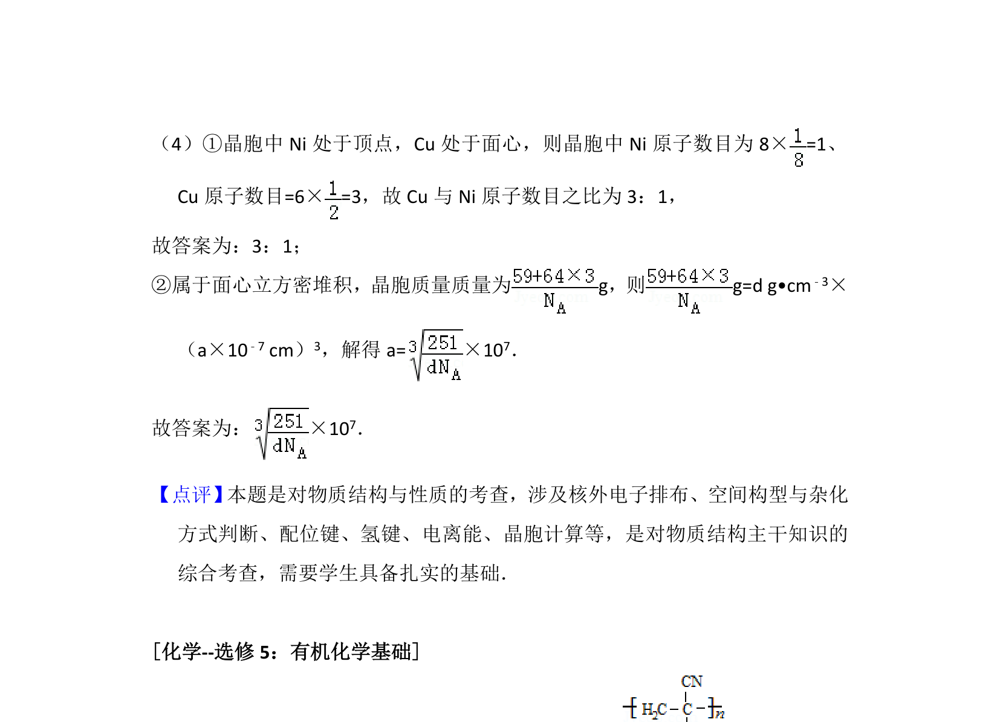

## 题面

## 摘要

考查东晋《华阳国志》中白铜记载，涉及镍白铜的成分与冶炼工艺推断。

## 关联考点

- [[655-合金成分|合金成分]]
- [[280-金属冶炼|金属冶炼]]
- [[575-镍白铜|镍白铜]]

## 答案与解析

> 📄 原 PDF 第 16 页：`素材/真题/吉林/2008-2024·（吉林）化学高考真题/2016年高考化学试卷（新课标Ⅱ）（解析卷）.pdf`
