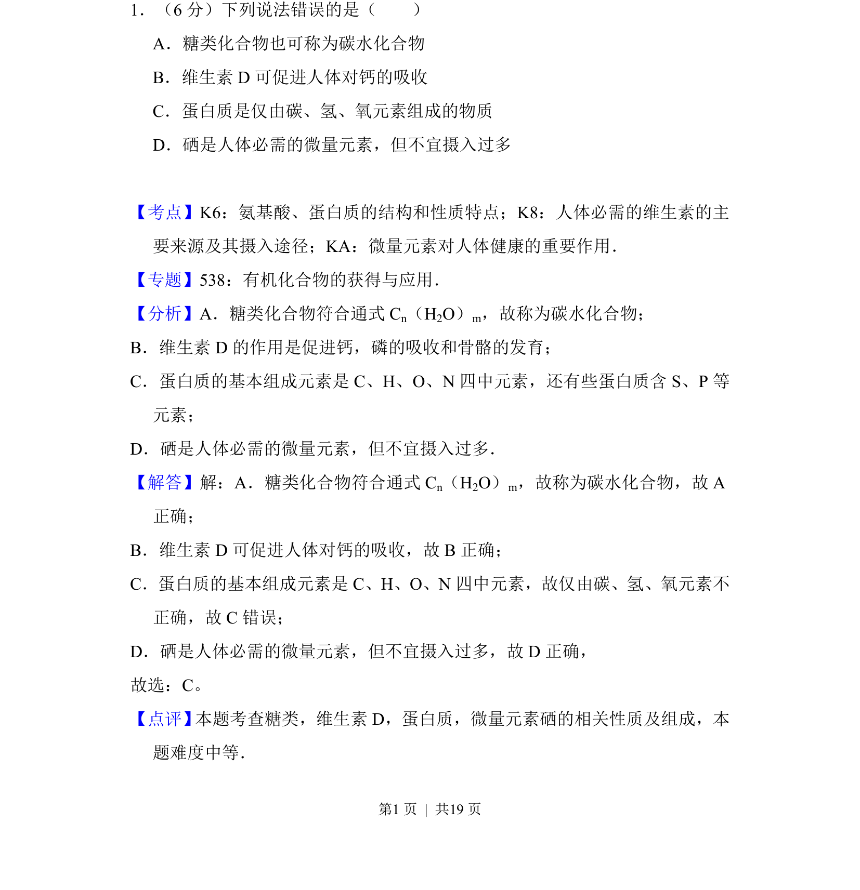

## 题面

## 摘要

本题考查糖类、维生素D、蛋白质的组成及微量元素硒的相关说法正误判断。

## 关联考点

- [[130-糖类|糖类]]
- [[131-维生素|维生素]]
- [[蛋白质组成]]
- [[211-微量元素|微量元素]]

## 答案与解析

> 📄 原 PDF 第 1 页：`素材/真题/吉林/2008-2024·（吉林）化学高考真题/2017年高考化学试卷（新课标Ⅱ）（解析卷）.pdf`
