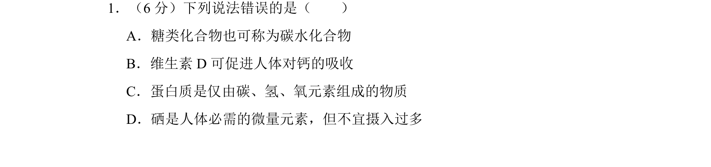
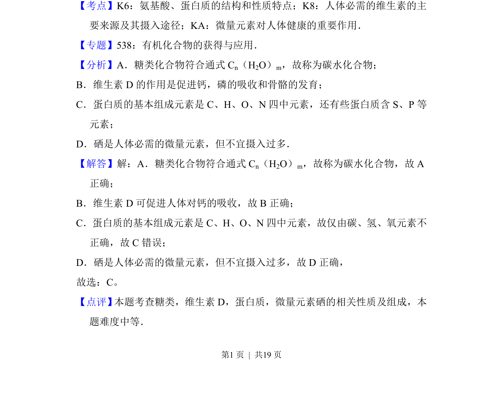

## 题面

## 摘要

本题考查糖类、维生素D、蛋白质的组成及微量元素硒的相关说法正误判断。

## 关联考点

- [[130-糖类|糖类]]
- [[131-维生素|维生素]]
- [[569-蛋白质组成|蛋白质组成]]
- [[211-微量元素|微量元素]]

## 答案与解析

> 📄 原 PDF 第 1 页：`素材/真题/吉林/2008-2024·（吉林）化学高考真题/2017年高考化学试卷（新课标Ⅱ）（解析卷）.pdf`

<!-- 题干文本-start -->
## 题干文本
1．（6分）下列说法错误的是（　　）
A．糖类化合物也可称为碳水化合物
B．维生素D可促进人体对钙的吸收
C．蛋白质是仅由碳、氢、氧元素组成的物质
D．硒是人体必需的微量元素，但不宜摄入过多
<!-- 题干文本-end -->

<!-- 解析文本-start -->
## 解析文本
【考点】K6：氨基酸、蛋白质的结构和性质特点；K8：人体必需的维生素的主
要来源及其摄入途径；KA：微量元素对人体健康的重要作用．菁优网版权所有
【专题】538：有机化合物的获得与应用．
【分析】A．糖类化合物符合通式C n（H2O）m，故称为碳水化合物；
B．维生素D的作用是促进钙，磷的吸收和骨骼的发育；
C．蛋白质的基本组成元素是C、H、O、N四中元素，还有些蛋白质含S、P等
元素；
D．硒是人体必需的微量元素，但不宜摄入过多．
【解答】解：A．糖类化合物符合通式C n（H2O）m，故称为碳水化合物，故A
正确；
B．维生素D可促进人体对钙的吸收，故B正确；
C．蛋白质的基本组成元素是C、H、O、N四中元素，故仅由碳、氢、氧元素不
正确，故C错误；
D．硒是人体必需的微量元素，但不宜摄入过多，故D正确，
故选：C。
【点评】 本题考查糖类，维生素D，蛋白质，微量元素硒的相关性质及组成，本
题难度中等．
<!-- 解析文本-end -->
