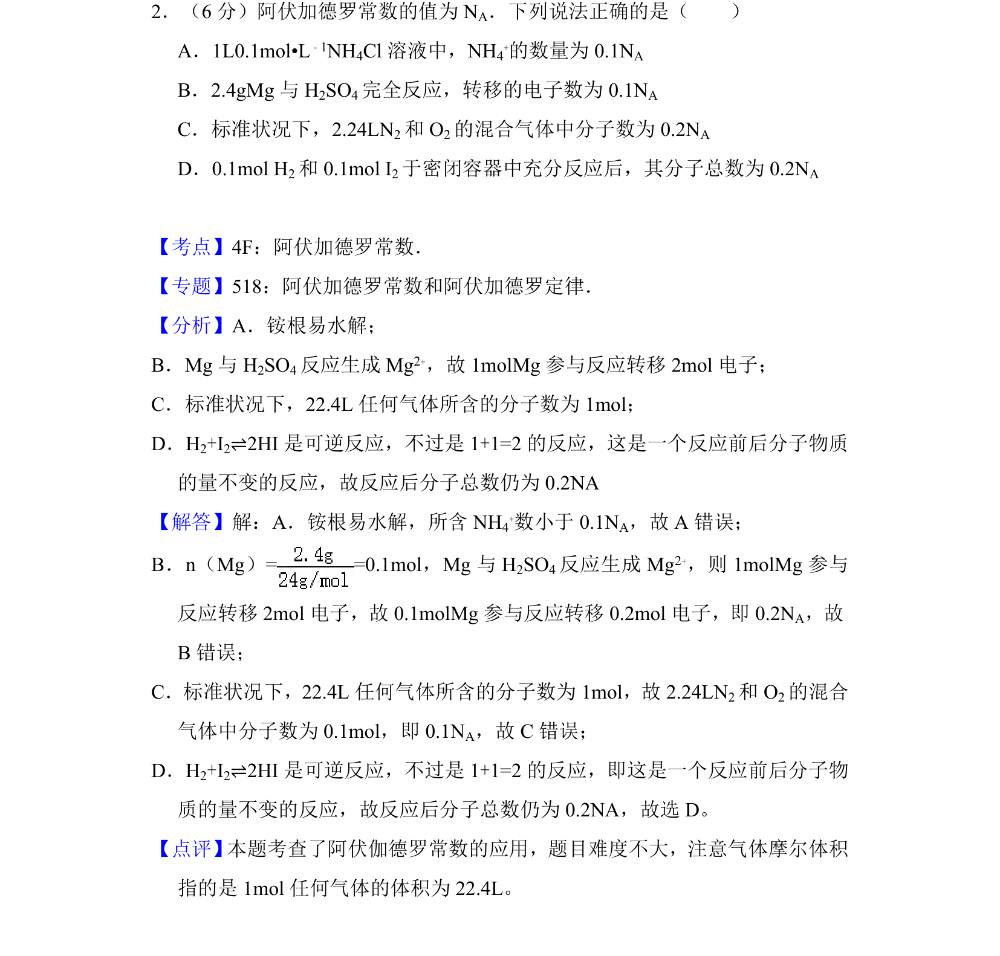
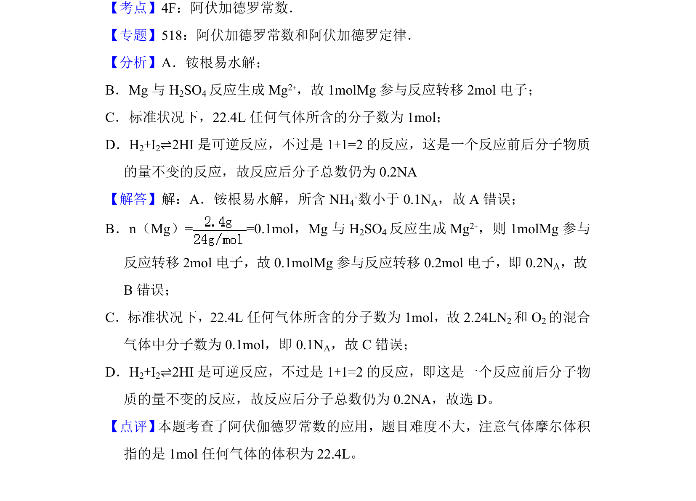

## 题面

## 摘要

阿伏加德罗常数应用，涉及水解、电子转移、气体摩尔体积及可逆反应分子数判断

## 关联考点

- [[450-阿伏伽德罗常数|阿伏加德罗常数]]
- [[779-物质的量|物质的量]]
- [[727-气体摩尔体积|气体摩尔体积]]
- [[165-电子转移|电子转移]]

## 答案与解析

> 📄 原 PDF 第 2 页：`素材/真题/吉林/2008-2024·（吉林）化学高考真题/2017年高考化学试卷（新课标Ⅱ）（解析卷）.pdf`
