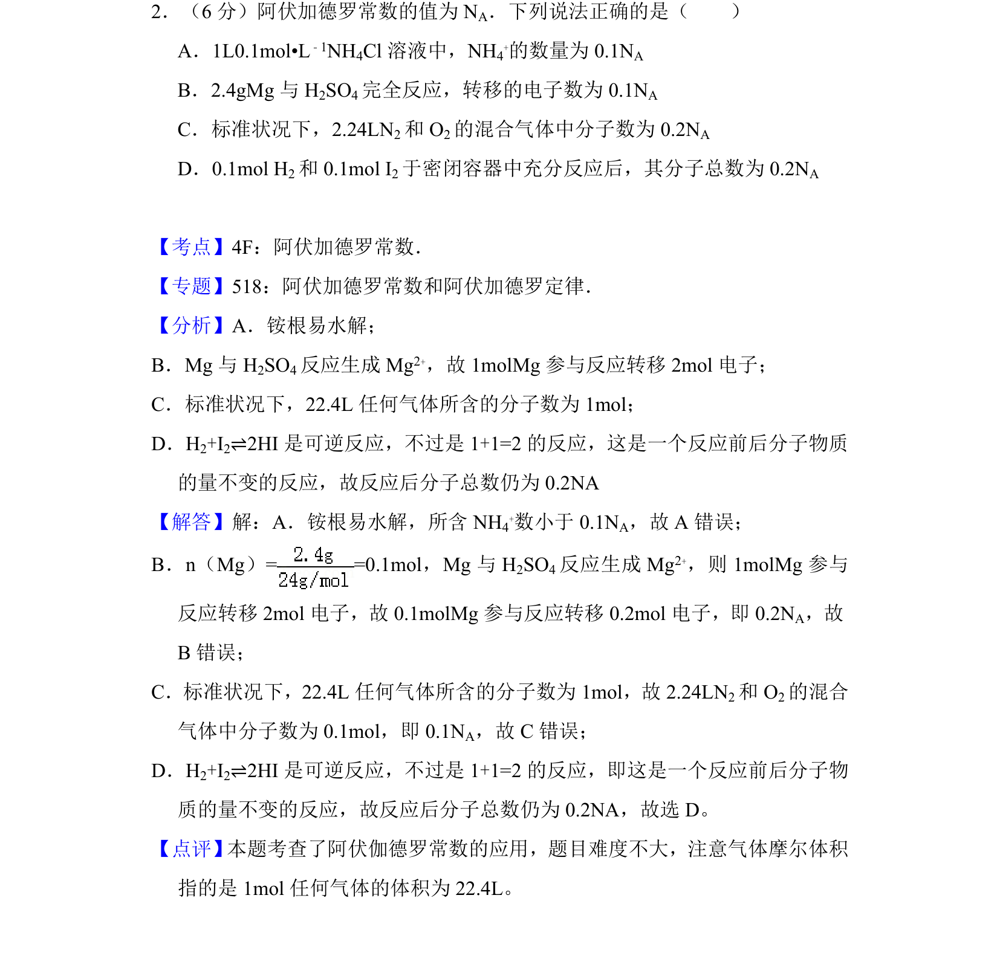
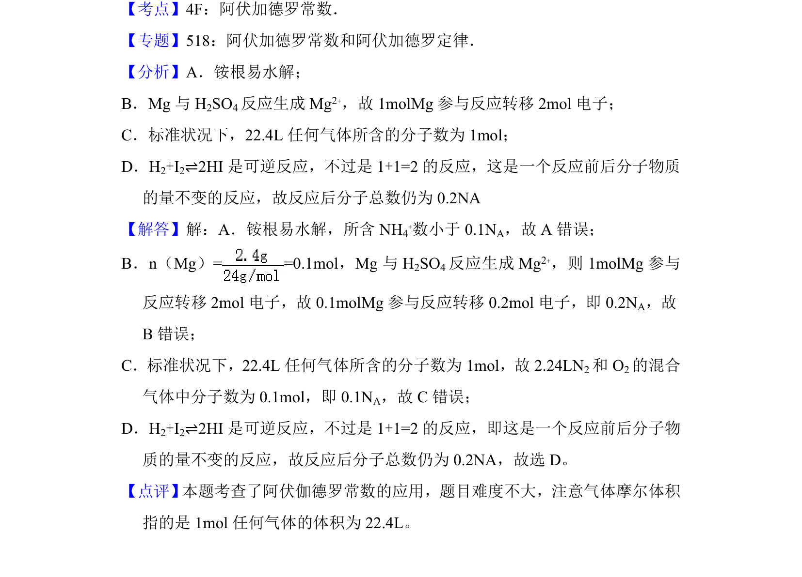

## 题面

## 摘要

阿伏加德罗常数应用，涉及水解、电子转移、气体摩尔体积及可逆反应分子数判断

## 关联考点

- [[450-阿伏伽德罗常数|阿伏加德罗常数]]
- [[779-物质的量|物质的量]]
- [[727-气体摩尔体积|气体摩尔体积]]
- [[165-电子转移|电子转移]]

## 答案与解析

> 📄 原 PDF 第 2 页：`素材/真题/吉林/2008-2024·（吉林）化学高考真题/2017年高考化学试卷（新课标Ⅱ）（解析卷）.pdf`

<!-- 题干文本-start -->
## 题干文本
2．（6分）阿伏加德罗常数的值为N A．下列说法正确的是（　　）
A．1L0.1mol•L﹣1NH4Cl溶液中，NH 4
+的数量为0.1N A
B．2.4gMg与H 2SO4完全反应，转移的电子数为0.1N A
C．标准状况下，2.24LN2和O 2的混合气体中分子数为0.2N A
D．0.1mol H2和0.1mol I 2于密闭容器中充分反应后，其分子总数为0.2N A
<!-- 题干文本-end -->

<!-- 解析文本-start -->
## 解析文本
【考点】4F：阿伏加德罗常数．菁优网版权所有
【专题】518：阿伏加德罗常数和阿伏加德罗定律．
【分析】A．铵根易水解；
B．Mg与H 2SO4反应生成Mg 2+，故1molMg参与反应转移2mol电子；
C．标准状况下，22.4L任何气体所含的分子数为1mol；
D．H2+I2⇌2HI是可逆反应，不过是1+1=2的反应，这是一个反应前后分子物质
的量不变的反应，故反应后分子总数仍为0.2NA
【解答】解：A．铵根易水解，所含NH 4
+数小于0.1N A，故A错误；
B．n（Mg）= =0.1mol，Mg与H 2SO4反应生成Mg 2+，则1molMg参与
反应转移2mol电子，故0.1molMg参与反应转移0.2mol电子，即0.2N A，故
B错误；
C．标准状况下，22.4L任何气体所含的分子数为1mol，故2.24LN 2和O 2的混合
气体中分子数为0.1mol，即0.1N A，故C错误；
D．H2+I2⇌2HI是可逆反应，不过是1+1=2的反应，即这是一个反应前后分子物
质的量不变的反应，故反应后分子总数仍为0.2NA，故选D。
【点评】 本题考查了阿伏伽德罗常数的应用，题目难度不大，注意气体摩尔体积
指的是1mol任何气体的体积为22.4L。
<!-- 解析文本-end -->
