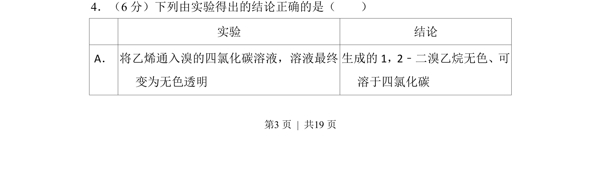
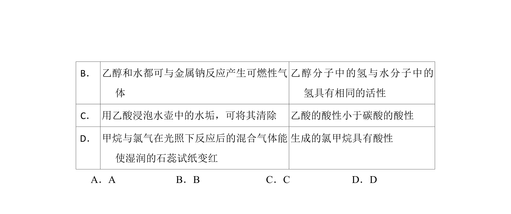
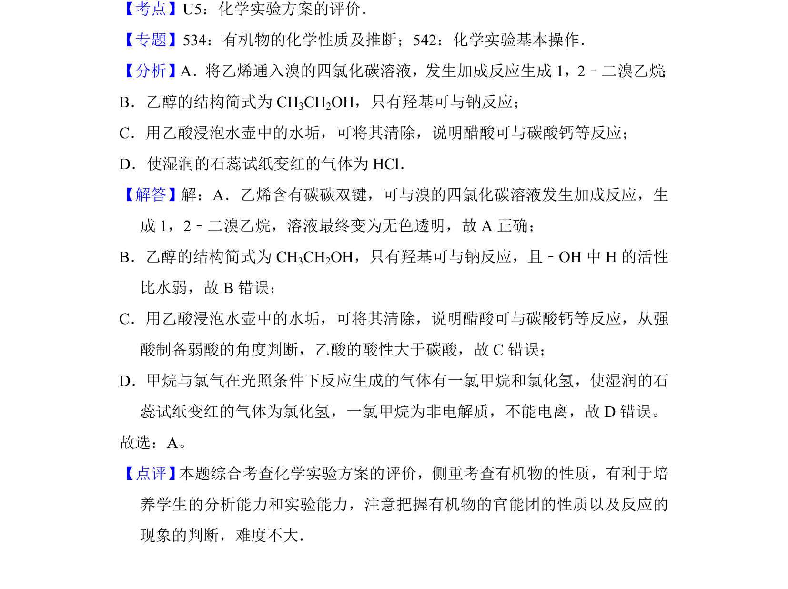

## 题面

## 摘要

化学实验与结论的逻辑对应关系辨析

## 关联考点

- [[666-实验分析|实验分析]]
- [[567-结论推导|结论推导]]
- [[708-有机化学性质|有机化学性质]]

## 答案与解析

> 📄 原 PDF 第 3 页：`素材/真题/吉林/2008-2024·（吉林）化学高考真题/2017年高考化学试卷（新课标Ⅱ）（解析卷）.pdf`

<!-- 题干文本-start -->
## 题干文本
4．（6分）下列由实验得出的结论正确的是（　　）
 实验 结论
A． 将乙烯通入溴的四氯化碳溶液，溶液最终
变为无色透明
生成的1，2﹣二溴乙烷无色、可
溶于四氯化碳
<!-- 题干文本-end -->

<!-- 解析文本-start -->
## 解析文本

<!-- 解析文本-end -->
