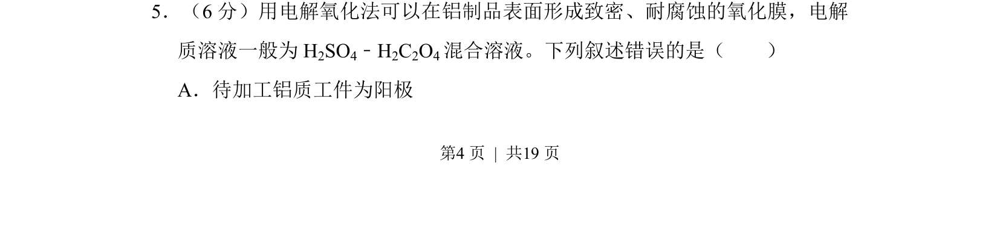
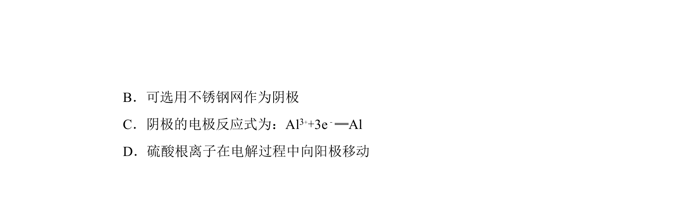
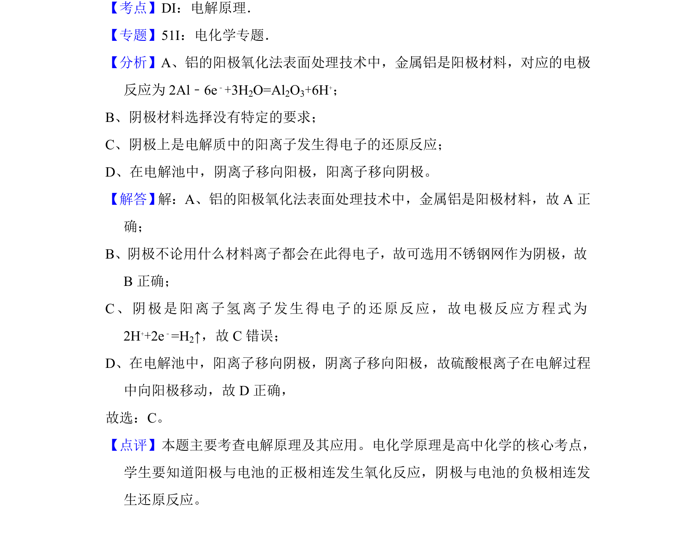

## 题面

## 摘要

该题考查电解氧化法的电极判断与原理理解，要求识别错误叙述。

## 关联考点

- [[367-电解原理|电解原理]]
- [[898-阳极氧化|阳极氧化]]
- [[792-电极判断|电极判断]]

## 答案与解析

> 📄 原 PDF 第 4 页：`素材/真题/吉林/2008-2024·（吉林）化学高考真题/2017年高考化学试卷（新课标Ⅱ）（解析卷）.pdf`
