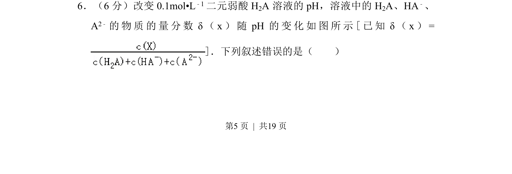
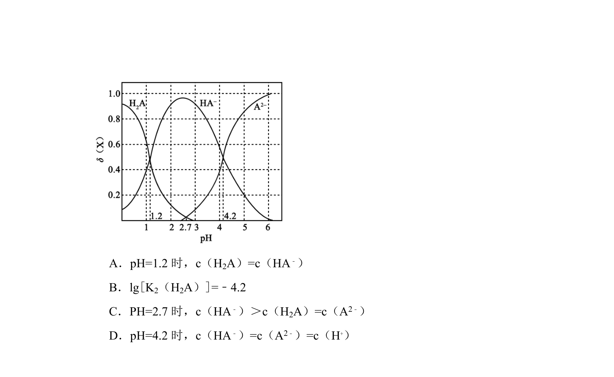
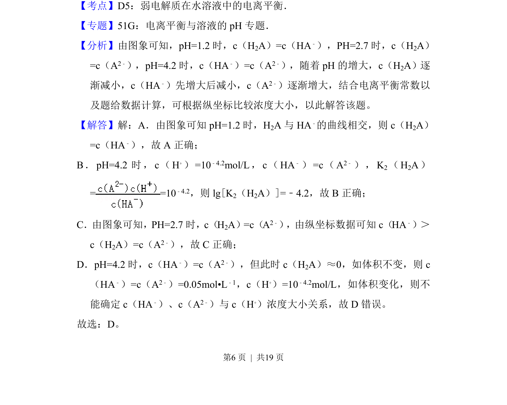
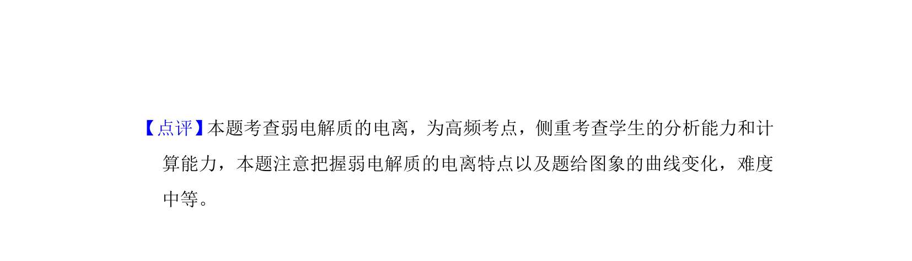

## 题面

## 摘要

考查二元弱酸分布分数随pH变化图像的分析与判断

## 关联考点

- [[685-弱酸电离平衡|弱酸电离平衡]]
- [[888-分布分数δ-pH图|分布分数δ-pH图]]
- [[772-物料守恒|物料守恒]]

## 答案与解析

> 📄 原 PDF 第 5 页：`素材/真题/吉林/2008-2024·（吉林）化学高考真题/2017年高考化学试卷（新课标Ⅱ）（解析卷）.pdf`
