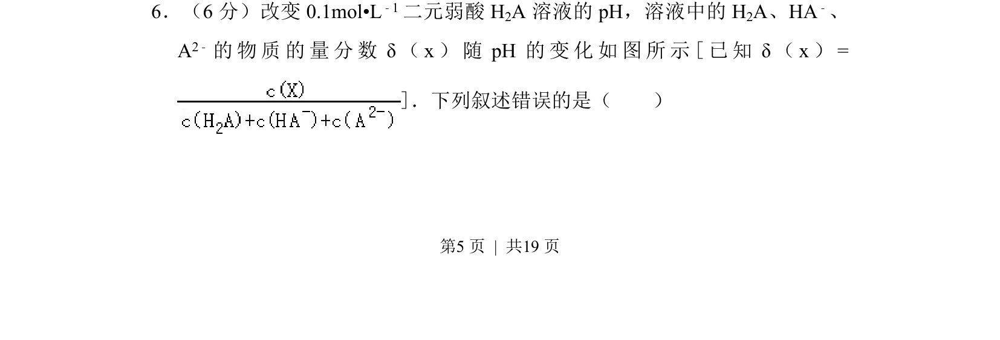
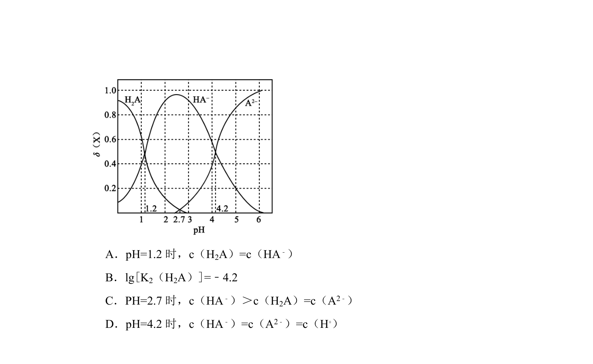
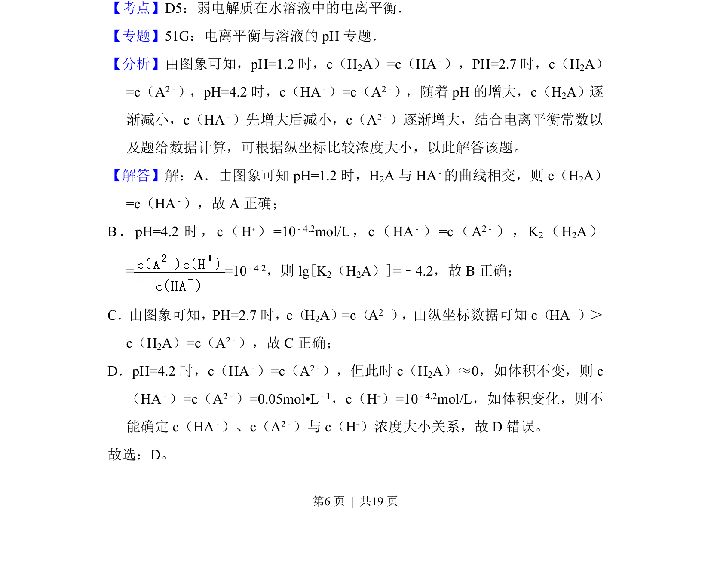
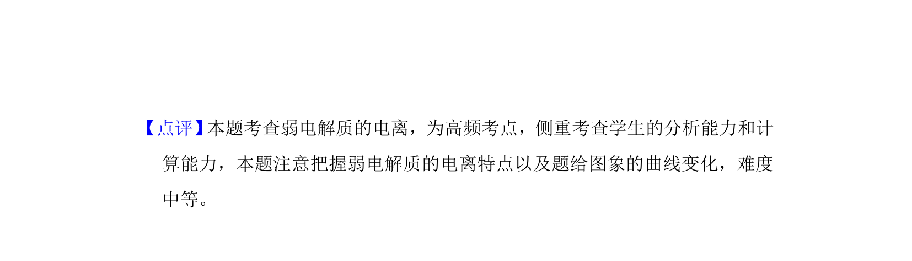

## 题面

## 摘要

考查二元弱酸分布分数随pH变化图像的分析与判断

## 关联考点

- [[685-弱酸电离平衡|弱酸电离平衡]]
- [[888-分布分数δ-pH图|分布分数δ-pH图]]
- [[772-物料守恒|物料守恒]]

## 答案与解析

> 📄 原 PDF 第 5 页：`素材/真题/吉林/2008-2024·（吉林）化学高考真题/2017年高考化学试卷（新课标Ⅱ）（解析卷）.pdf`

<!-- 题干文本-start -->
## 题干文本
6．（6分）改变0.1mol•L ﹣1二元弱酸H 2A溶液的pH，溶液中的H 2A、HA﹣、
A2﹣的物质的量分数δ（x）随pH的变化如图所示[已知δ（x）=
]．下列叙述错误的是（　　）
<!-- 题干文本-end -->

<!-- 解析文本-start -->
## 解析文本

<!-- 解析文本-end -->
