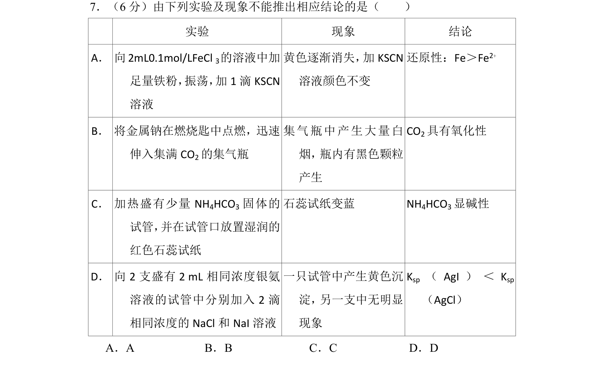
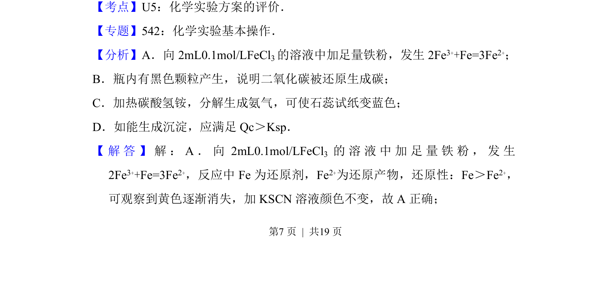
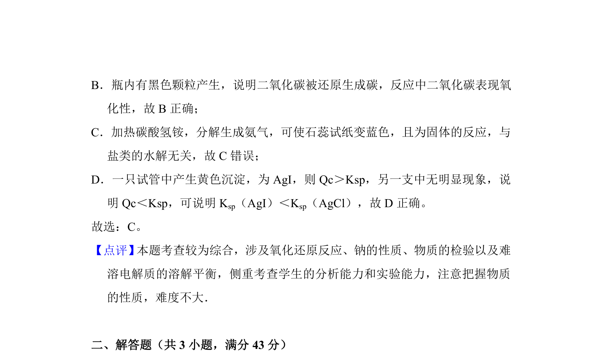

## 题面

## 摘要

根据实验现象和反应原理判断结论的正确性

## 关联考点

- [[615-化学实验评价|化学实验评价]]
- [[162-氧化还原反应|氧化还原反应]]
- [[328-沉淀溶解平衡|沉淀溶解平衡]]

## 答案与解析

> 📄 原 PDF 第 7 页：`素材/真题/吉林/2008-2024·（吉林）化学高考真题/2017年高考化学试卷（新课标Ⅱ）（解析卷）.pdf`
