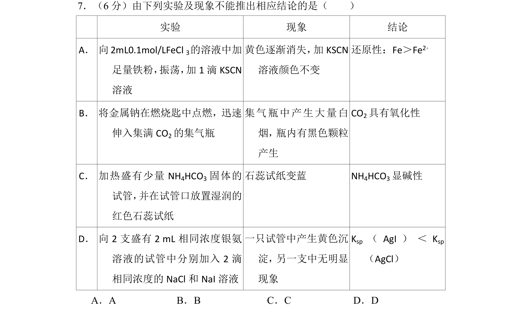
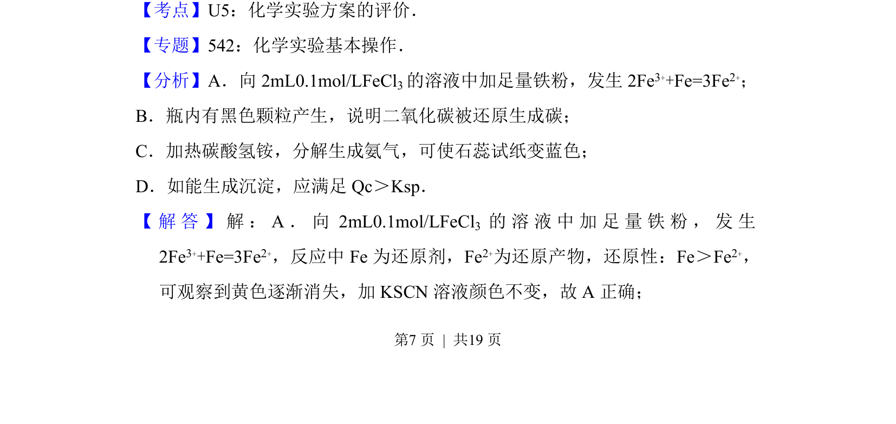
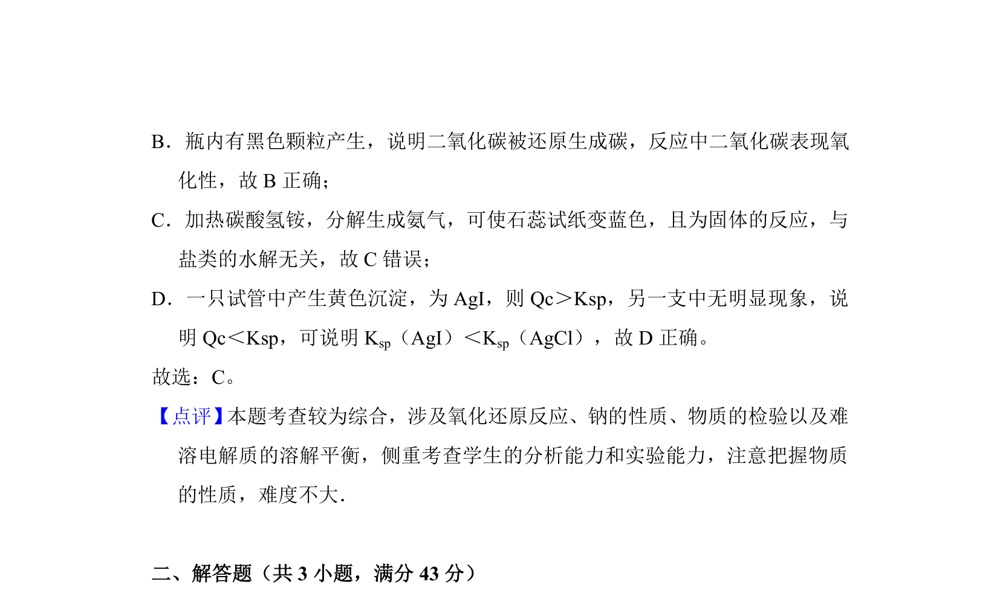

## 题面

## 摘要

根据实验现象和反应原理判断结论的正确性

## 关联考点

- [[614-化学实验评价|化学实验评价]]
- [[162-氧化还原反应|氧化还原反应]]
- [[328-沉淀溶解平衡|沉淀溶解平衡]]

## 答案与解析

> 📄 原 PDF 第 7 页：`素材/真题/吉林/2008-2024·（吉林）化学高考真题/2017年高考化学试卷（新课标Ⅱ）（解析卷）.pdf`

<!-- 题干文本-start -->
## 题干文本
7．（6分）由下列实验及现象不能推出相应结论的是（　　）
 实验 现象 结论
A． 向2mL0.1mol/LFeCl 3的溶液中加
足量铁粉， 振荡， 加1滴KSCN
溶液
黄色逐渐消失， 加KSCN
溶液颜色不变
还原性：Fe＞Fe2+
B． 将金属钠在燃烧匙中点燃，迅速
伸入集满CO 2的集气瓶
集气瓶中产生大量白
烟， 瓶内有黑色颗粒
产生
CO2具有氧化性
C． 加热盛有少量NH 4HCO3固体的
试管， 并在试管口放置湿润的
红色石蕊试纸
石蕊试纸变蓝 NH4HCO3显碱性
D． 向2支盛有2 mL相同浓度银氨
溶液的试管中分别加入2滴
相同浓度的NaCl和NaI溶液
一只试管中产生黄色沉
淀， 另一支中无明显
现象
Ksp （AgI） ＜K sp
（AgCl）
A．A B．B C．C D．D
<!-- 题干文本-end -->

<!-- 解析文本-start -->
## 解析文本
【考点】U5：化学实验方案的评价．菁优网版权所有
【专题】542：化学实验基本操作．
【分析】A．向2mL0.1mol/LFeCl 3的溶液中加足量铁粉，发生2Fe 3++Fe=3Fe2+；
B．瓶内有黑色颗粒产生，说明二氧化碳被还原生成碳；
C．加热碳酸氢铵，分解生成氨气，可使石蕊试纸变蓝色；
D．如能生成沉淀，应满足Qc＞Ksp．
【 解 答 】 解 ：A． 向2mL0.1mol/LFeCl3 的 溶 液 中 加 足 量 铁 粉 ， 发 生
2Fe3++Fe=3Fe2+，反应中Fe为还原剂，Fe 2+为还原产物，还原性：Fe＞Fe 2+，
可观察到黄色逐渐消失，加KSCN溶液颜色不变，故A正确；
<!-- 解析文本-end -->
