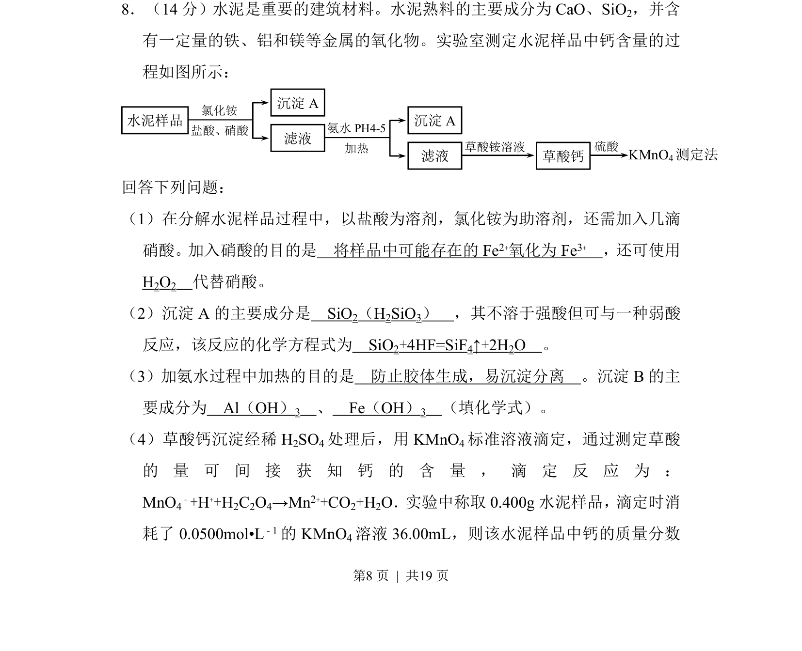

## 题面

## 摘要

该题考查水泥样品中钙含量测定流程，涉及物质氧化、沉淀分离及滴定计算。

## 关联考点

- [[162-氧化还原反应|氧化还原反应]]
- [[沉淀反应]]
- [[络合反应]]
- [[滴定分析]]

## 答案与解析

> 📄 原 PDF 第 8 页：`素材/真题/吉林/2008-2024·（吉林）化学高考真题/2017年高考化学试卷（新课标Ⅱ）（解析卷）.pdf`
