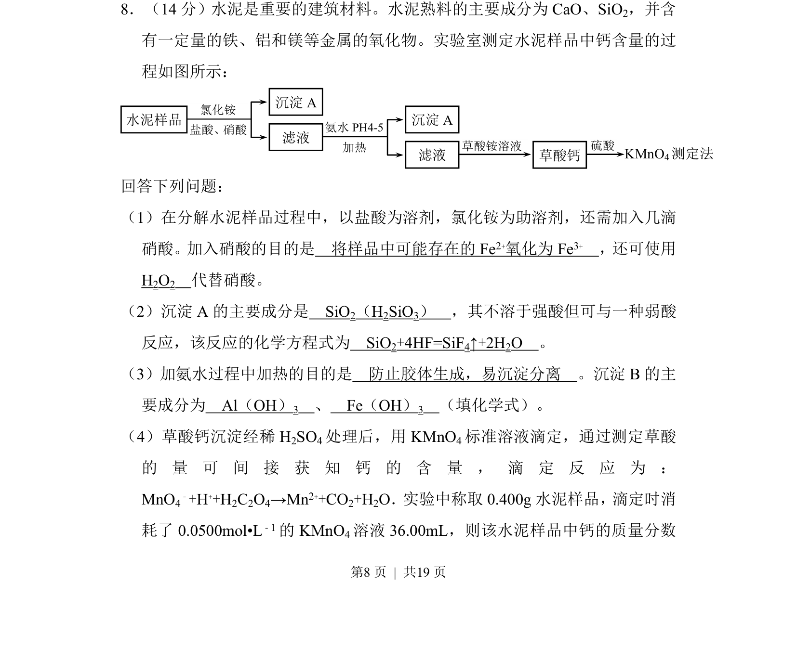
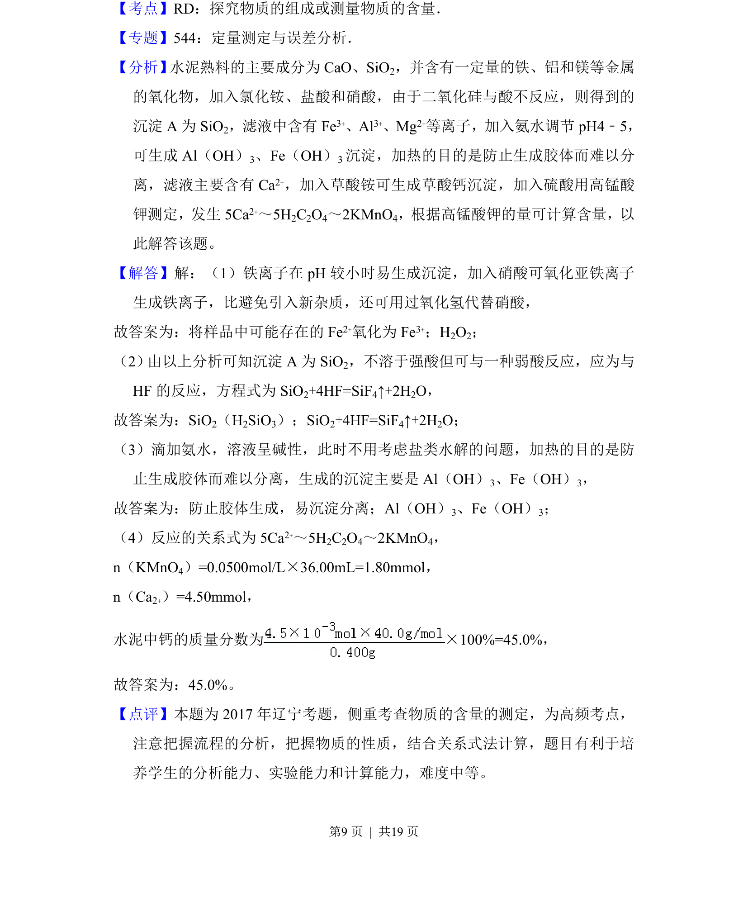

## 题面

## 摘要

该题考查水泥样品中钙含量测定流程，涉及物质氧化、沉淀分离及滴定计算。

## 关联考点

- [[162-氧化还原反应|氧化还原反应]]
- [[745-沉淀反应|沉淀反应]]
- [[820-络合反应|络合反应]]
- [[765-滴定分析|滴定分析]]

## 答案与解析

> 📄 原 PDF 第 8 页：`素材/真题/吉林/2008-2024·（吉林）化学高考真题/2017年高考化学试卷（新课标Ⅱ）（解析卷）.pdf`

<!-- 题干文本-start -->
## 题干文本
8．（14分）水泥是重要的建筑材料。水泥熟料的主要成分为CaO、SiO 2，并含
有一定量的铁、铝和镁等金属的氧化物。实验室测定水泥样品中钙含量的过
程如图所示：
回答下列问题：
（1）在分解水泥样品过程中，以盐酸为溶剂，氯化铵为助溶剂，还需加入几滴
硝酸。加入硝酸的目的是　将样品中可能存在的Fe2+氧化为Fe 3+　，还可使用　
H2O2　代替硝酸。
（2）沉淀A的主要成分是　SiO 2（H2SiO3）　，其不溶于强酸但可与一种弱酸
反应，该反应的化学方程式为　SiO2+4HF=SiF4↑+2H2O　。
（3）加氨水过程中加热的目的是　防止胶体生成，易沉淀分离　。沉淀B的主
要成分为　Al（OH）3　、　Fe（OH）3　（填化学式）。
（4）草酸钙沉淀经稀H 2SO4处理后，用KMnO 4标准溶液滴定，通过测定草酸
的 量 可 间 接 获 知 钙 的 含 量 ， 滴 定 反 应 为 ：
MnO4
﹣+H++H2C2O4→Mn2++CO2+H2O．实验中称取0.400g水泥样品，滴定时消
耗了0.0500mol•L ﹣1的KMnO 4溶液36.00mL，则该水泥样品中钙的质量分数
氯化铵
盐酸、硝酸水泥样品
沉淀A
滤液
氨水PH4-5
加热
沉淀A
滤液
草酸铵溶液
草酸钙
硫酸 KMnO4测定法
<!-- 题干文本-end -->

<!-- 解析文本-start -->
## 解析文本

<!-- 解析文本-end -->
