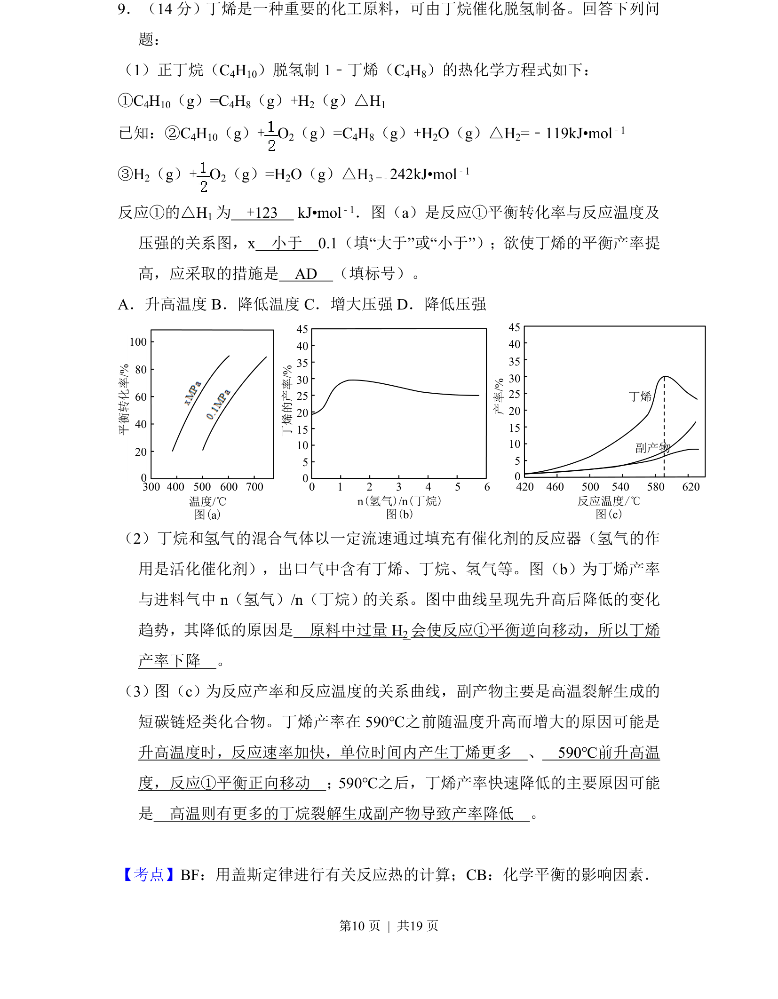
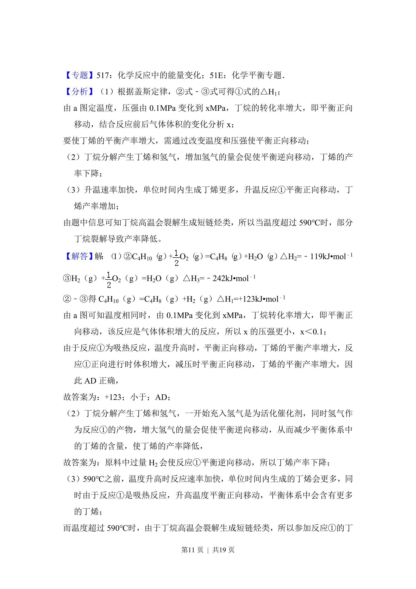
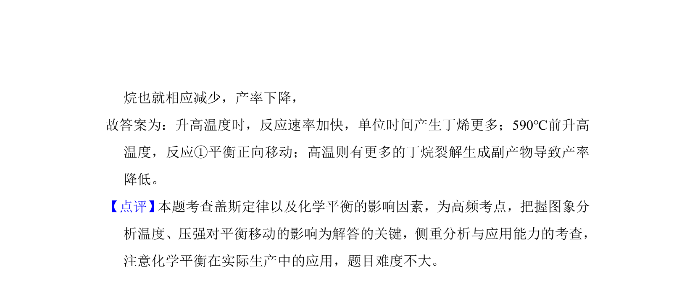

## 题面

## 摘要

这是一道化学热化学与化学平衡综合题，计算反应热并分析温度、压强、投料比对平衡转化率和产率的影响。

## 关联考点

- [[788-用盖斯定律进行有关反应热的计算|用盖斯定律进行有关反应热的计算]]
- [[879-化学平衡的影响因素|化学平衡的影响因素]]

## 答案与解析

> 📄 原 PDF 第 10 页：`素材/真题/吉林/2008-2024·（吉林）化学高考真题/2017年高考化学试卷（新课标Ⅱ）（解析卷）.pdf`
