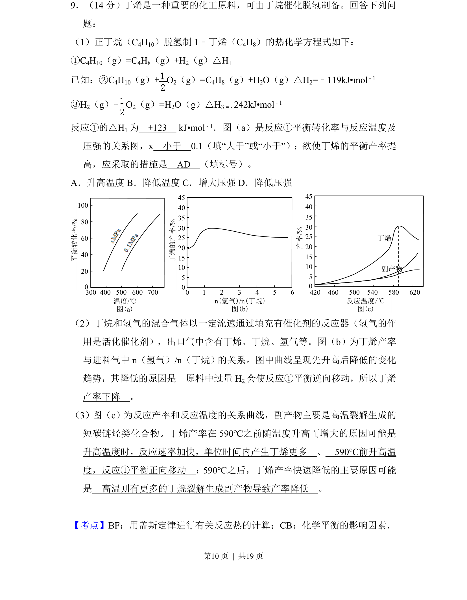
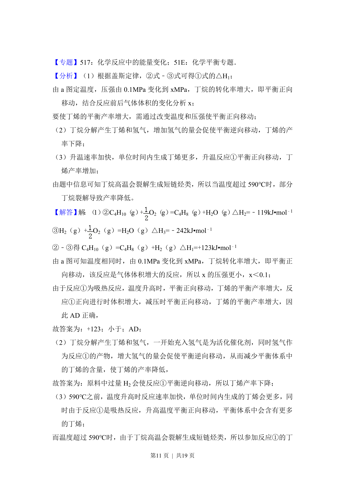
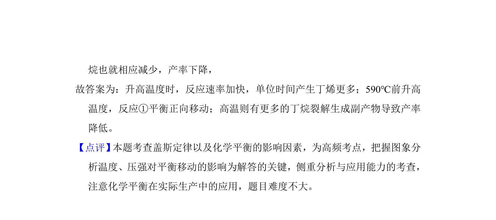

## 题面

## 摘要

这是一道化学热化学与化学平衡综合题，计算反应热并分析温度、压强、投料比对平衡转化率和产率的影响。

## 关联考点

- [[787-用盖斯定律进行有关反应热的计算|用盖斯定律进行有关反应热的计算]]
- [[619-化学平衡影响因素|化学平衡的影响因素]]

## 答案与解析

> 📄 原 PDF 第 10 页：`素材/真题/吉林/2008-2024·（吉林）化学高考真题/2017年高考化学试卷（新课标Ⅱ）（解析卷）.pdf`

<!-- 题干文本-start -->
## 题干文本
9．（14分）丁烯是一种重要的化工原料，可由丁烷催化脱氢制备。回答下列问
题：
（1）正丁烷（C4H10）脱氢制1﹣丁烯（C 4H8）的热化学方程式如下：
①C4H10（g）=C4H8（g）+H2（g）△H1
已知：②C4H10（g）+O 2（g）=C4H8（g）+H2O（g）△H2=﹣119kJ•mol﹣1
③H2（g）+O 2（g）=H2O（g）△H3 =﹣242kJ•mol﹣1
反应①的△H1为　+123　 kJ•mol﹣1．图（a）是反应①平衡转化率与反应温度及
压强的关系图，x　小于　0.1（填“大于”或“小于”）；欲使丁烯的平衡产率提
高，应采取的措施是　AD　（填标号）。
A．升高温度B．降低温度C．增大压强D．降低压强
（2）丁烷和氢气的混合气体以一定流速通过填充有催化剂的反应器（氢气的作
用是活化催化剂），出口气中含有丁烯、丁烷、氢气等。图（b）为丁烯产率
与进料气中n（氢气）/n（丁烷）的关系。图中曲线呈现先升高后降低的变化
趋势，其降低的原因是　原料中过量H 2会使反应①平衡逆向移动，所以丁烯
产率下降　。
（3）图（c）为反应产率和反应温度的关系曲线，副产物主要是高温裂解生成的
短碳链烃类化合物。丁烯产率在590℃之前随温度升高而增大的原因可能是　
升高温度时，反应速率加快，单位时间内产生丁烯更多　、　590℃前升高温
度，反应①平衡正向移动　；590℃之后，丁烯产率快速降低的主要原因可能
是　高温则有更多的丁烷裂解生成副产物导致产率降低　。
<!-- 题干文本-end -->

<!-- 解析文本-start -->
## 解析文本
【考点】BF：用盖斯定律进行有关反应热的计算；CB：化学平衡的影响因素．菁
300  400  500  600  700
温度/℃
图(a)
100
80
60
40
20
0
平衡转化率/%
0    1    2    3    4    5    6
n(氢气)/n(丁烷)
图(b)
45
40
35
30
25
20
15
10
5
0
丁烯的产率/%
丁烯
副产物
45
40
35
30
25
20
15
10
5
0
产率/%
420   460   500   540   580   620
反应温度/℃
图(c)
<!-- 解析文本-end -->
