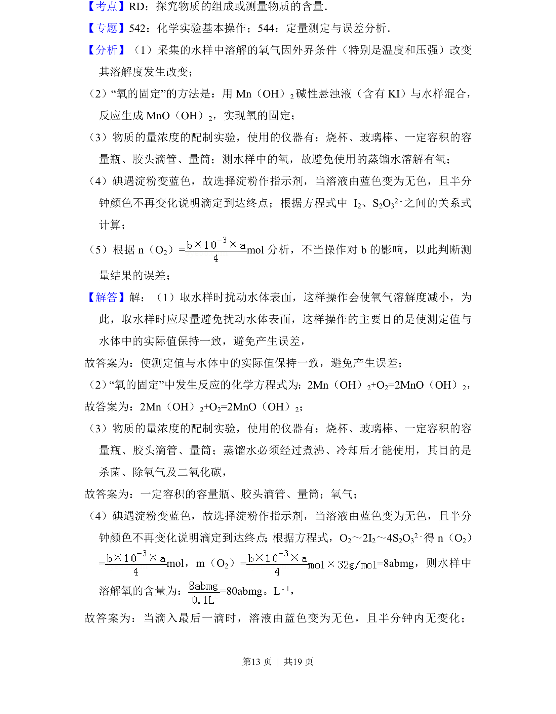
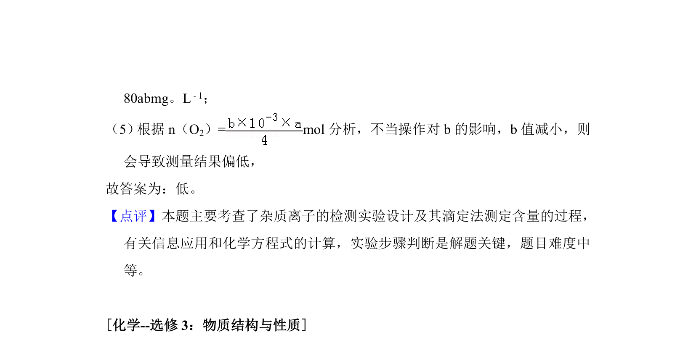

## 题面

## 摘要

碘量法测定水中溶解氧的原理、操作及误差分析。

## 关联考点

- [[548-氧化还原滴定|氧化还原滴定]]
- [[627-化学计量|化学计量]]
- [[580-实验操作|实验操作]]
- [[724-误差分析|误差分析]]

## 答案与解析

> 📄 原 PDF 第 12 页：`素材/真题/吉林/2008-2024·（吉林）化学高考真题/2017年高考化学试卷（新课标Ⅱ）（解析卷）.pdf`
