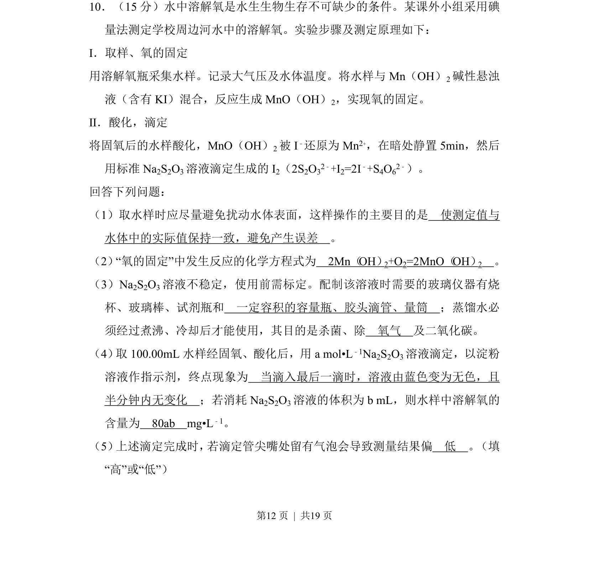
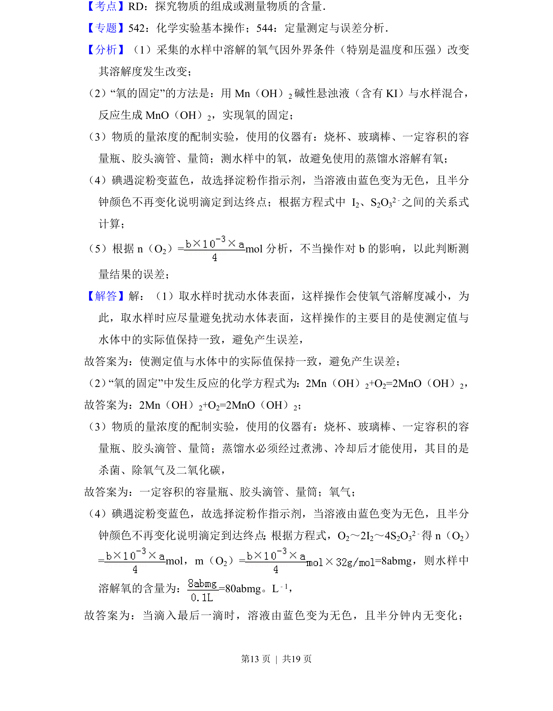
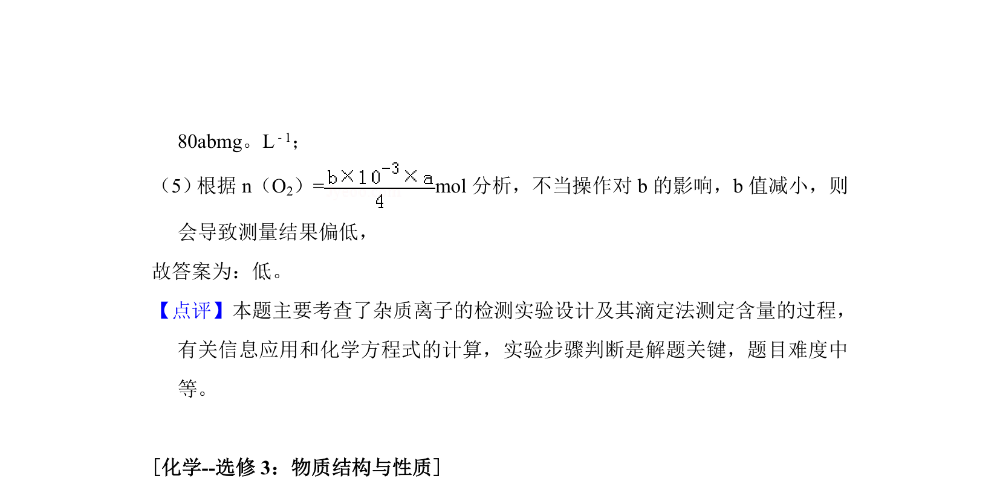

## 题面

## 摘要

碘量法测定水中溶解氧的原理、操作及误差分析。

## 关联考点

- [[548-氧化还原滴定|氧化还原滴定]]
- [[627-化学计量|化学计量]]
- [[580-实验操作|实验操作]]
- [[724-误差分析|误差分析]]

## 答案与解析

> 📄 原 PDF 第 12 页：`素材/真题/吉林/2008-2024·（吉林）化学高考真题/2017年高考化学试卷（新课标Ⅱ）（解析卷）.pdf`

<!-- 题干文本-start -->
## 题干文本
10．（15分）水中溶解氧是水生生物生存不可缺少的条件。某课外小组采用碘
量法测定学校周边河水中的溶解氧。实验步骤及测定原理如下：
Ⅰ．取样、氧的固定
用溶解氧瓶采集水样。记录大气压及水体温度。将水样与Mn（OH） 2碱性悬浊
液（含有KI）混合，反应生成MnO（OH） 2，实现氧的固定。
Ⅱ．酸化，滴定
将固氧后的水样酸化，MnO（OH）2被I ﹣还原为Mn 2+，在暗处静置5min，然后
用标准Na 2S2O3溶液滴定生成的I 2（2S2O32﹣+I2=2I﹣+S4O62﹣）。
回答下列问题：
（1）取水样时应尽量避免扰动水体表面，这样操作的主要目的是　使测定值与
水体中的实际值保持一致，避免产生误差　。
（2）“氧的固定”中发生反应的化学方程式为　2Mn（OH）2+O2=2MnO（OH）2　。
（3）Na2S2O3溶液不稳定，使用前需标定。配制该溶液时需要的玻璃仪器有烧
杯、玻璃棒、试剂瓶和　一定容积的容量瓶、胶头滴管、量筒　；蒸馏水必
须经过煮沸、冷却后才能使用，其目的是杀菌、除　氧气　及二氧化碳。
（4） 取100.00mL水样经固氧、酸化后，用a mol•L﹣1Na2S2O3溶液滴定，以淀粉
溶液作指示剂，终点现象为　当滴入最后一滴时，溶液由蓝色变为无色，且
半分钟内无变化　；若消耗Na 2S2O3溶液的体积为b mL，则水样中溶解氧的
含量为　80ab　mg•L﹣1。
（5） 上述滴定完成时， 若滴定管尖嘴处留有气泡会导致测量结果偏　低　。 （填
“高”或“低”）
<!-- 题干文本-end -->

<!-- 解析文本-start -->
## 解析文本

<!-- 解析文本-end -->
