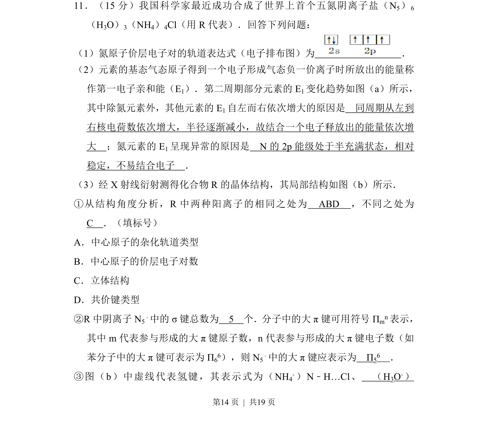
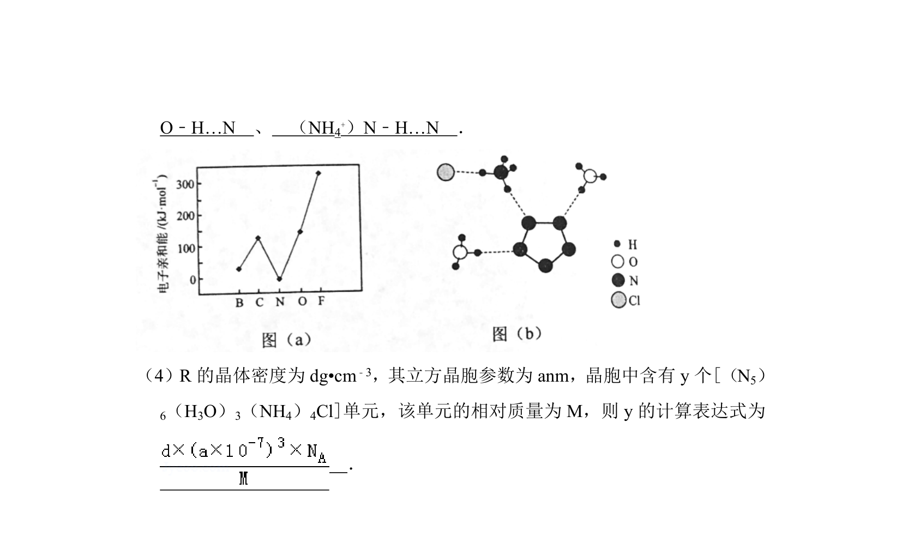
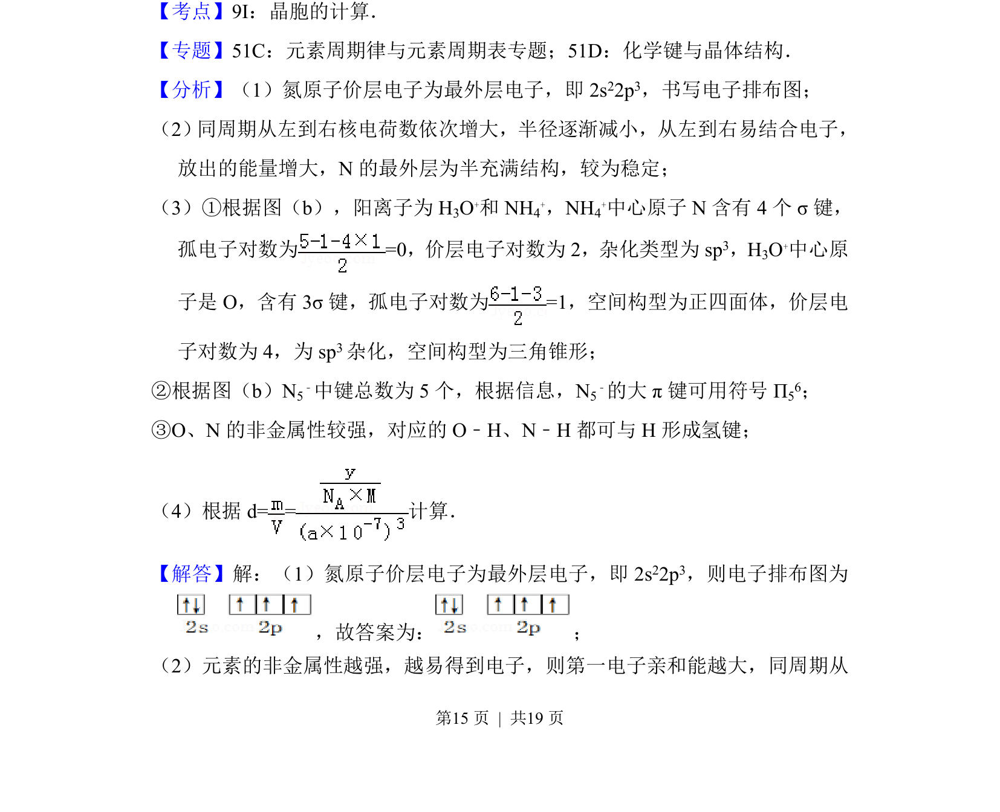
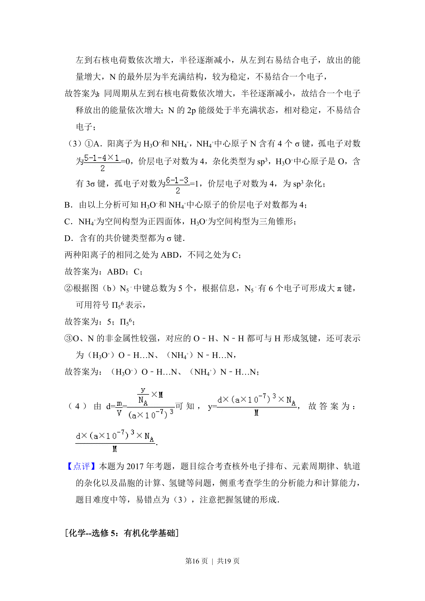

## 题面

## 摘要

该题考查原子电子排布、第一电子亲和能变化规律、晶体的杂化轨道与化学键等知识。

## 关联考点

- [[790-电子排布|电子排布]]
- [[720-杂化轨道|杂化轨道]]
- [[661-大π键|大π键]]
- [[435-氢键|氢键]]

## 答案与解析

> 📄 原 PDF 第 14 页：`素材/真题/吉林/2008-2024·（吉林）化学高考真题/2017年高考化学试卷（新课标Ⅱ）（解析卷）.pdf`
