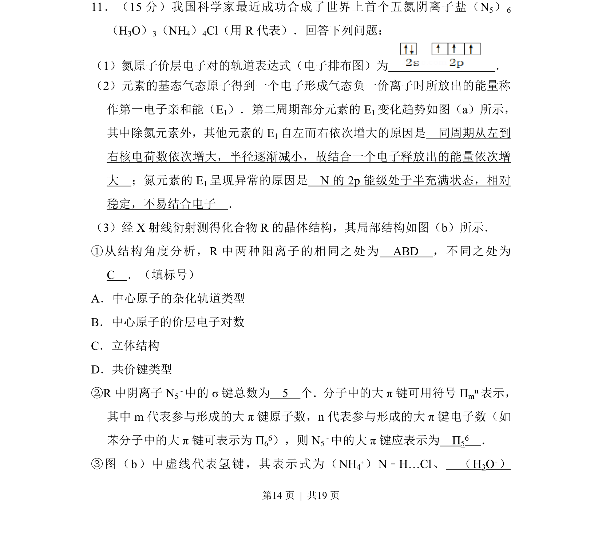
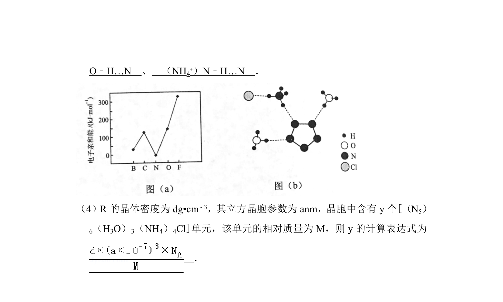
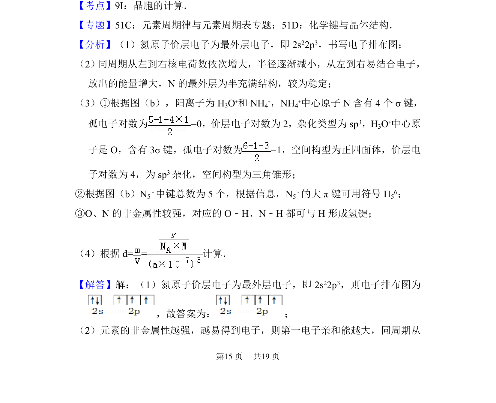
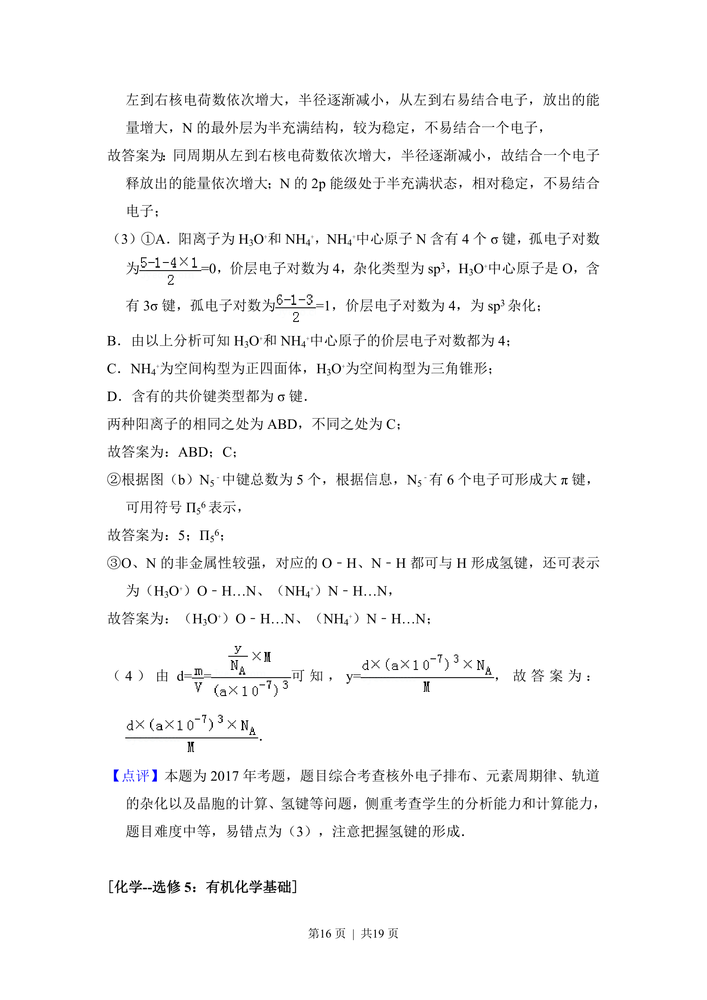

## 题面

## 摘要

该题考查原子电子排布、第一电子亲和能变化规律、晶体的杂化轨道与化学键等知识。

## 关联考点

- [[790-电子排布|电子排布]]
- [[720-杂化轨道|杂化轨道]]
- [[661-大π键|大π键]]
- [[435-氢键|氢键]]

## 答案与解析

> 📄 原 PDF 第 14 页：`素材/真题/吉林/2008-2024·（吉林）化学高考真题/2017年高考化学试卷（新课标Ⅱ）（解析卷）.pdf`

<!-- 题干文本-start -->
## 题干文本
11．（15分）我国科学家最近成功合成了世界上首个五氮阴离子盐（N 5）6
（H3O）3（NH4）4Cl（用R代表）．回答下列问题：
（1）氮原子价层电子对的轨道表达式（电子排布图）为　 　．
（2）元素的基态气态原子得到一个电子形成气态负一价离子时所放出的能量称
作第一电子亲和能（E1）．第二周期部分元素的E 1变化趋势如图（a）所示，
其中除氮元素外，其他元素的E 1自左而右依次增大的原因是　同周期从左到
右核电荷数依次增大，半径逐渐减小，故结合一个电子释放出的能量依次增
大　；氮元素的E 1呈现异常的原因是　N的2p能级处于半充满状态，相对
稳定，不易结合电子　．
（3）经X射线衍射测得化合物R的晶体结构，其局部结构如图（b）所示．
①从结构角度分析，R中两种阳离子的相同之处为　ABD　，不同之处为　
C　．（填标号）
A．中心原子的杂化轨道类型
B．中心原子的价层电子对数
C．立体结构
D．共价键类型
②R中阴离子N 5
﹣中的σ键总数为　5　个．分子中的大π键可用符号Π mn表示，
其中m代表参与形成的大π键原子数，n代表参与形成的大π键电子数（如
苯分子中的大π键可表示为Π 66），则N 5
﹣中的大π键应表示为　Π 56　．
③图（b）中虚线代表氢键，其表示式为（NH 4
+）N﹣H…Cl、　（H 3O+）
<!-- 题干文本-end -->

<!-- 解析文本-start -->
## 解析文本

<!-- 解析文本-end -->
