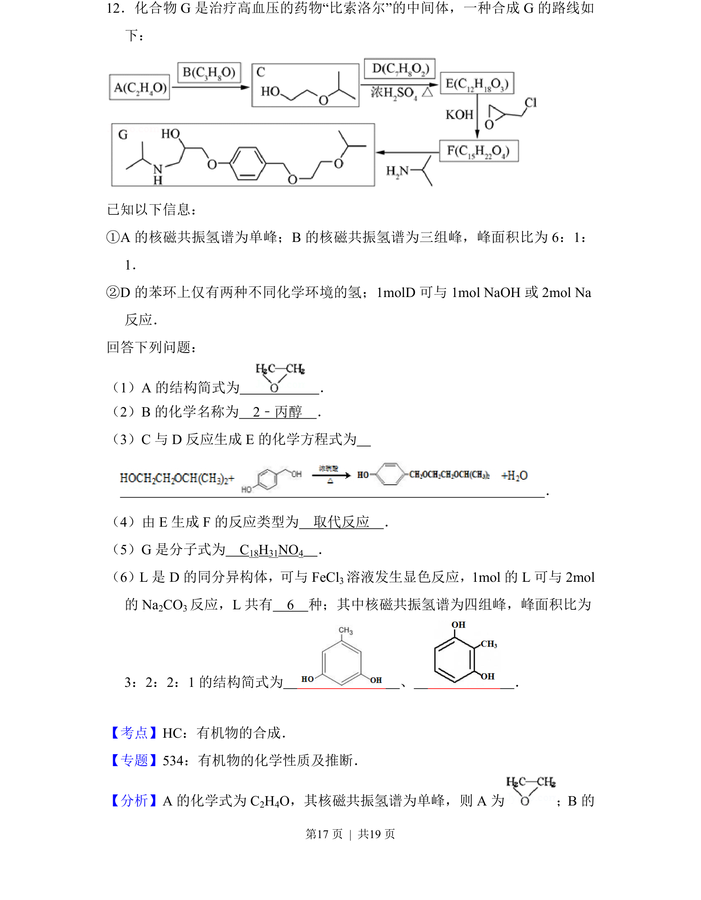
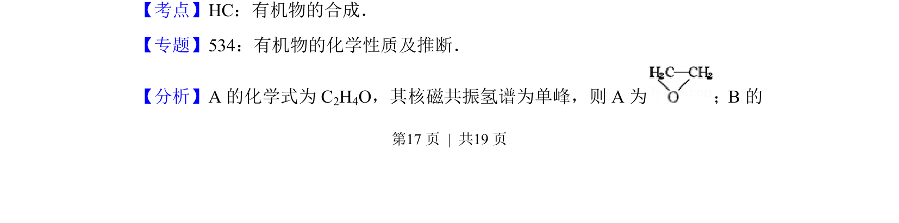
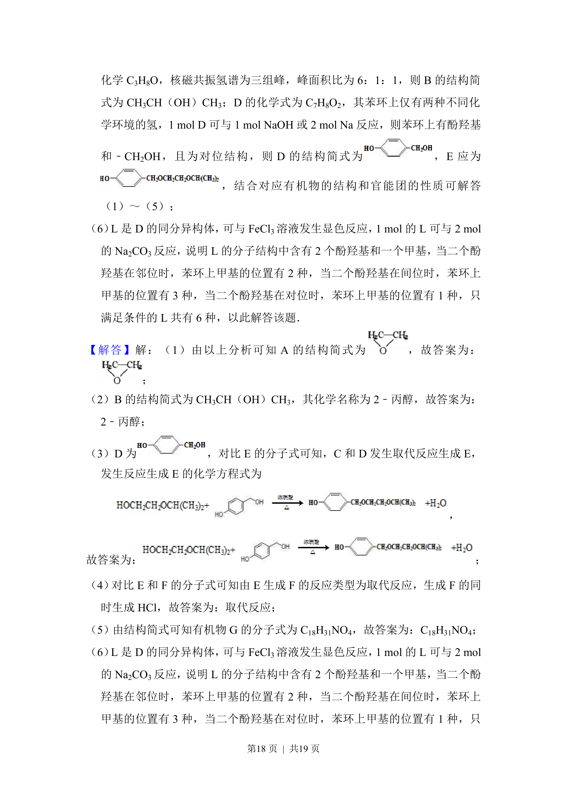
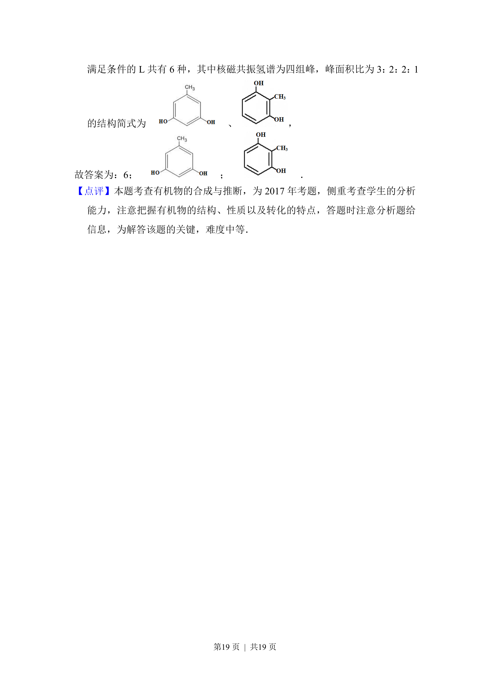

## 题面

## 摘要

以比索洛尔中间体合成为背景，考查有机物结构推断、反应类型、同分异构体书写及谱图分析。

## 关联考点

- [[713-有机物的合成|有机物的合成]]
- [[723-核磁共振氢谱|核磁共振氢谱]]
- [[446-同分异构体|同分异构体]]
- [[646-反应类型|反应类型]]

## 答案与解析

> 📄 原 PDF 第 17 页：`素材/真题/吉林/2008-2024·（吉林）化学高考真题/2017年高考化学试卷（新课标Ⅱ）（解析卷）.pdf`
