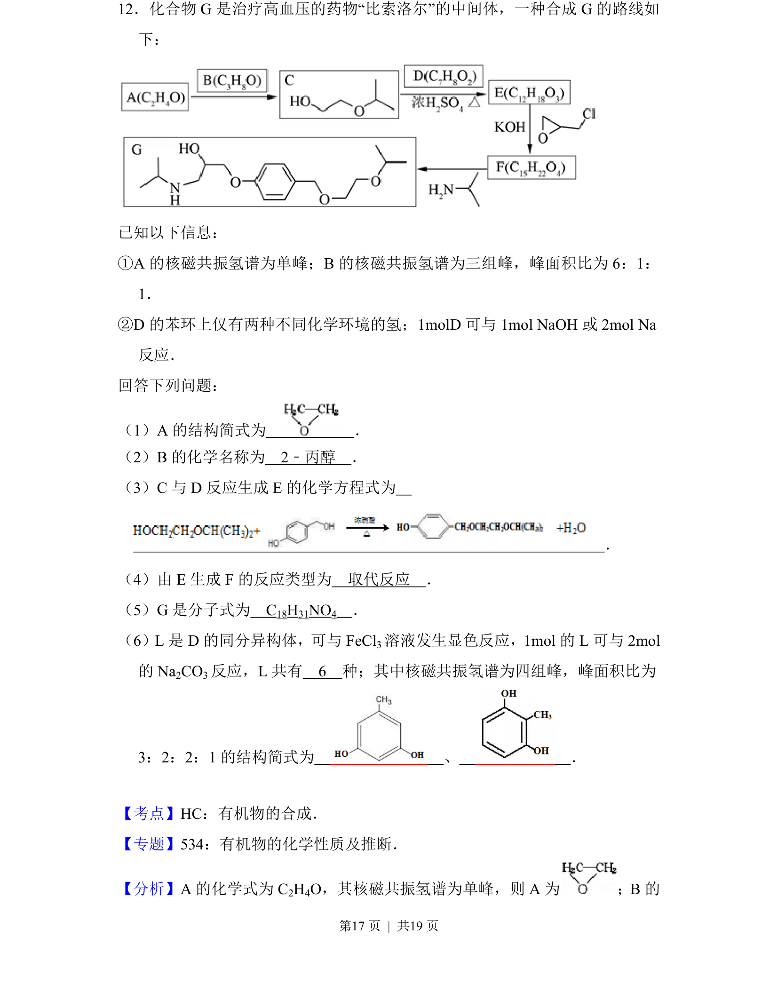
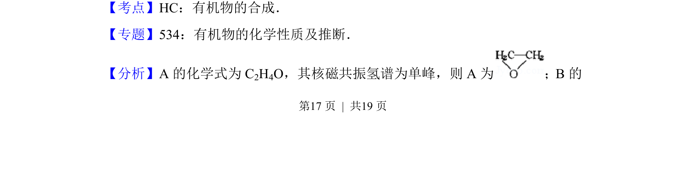
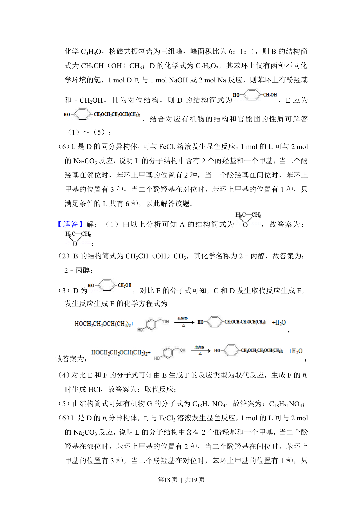
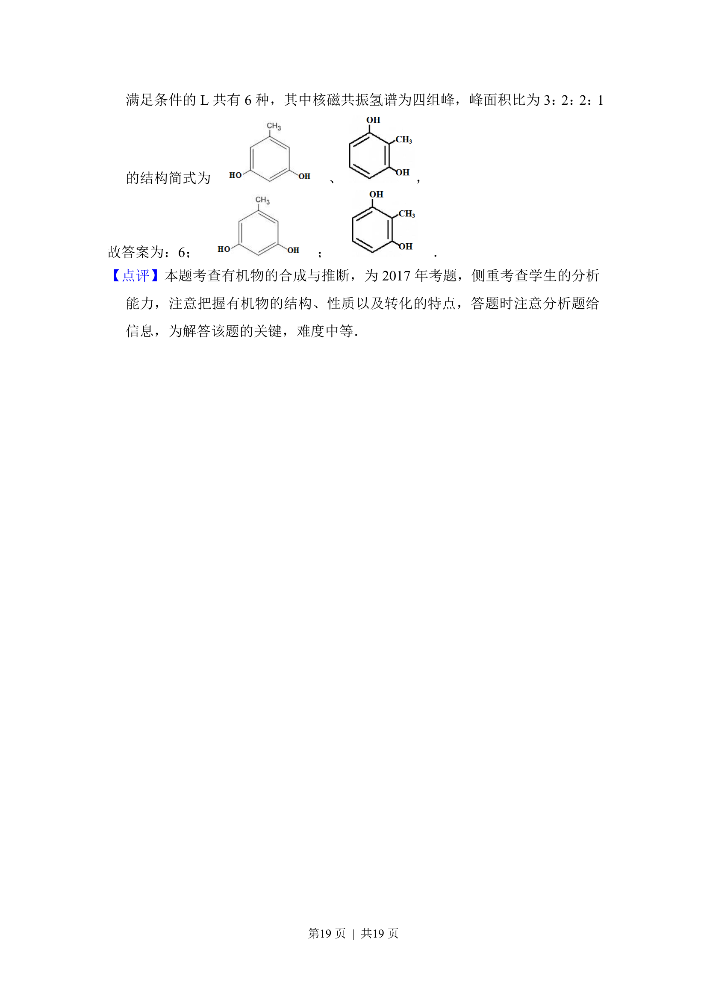

## 题面

## 摘要

以比索洛尔中间体合成为背景，考查有机物结构推断、反应类型、同分异构体书写及谱图分析。

## 关联考点

- [[713-有机物的合成|有机物的合成]]
- [[723-核磁共振氢谱|核磁共振氢谱]]
- [[446-同分异构体|同分异构体]]
- [[646-反应类型|反应类型]]

## 答案与解析

> 📄 原 PDF 第 17 页：`素材/真题/吉林/2008-2024·（吉林）化学高考真题/2017年高考化学试卷（新课标Ⅱ）（解析卷）.pdf`

<!-- 题干文本-start -->
## 题干文本
12．化合物G是治疗高血压的药物“比索洛尔”的中间体，一种合成G的路线如
下：
已知以下信息：
①A的核磁共振氢谱为单峰；B的核磁共振氢谱为三组峰，峰面积比为6：1：
1．
②D的苯环上仅有两种不同化学环境的氢；1molD可与1mol NaOH或2mol Na
反应．
回答下列问题：
（1）A的结构简式为　 　．
（2）B的化学名称为　2﹣丙醇　．
（3）C与D反应生成E的化学方程式为　
　．
（4）由E生成F的反应类型为　取代反应　．
（5）G是分子式为　C 18H31NO4　．
（6）L是D的同分异构体，可与FeCl 3溶液发生显色反应，1mol的L可与2mol
的Na 2CO3反应，L共有　6　种；其中核磁共振氢谱为四组峰，峰面积比为
3：2：2：1的结构简式为　 　、　 　．
<!-- 题干文本-end -->

<!-- 解析文本-start -->
## 解析文本
【考点】HC：有机物的合成．菁优网版权所有
【专题】534：有机物的化学性质及推断．
【分析】A的化学式为C 2H4O，其核磁共振氢谱为单峰，则A为 ；B的
<!-- 解析文本-end -->
