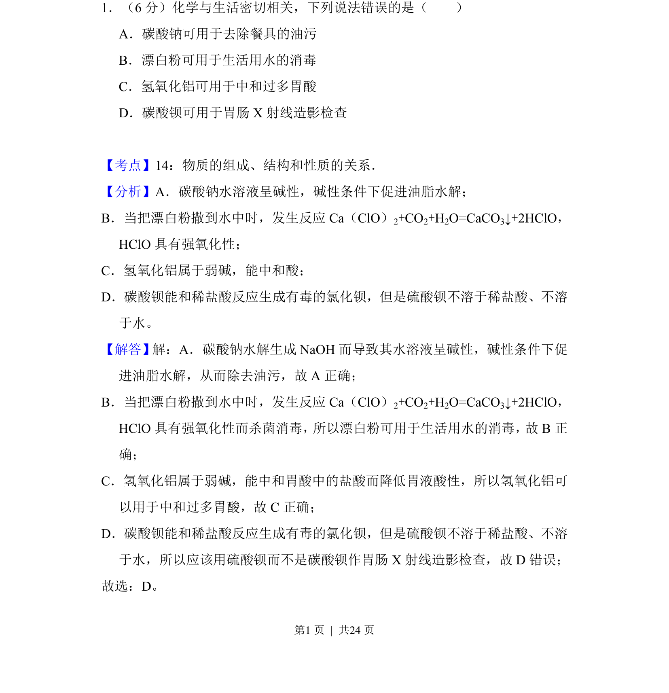
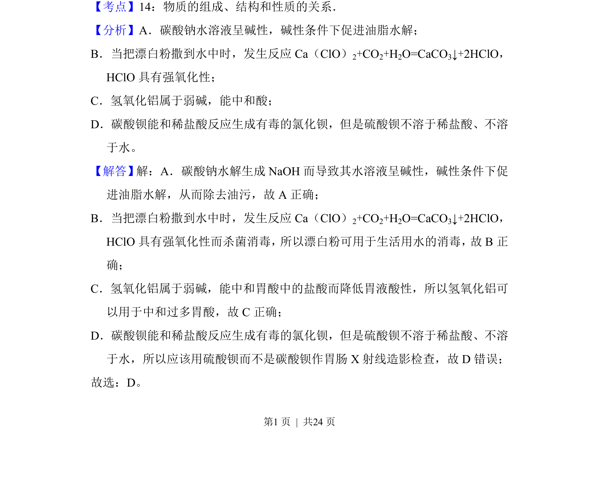
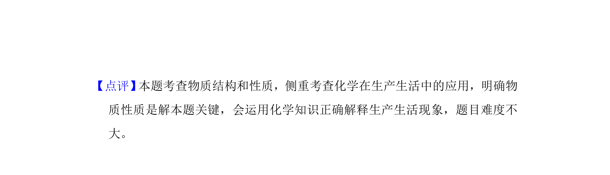

## 题面

## 摘要

考查常见无机物性质与用途的正误判断，涉及碳酸钠、漂白粉、氢氧化铝、碳酸钡。

## 关联考点

- [[777-物质的性质与用途|物质的性质与用途]]
- [[336-盐类水解|盐类水解]]
- [[686-强氧化性|强氧化性]]
- [[330-沉淀转化|沉淀转化]]

## 答案与解析

> 📄 原 PDF 第 1 页：`素材/真题/吉林/2008-2024·（吉林）化学高考真题/2018年高考化学试卷（新课标Ⅱ）（解析卷）.pdf`

<!-- 题干文本-start -->
## 题干文本
1．（6分）化学与生活密切相关，下列说法错误的是（　　）
A．碳酸钠可用于去除餐具的油污
B．漂白粉可用于生活用水的消毒
C．氢氧化铝可用于中和过多胃酸
D．碳酸钡可用于胃肠X射线造影检查
<!-- 题干文本-end -->

<!-- 解析文本-start -->
## 解析文本
【考点】14：物质的组成、结构和性质的关系．菁优网版权所有
【分析】A．碳酸钠水溶液呈碱性，碱性条件下促进油脂水解；
B．当把漂白粉撒到水中时，发生反应Ca（ClO） 2+CO2+H2O=CaCO3↓+2HClO，
HClO具有强氧化性；
C．氢氧化铝属于弱碱，能中和酸；
D．碳酸钡能和稀盐酸反应生成有毒的氯化钡，但是硫酸钡不溶于稀盐酸、不溶
于水。
【解答】解：A．碳酸钠水解生成NaOH而导致其水溶液呈碱性，碱性条件下促
进油脂水解，从而除去油污，故A正确；
B．当把漂白粉撒到水中时，发生反应Ca（ClO） 2+CO2+H2O=CaCO3↓+2HClO，
HClO具有强氧化性而杀菌消毒， 所以漂白粉可用于生活用水的消毒， 故B正
确；
C．氢氧化铝属于弱碱，能中和胃酸中的盐酸而降低胃液酸性，所以氢氧化铝可
以用于中和过多胃酸，故C正确；
D．碳酸钡能和稀盐酸反应生成有毒的氯化钡，但是硫酸钡不溶于稀盐酸、不溶
于水，所以应该用硫酸钡而不是碳酸钡作胃肠X射线造影检查，故D错误；
故选：D。
<!-- 解析文本-end -->
