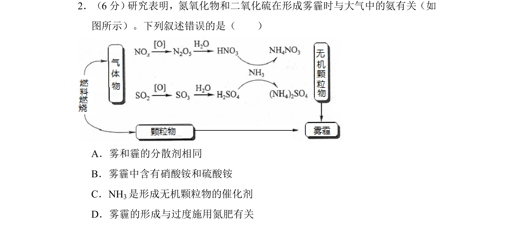
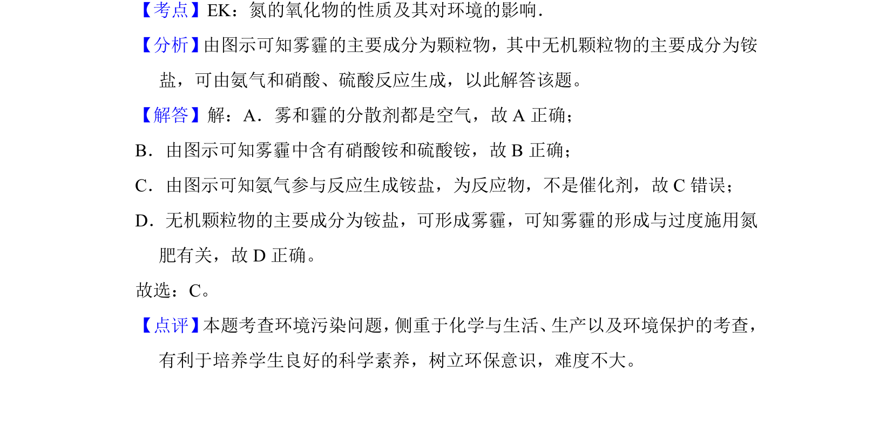

## 题面

## 摘要

雾霾形成中氮氧化物、二氧化硫与氨的反应，考查分散剂、铵盐和催化剂等概念。

## 关联考点

- [[738-氮的氧化物性质|氮的氧化物性质]]
- [[152-分散系|分散系]]
- [[039-催化剂|催化剂]]
- [[074-环境污染|环境污染]]

## 答案与解析

> 📄 原 PDF 第 2 页：`素材/真题/吉林/2008-2024·（吉林）化学高考真题/2018年高考化学试卷（新课标Ⅱ）（解析卷）.pdf`
