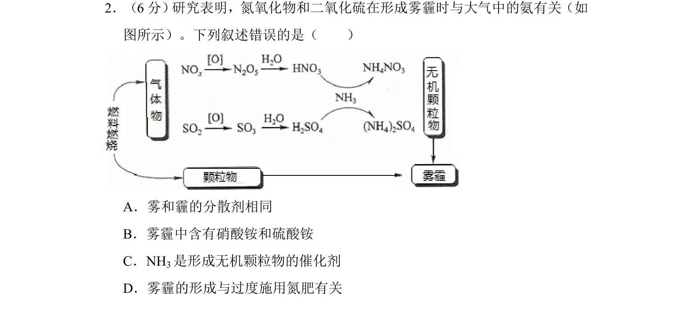
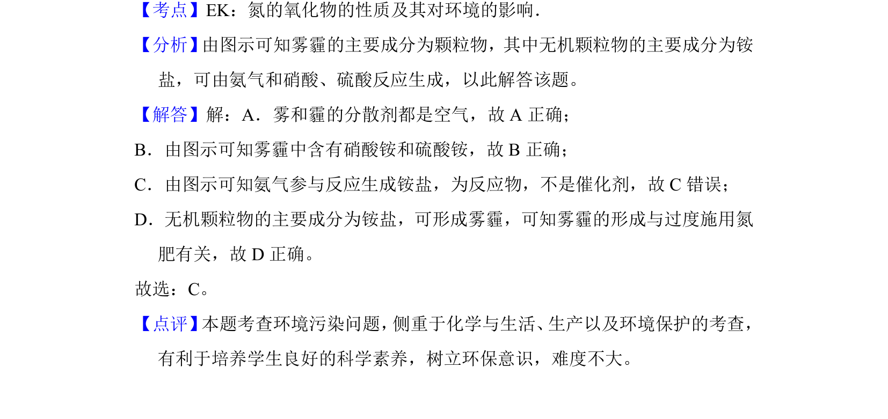

## 题面

## 摘要

雾霾形成中氮氧化物、二氧化硫与氨的反应，考查分散剂、铵盐和催化剂等概念。

## 关联考点

- [[738-氮的氧化物性质|氮的氧化物性质]]
- [[152-分散系|分散系]]
- [[039-催化剂|催化剂]]
- [[074-环境污染|环境污染]]

## 答案与解析

> 📄 原 PDF 第 2 页：`素材/真题/吉林/2008-2024·（吉林）化学高考真题/2018年高考化学试卷（新课标Ⅱ）（解析卷）.pdf`

<!-- 题干文本-start -->
## 题干文本
2．（6分） 研究表明，氮氧化物和二氧化硫在形成雾霾时与大气中的氨有关（如
图所示）。下列叙述错误的是（　　）
A．雾和霾的分散剂相同
B．雾霾中含有硝酸铵和硫酸铵
C．NH3是形成无机颗粒物的催化剂
D．雾霾的形成与过度施用氮肥有关
<!-- 题干文本-end -->

<!-- 解析文本-start -->
## 解析文本
【考点】EK：氮的氧化物的性质及其对环境的影响．菁优网版权所有
【分析】 由图示可知雾霾的主要成分为颗粒物，其中无机颗粒物的主要成分为铵
盐，可由氨气和硝酸、硫酸反应生成，以此解答该题。
【解答】解：A．雾和霾的分散剂都是空气，故A正确；
B．由图示可知雾霾中含有硝酸铵和硫酸铵，故B正确；
C．由图示可知氨气参与反应生成铵盐，为反应物，不是催化剂，故C错误；
D．无机颗粒物的主要成分为铵盐，可形成雾霾，可知雾霾的形成与过度施用氮
肥有关，故D正确。
故选：C。
【点评】 本题考查环境污染问题， 侧重于化学与生活、 生产以及环境保护的考查，
有利于培养学生良好的科学素养，树立环保意识，难度不大。
<!-- 解析文本-end -->
