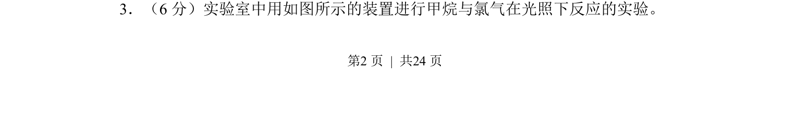
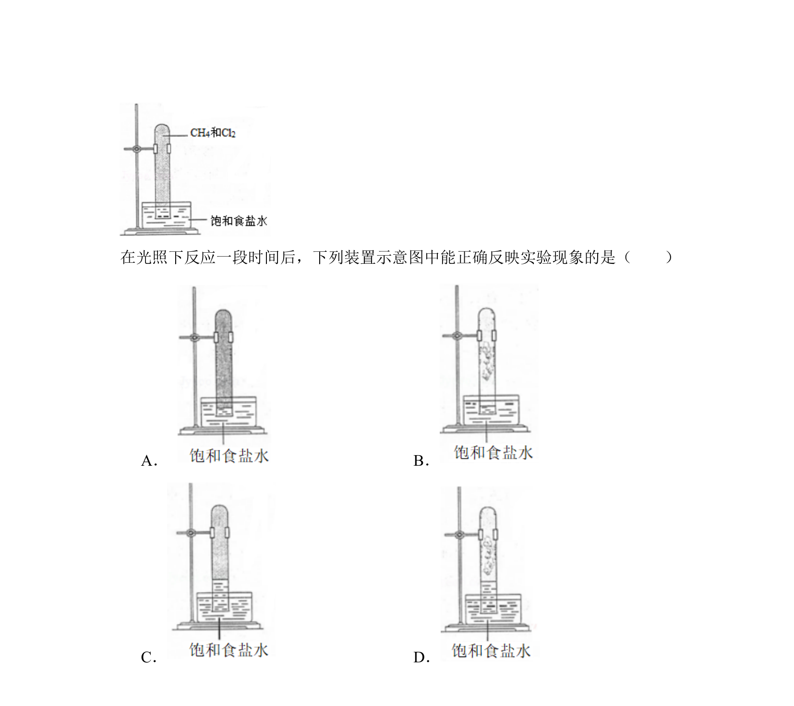
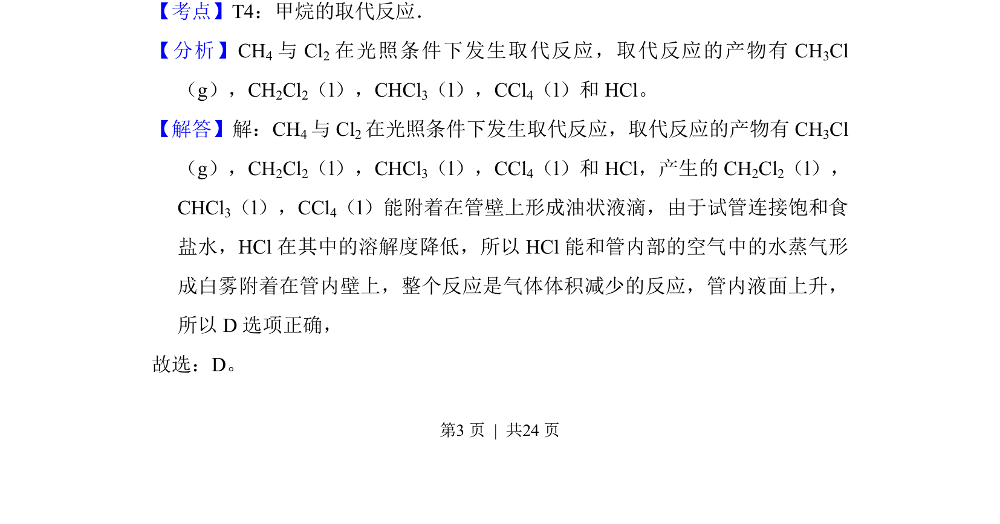
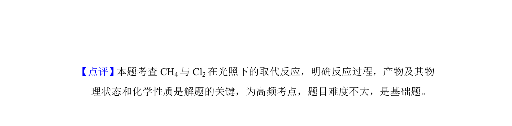

## 题面

## 摘要

甲烷与氯气在光照下发生取代反应的实验原理、现象及产物判断。

## 关联考点

- [[789-甲烷的取代反应|甲烷的取代反应]]
- [[830-自由基取代|自由基取代]]
- [[246-甲烷取代反应|卤代反应]]
- [[672-实验现象|实验现象]]

## 答案与解析

> 📄 原 PDF 第 2 页：`素材/真题/吉林/2008-2024·（吉林）化学高考真题/2018年高考化学试卷（新课标Ⅱ）（解析卷）.pdf`
