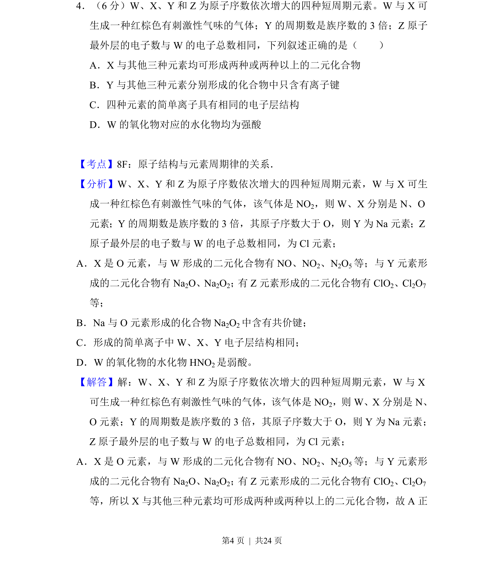
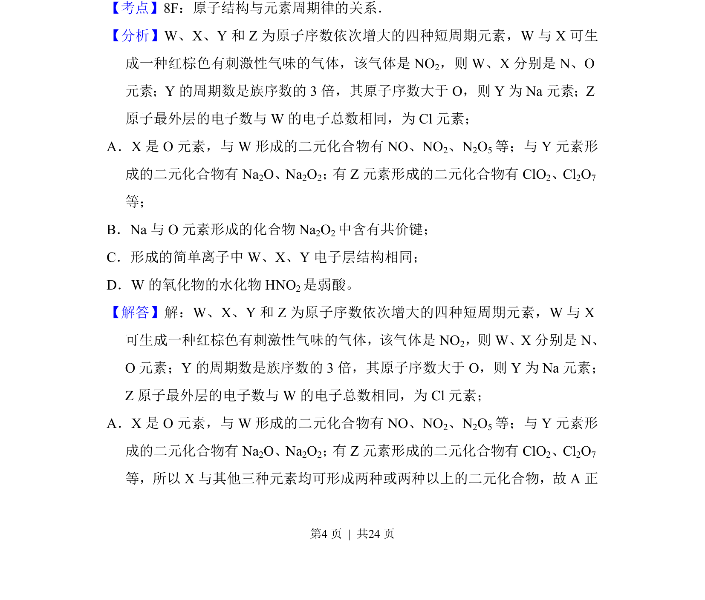
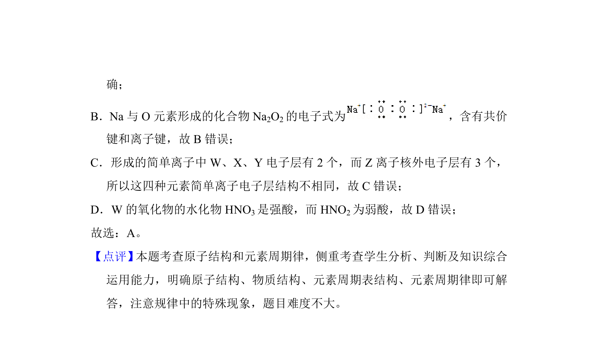

## 题面

## 摘要

W、X、Y、Z短周期元素推断及化合物性质判断

## 关联考点

- [[426-原子结构|原子结构]]
- [[252-元素周期律|元素周期律]]
- [[268-离子键|离子键]]
- [[588-二元化合物|二元化合物]]

## 答案与解析

> 📄 原 PDF 第 4 页：`素材/真题/吉林/2008-2024·（吉林）化学高考真题/2018年高考化学试卷（新课标Ⅱ）（解析卷）.pdf`
