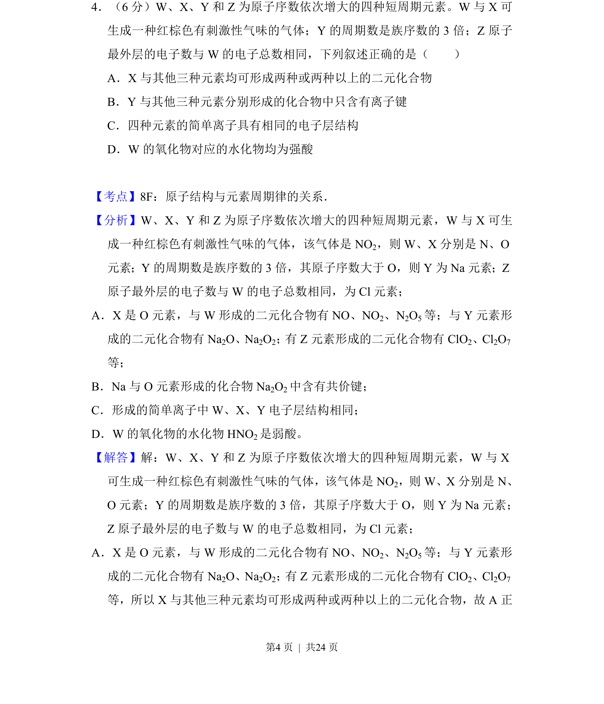
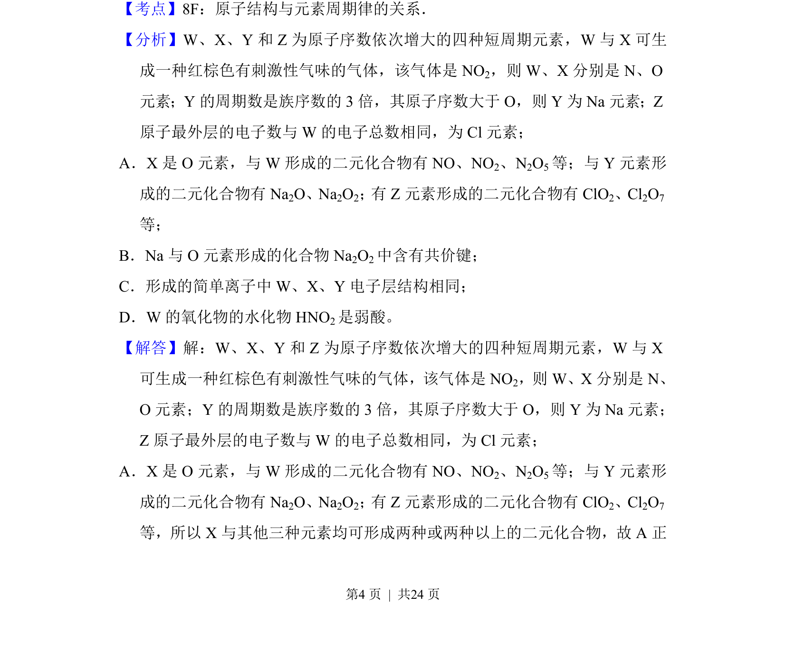
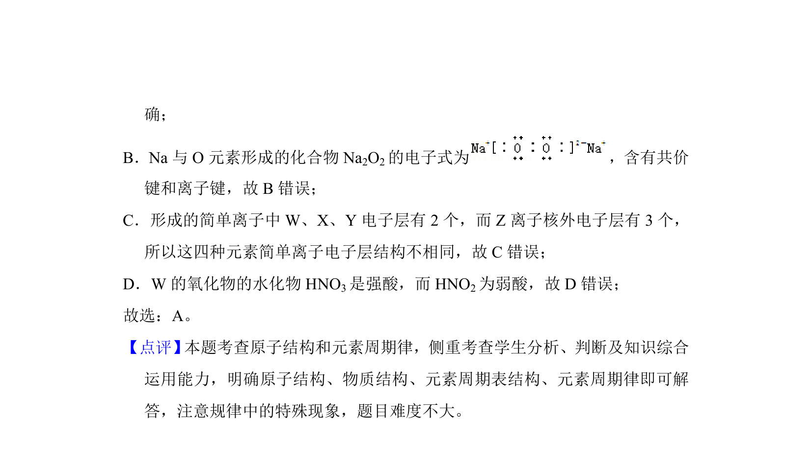

## 题面

## 摘要

W、X、Y、Z短周期元素推断及化合物性质判断

## 关联考点

- [[426-原子结构|原子结构]]
- [[252-元素周期律|元素周期律]]
- [[268-离子键|离子键]]
- [[588-二元化合物|二元化合物]]

## 答案与解析

> 📄 原 PDF 第 4 页：`素材/真题/吉林/2008-2024·（吉林）化学高考真题/2018年高考化学试卷（新课标Ⅱ）（解析卷）.pdf`

<!-- 题干文本-start -->
## 题干文本
4．（6分）W、X、Y和Z为原子序数依次增大的四种短周期元素。W与X可
生成一种红棕色有刺激性气味的气体；Y的周期数是族序数的3倍；Z原子
最外层的电子数与W的电子总数相同，下列叙述正确的是（　　）
A．X与其他三种元素均可形成两种或两种以上的二元化合物
B．Y与其他三种元素分别形成的化合物中只含有离子键
C．四种元素的简单离子具有相同的电子层结构
D．W的氧化物对应的水化物均为强酸
<!-- 题干文本-end -->

<!-- 解析文本-start -->
## 解析文本
【考点】8F：原子结构与元素周期律的关系．菁优网版权所有
【分析】W、X、Y和Z为原子序数依次增大的四种短周期元素，W与X可生
成一种红棕色有刺激性气味的气体，该气体是NO 2，则W、X分别是N、O
元素；Y的周期数是族序数的3倍，其原子序数大于O，则Y为Na元素；Z
原子最外层的电子数与W的电子总数相同，为Cl元素；
A．X是O元素，与W形成的二元化合物有NO、NO 2、N2O5等；与Y元素形
成的二元化合物有Na 2O、Na2O2； 有Z元素形成的二元化合物有ClO2、Cl2O7
等；
B．Na与O元素形成的化合物Na 2O2中含有共价键；
C．形成的简单离子中W、X、Y电子层结构相同；
D．W的氧化物的水化物HNO 2是弱酸。
【解答】解：W、X、Y和Z为原子序数依次增大的四种短周期元素，W与X
可生成一种红棕色有刺激性气味的气体，该气体是NO 2，则W、X分别是N、
O元素；Y的周期数是族序数的3倍，其原子序数大于O，则Y为Na元素；
Z原子最外层的电子数与W的电子总数相同，为Cl元素；
A．X是O元素，与W形成的二元化合物有NO、NO 2、N2O5等；与Y元素形
成的二元化合物有Na 2O、Na2O2； 有Z元素形成的二元化合物有ClO2、Cl2O7
等，所以X与其他三种元素均可形成两种或两种以上的二元化合物，故A正
<!-- 解析文本-end -->
