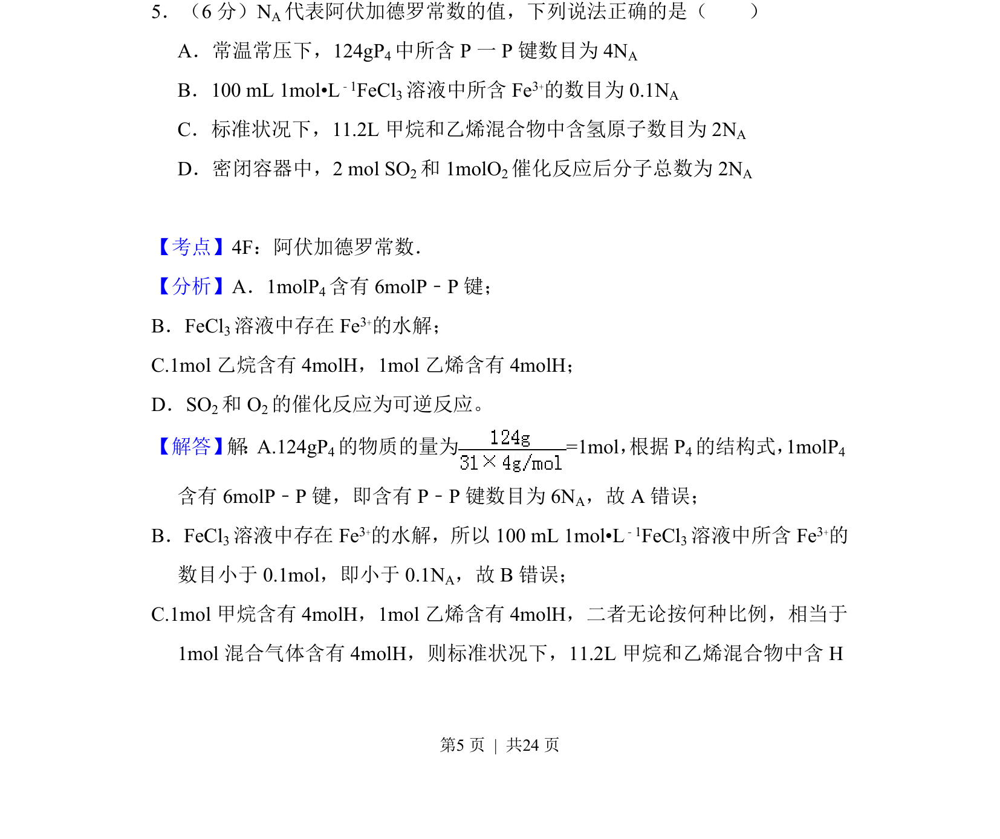
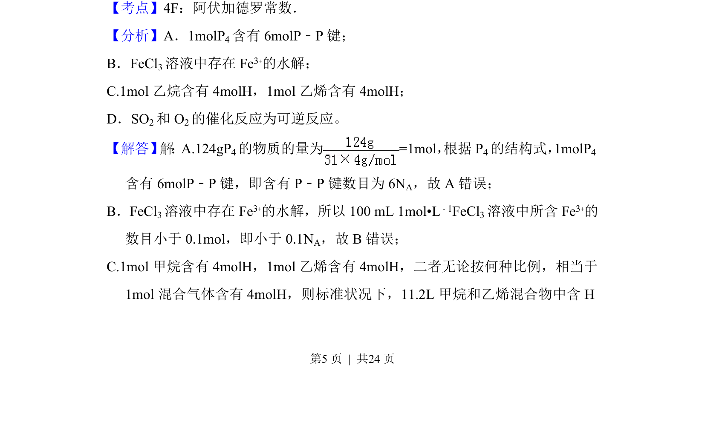
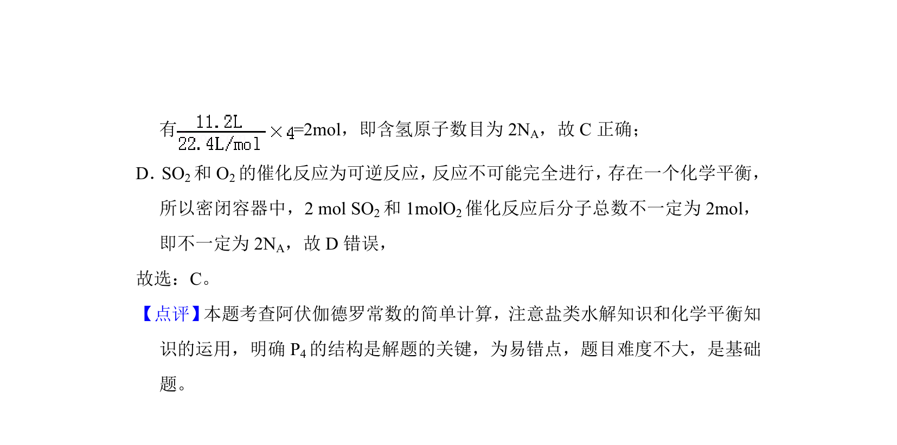

## 题面

## 摘要

考查阿伏加德罗常数应用，涵盖物质结构、盐类水解、气体摩尔体积及可逆反应计算。

## 关联考点

- [[450-阿伏伽德罗常数|阿伏加德罗常数]]
- [[物质的量]]
- [[气体摩尔体积]]
- [[289-可逆反应|可逆反应]]

## 答案与解析

> 📄 原 PDF 第 5 页：`素材/真题/吉林/2008-2024·（吉林）化学高考真题/2018年高考化学试卷（新课标Ⅱ）（解析卷）.pdf`
