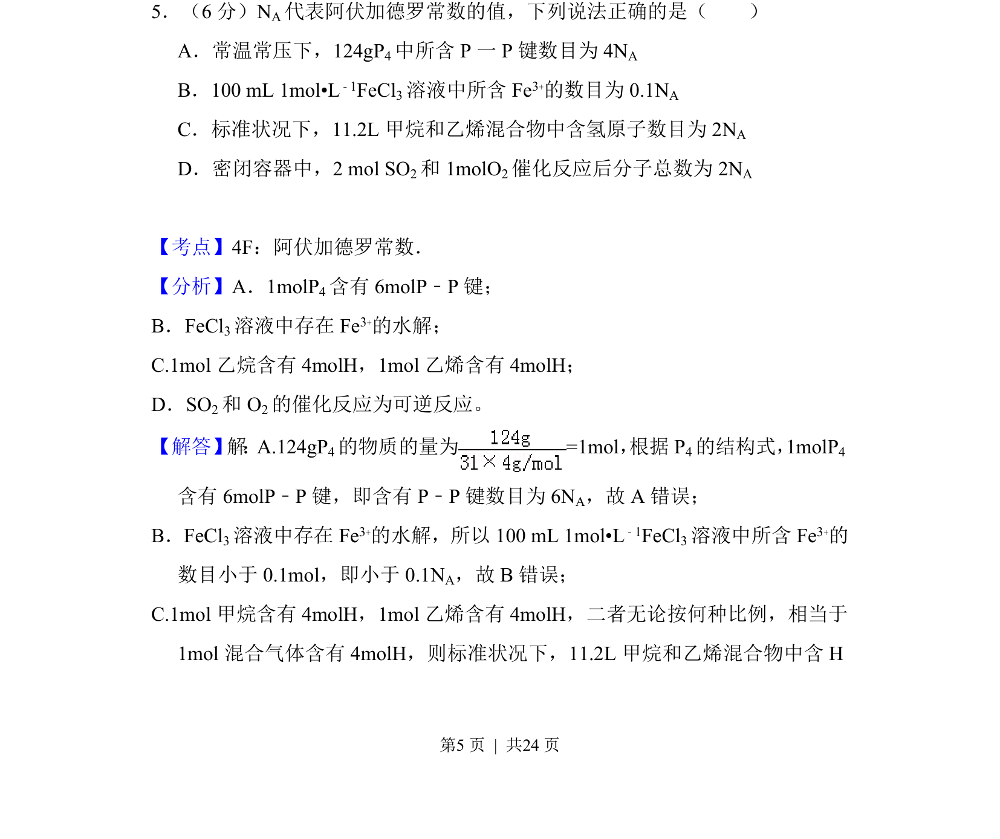
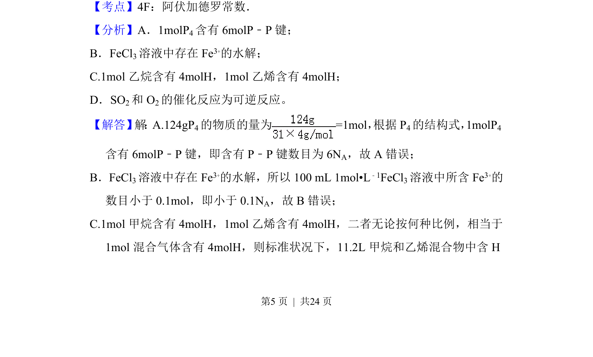
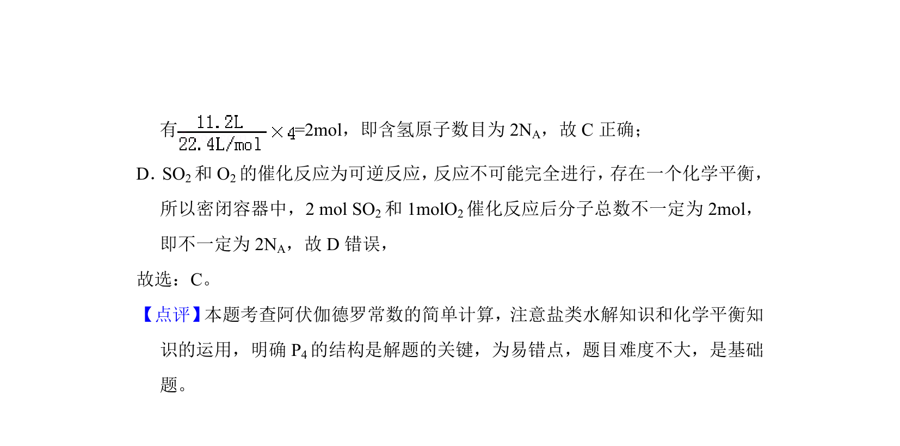

## 题面

## 摘要

考查阿伏加德罗常数应用，涵盖物质结构、盐类水解、气体摩尔体积及可逆反应计算。

## 关联考点

- [[450-阿伏伽德罗常数|阿伏加德罗常数]]
- [[779-物质的量|物质的量]]
- [[727-气体摩尔体积|气体摩尔体积]]
- [[289-可逆反应|可逆反应]]

## 答案与解析

> 📄 原 PDF 第 5 页：`素材/真题/吉林/2008-2024·（吉林）化学高考真题/2018年高考化学试卷（新课标Ⅱ）（解析卷）.pdf`

<!-- 题干文本-start -->
## 题干文本
5．（6分）N A代表阿伏加德罗常数的值，下列说法正确的是（　　）
A．常温常压下，124gP4中所含P一P键数目为4N A
B．100 mL 1mol•L﹣1FeCl3溶液中所含Fe 3+的数目为0.1N A
C．标准状况下，11.2L甲烷和乙烯混合物中含氢原子数目为2N A
D．密闭容器中，2 mol SO2和1molO 2催化反应后分子总数为2N A
<!-- 题干文本-end -->

<!-- 解析文本-start -->
## 解析文本
【考点】4F：阿伏加德罗常数．菁优网版权所有
【分析】A．1molP4含有6molP﹣P键；
B．FeCl3溶液中存在Fe 3+的水解；
C.1mol乙烷含有4molH，1mol乙烯含有4molH；
D．SO2和O 2的催化反应为可逆反应。
【解答】 解 ：A.124gP4的物质的量为=1mol， 根据P 4的结构式，1molP4
含有6molP﹣P键，即含有P﹣P键数目为6N A，故A错误；
B．FeCl3溶液中存在Fe 3+的水解，所以100 mL 1mol•L ﹣1FeCl3溶液中所含Fe 3+的
数目小于0.1mol，即小于0.1N A，故B错误；
C.1mol甲烷含有4molH，1mol乙烯含有4molH，二者无论按何种比例，相当于
1mol混合气体含有4molH，则标准状况下，11.2L甲烷和乙烯混合物中含H
<!-- 解析文本-end -->
