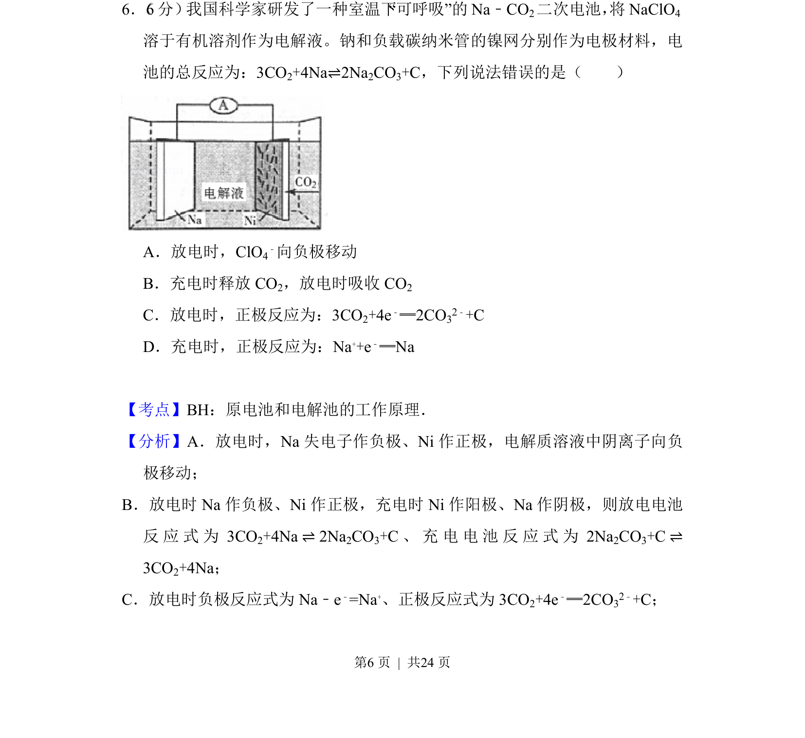
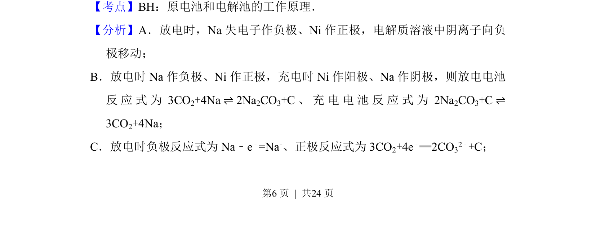
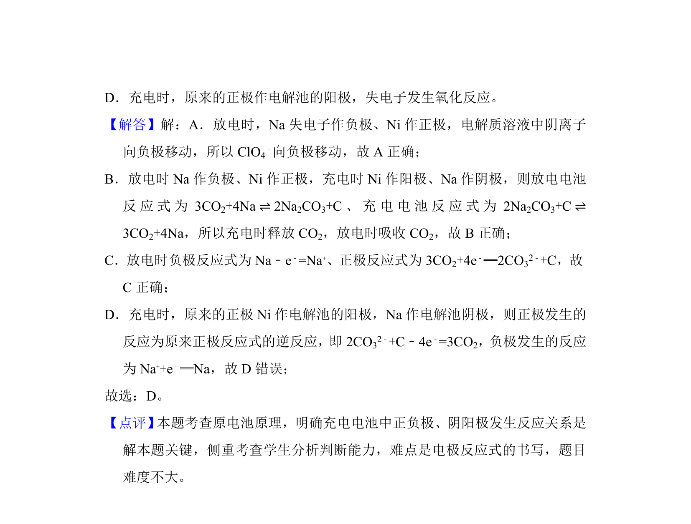

## 题面

## 摘要

Na-CO2二次电池工作原理，判断电极反应及离子移动方向

## 关联考点

- [[287-原电池|原电池]]
- [[368-电解池|电解池]]
- [[793-电极反应|电极反应]]

## 答案与解析

> 📄 原 PDF 第 6 页：`素材/真题/吉林/2008-2024·（吉林）化学高考真题/2018年高考化学试卷（新课标Ⅱ）（解析卷）.pdf`

<!-- 题干文本-start -->
## 题干文本
6． （6分） 我国科学家研发了一种室温下“可呼吸”的Na﹣CO2二次电池， 将NaClO4
溶于有机溶剂作为电解液。钠和负载碳纳米管的镍网分别作为电极材料，电
池的总反应为：3CO2+4Na⇌2Na2CO3+C，下列说法错误的是（　　）
A．放电时，ClO4
﹣向负极移动
B．充电时释放CO 2，放电时吸收CO 2
C．放电时，正极反应为：3CO2+4e﹣═2CO32﹣+C
D．充电时，正极反应为：Na++e﹣═Na
<!-- 题干文本-end -->

<!-- 解析文本-start -->
## 解析文本
【考点】BH：原电池和电解池的工作原理．菁优网版权所有
【分析】A．放电时，Na失电子作负极、Ni作正极，电解质溶液中阴离子向负
极移动；
B．放电时Na作负极、Ni作正极，充电时Ni作阳极、Na作阴极，则放电电池
反应式为3CO 2+4Na⇌2Na 2CO3+C、充电电池反应式为2Na 2CO3+C⇌
3CO2+4Na；
C．放电时负极反应式为Na﹣e ﹣=Na+、正极反应式为3CO 2+4e﹣═2CO32﹣+C；
<!-- 解析文本-end -->
