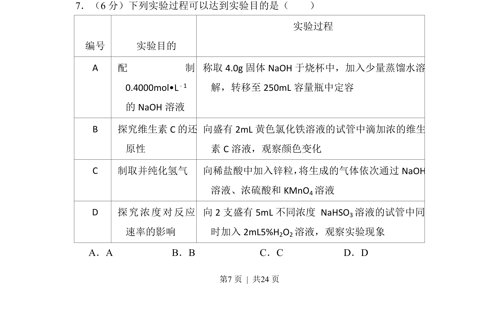
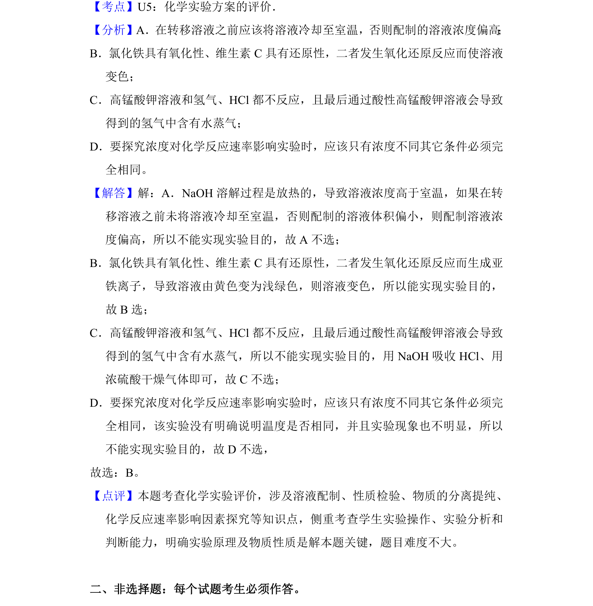

## 题面

## 摘要

该题判断各实验方案能否达到目的，涉及实验操作与原理的匹配性

## 关联考点

- [[实验方案评价]]
- [[一定物质的量浓度溶液配制]]
- [[162-氧化还原反应|氧化还原反应]]
- [[反应速率影响因素]]

## 答案与解析

> 📄 原 PDF 第 7 页：`素材/真题/吉林/2008-2024·（吉林）化学高考真题/2018年高考化学试卷（新课标Ⅱ）（解析卷）.pdf`
