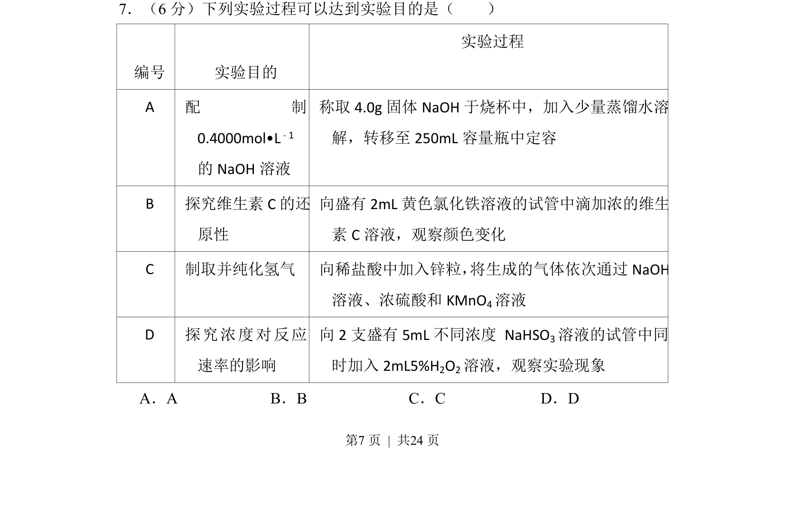
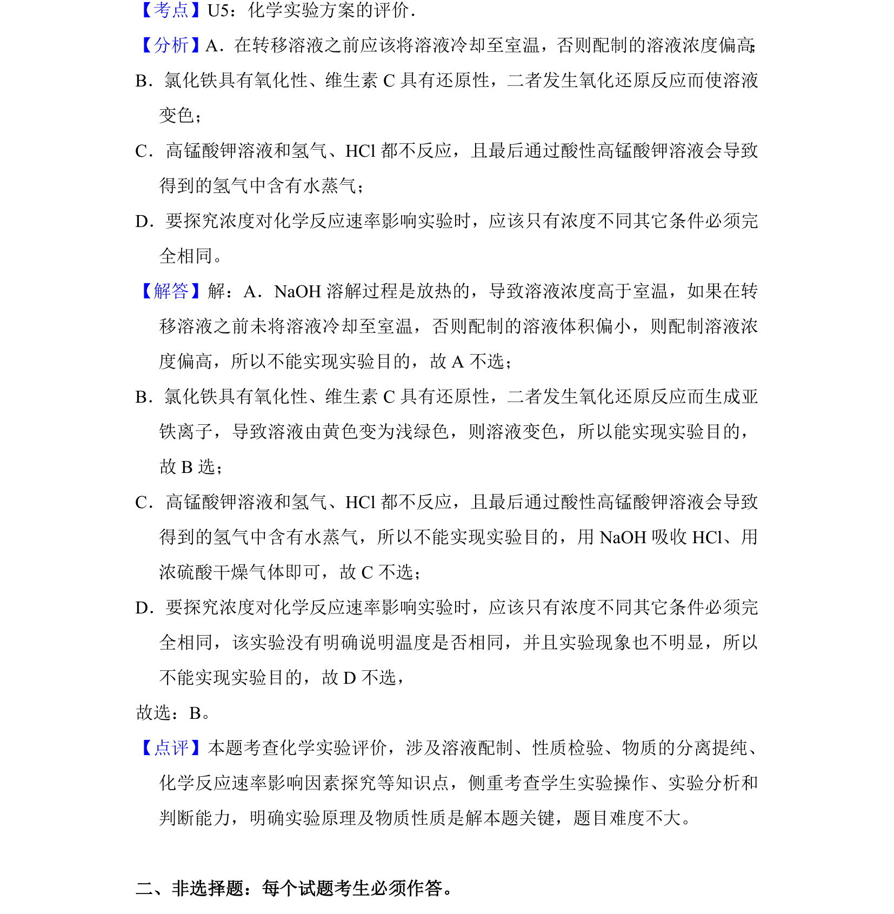

## 题面

## 摘要

该题判断各实验方案能否达到目的，涉及实验操作与原理的匹配性

## 关联考点

- [[613-化学实验方案评价|实验方案评价]]
- [[908-一定物质的量浓度溶液的配制|一定物质的量浓度溶液配制]]
- [[162-氧化还原反应|氧化还原反应]]
- [[534-反应速率影响因素|反应速率影响因素]]

## 答案与解析

> 📄 原 PDF 第 7 页：`素材/真题/吉林/2008-2024·（吉林）化学高考真题/2018年高考化学试卷（新课标Ⅱ）（解析卷）.pdf`

<!-- 题干文本-start -->
## 题干文本
7．（6分）下列实验过程可以达到实验目的是（　　）
 编号  实验目的
 实验过程
 A  配 制 
0.4000mol•L﹣1
的NaOH溶液
 称取4.0g固体NaOH于烧杯中，加入少量蒸馏水溶
解，转移至250mL容量瓶中定容
 B  探究维生素C的还
原性
 向盛有2mL黄色氯化铁溶液的试管中滴加浓的维生
素C溶液，观察颜色变化
 C  制取并纯化氢气  向稀盐酸中加入锌粒， 将生成的气体依次通过NaOH
溶液、浓硫酸和KMnO 4溶液
 D  探究浓度对反应
速率的影响
 向2支盛有5mL不同浓度 NaHSO 3溶液的试管中同
时加入2mL5%H 2O2溶液，观察实验现象
A．A B．B C．C D．D
<!-- 题干文本-end -->

<!-- 解析文本-start -->
## 解析文本

<!-- 解析文本-end -->
