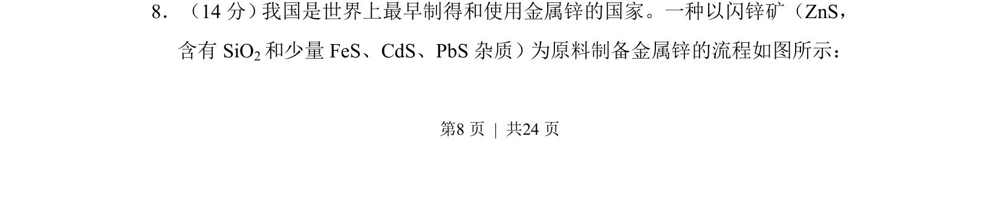
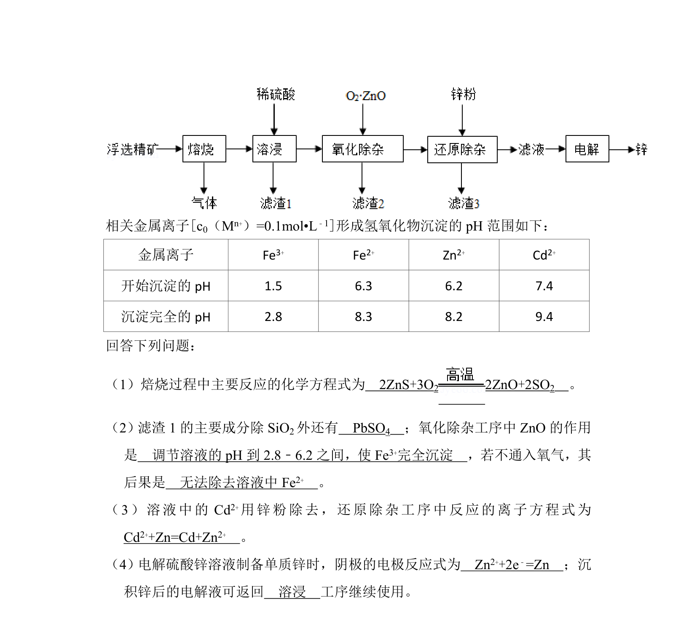
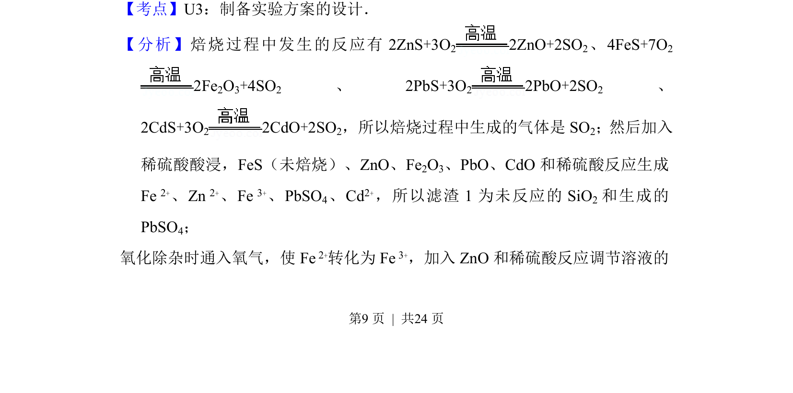
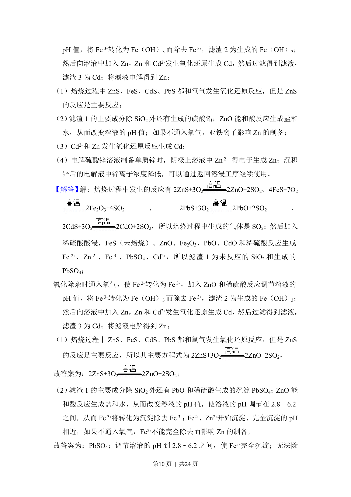
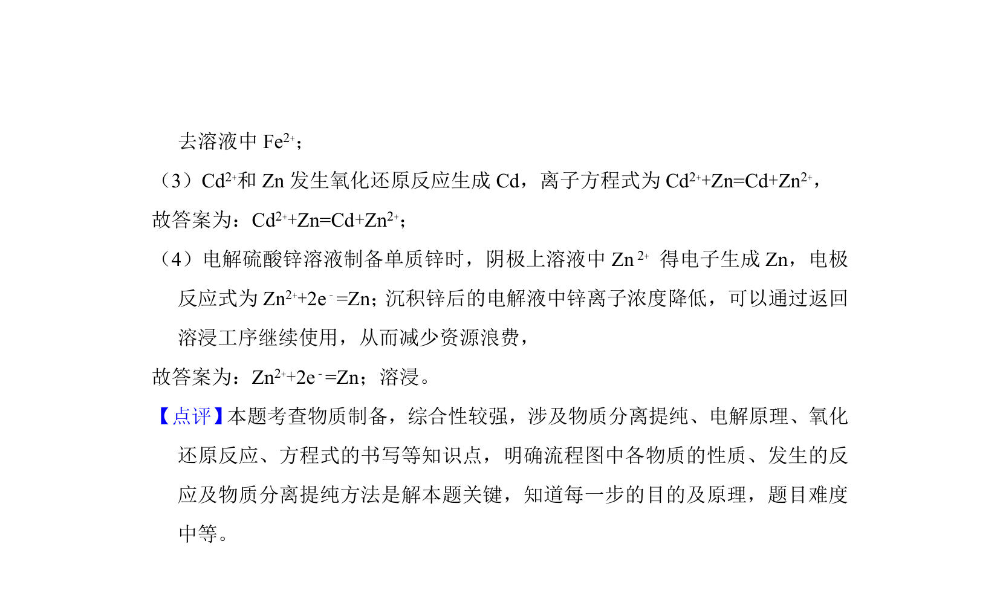

## 题面

## 摘要

该题考查化学工艺流程分析，涉及闪锌矿制备金属锌的分离与提纯步骤。

## 关联考点

- [[624-化学流程分析|化学流程分析]]
- [[597-元素化合物性质|元素化合物性质]]
- [[533-反应原理|反应原理]]
- [[580-实验操作|实验操作]]

## 答案与解析

> 📄 原 PDF 第 8 页：`素材/真题/吉林/2008-2024·（吉林）化学高考真题/2018年高考化学试卷（新课标Ⅱ）（解析卷）.pdf`
