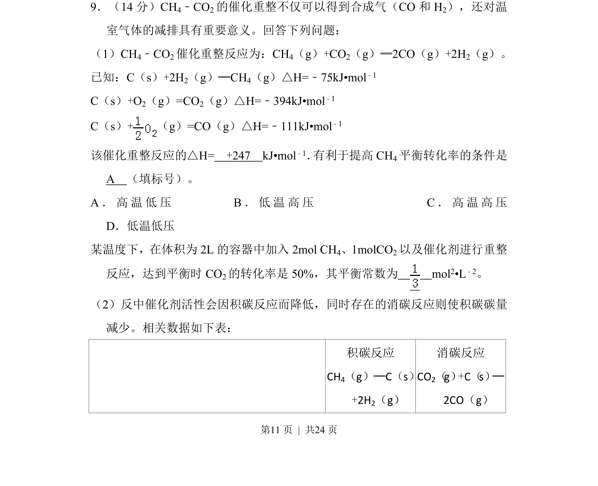
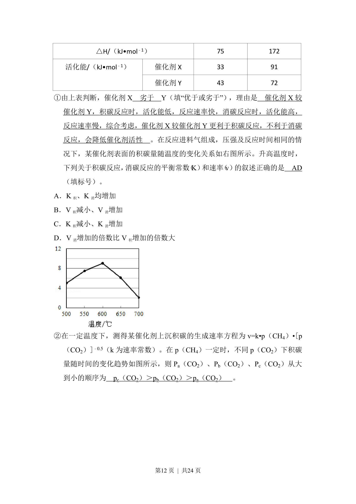
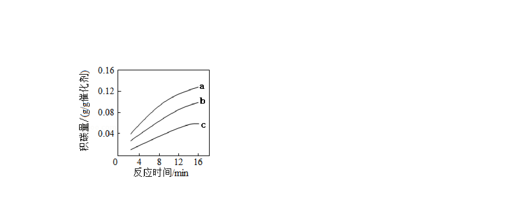
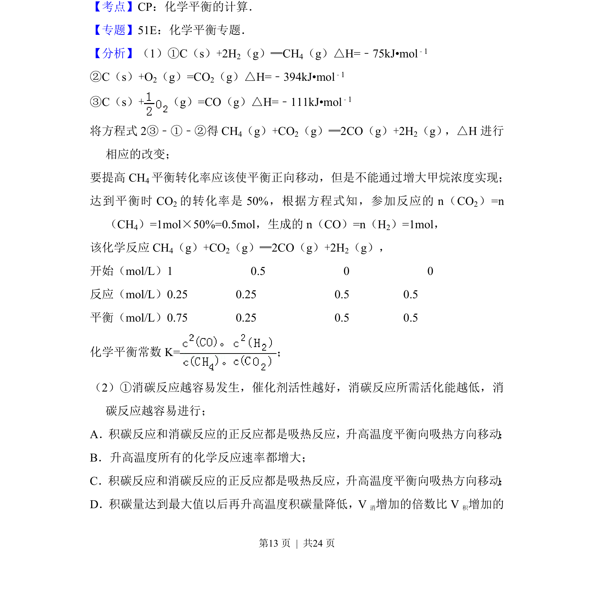
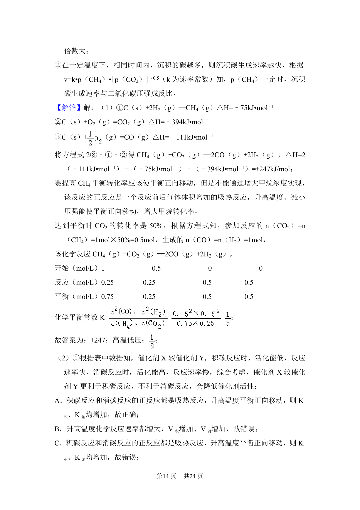
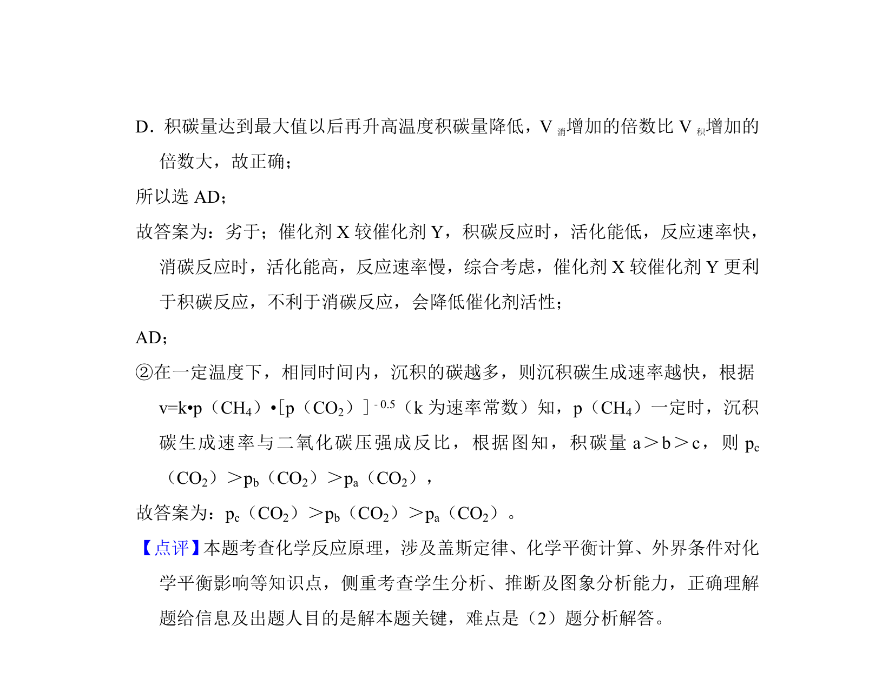

## 题面

## 摘要

本题为化学反应原理综合题，涉及焓变计算、平衡常数及转化率分析。

## 关联考点

- [[580-化学反应热计算|化学反应热计算]]
- [[342-化学平衡常数|化学平衡常数]]
- [[282-勒夏特列原理|勒夏特列原理]]

## 答案与解析

> 📄 原 PDF 第 11 页：`素材/真题/吉林/2008-2024·（吉林）化学高考真题/2018年高考化学试卷（新课标Ⅱ）（解析卷）.pdf`
