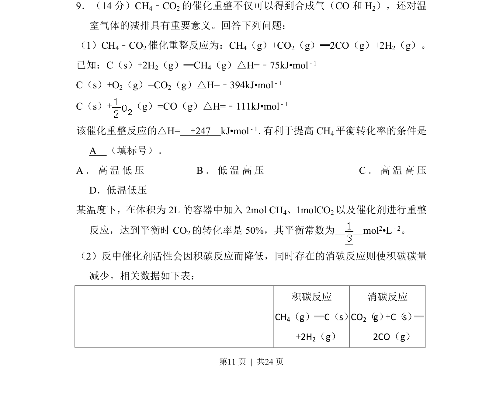
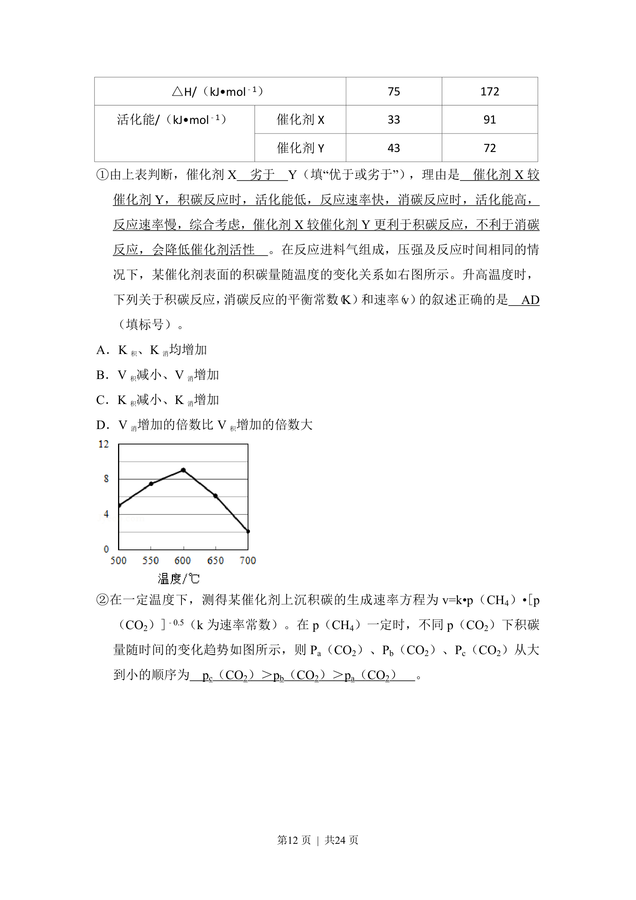
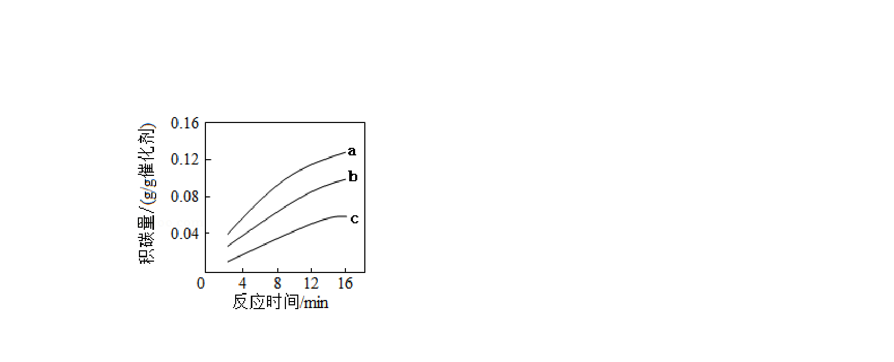
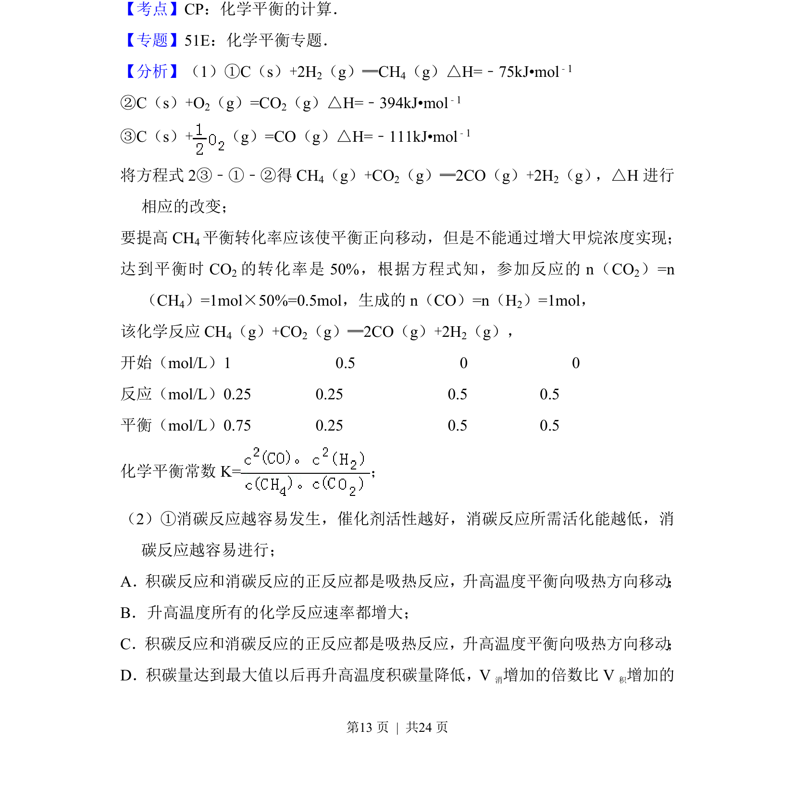
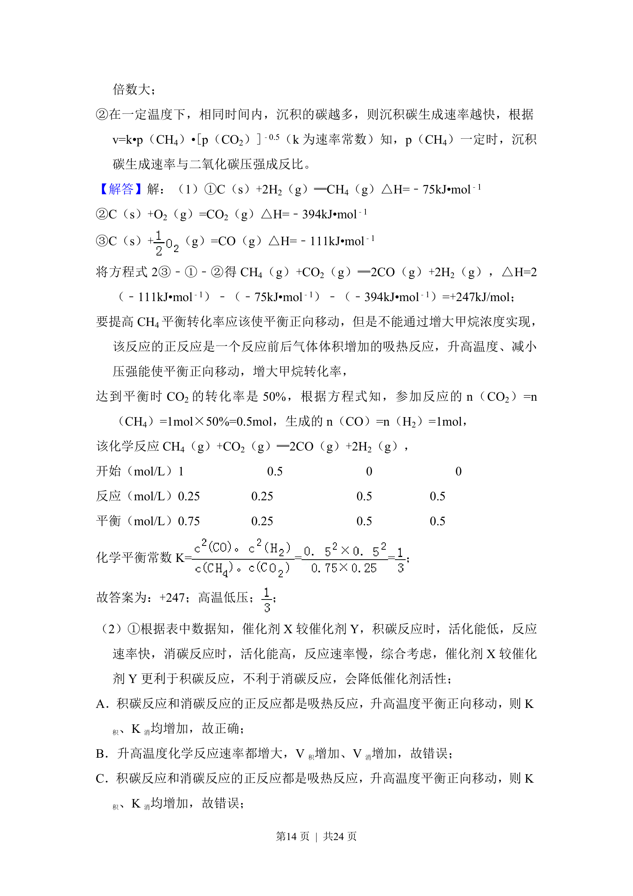
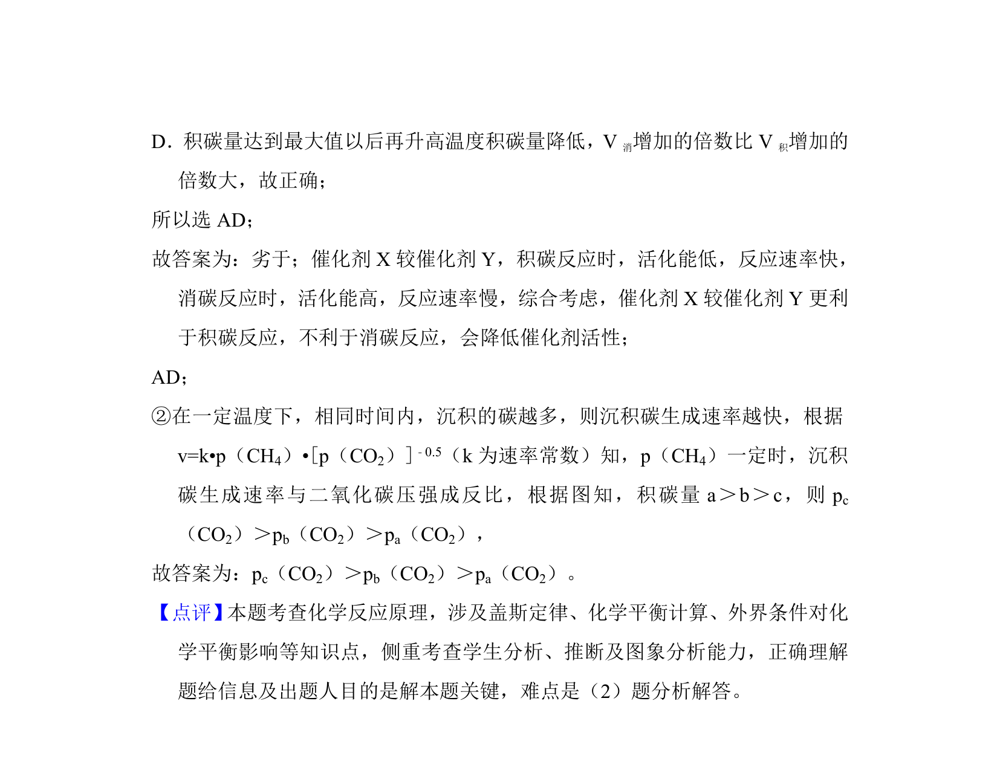

## 题面

## 摘要

本题为化学反应原理综合题，涉及焓变计算、平衡常数及转化率分析。

## 关联考点

- [[579-化学反应热计算|化学反应热计算]]
- [[342-化学平衡常数|化学平衡常数]]
- [[282-勒夏特列原理|勒夏特列原理]]

## 答案与解析

> 📄 原 PDF 第 11 页：`素材/真题/吉林/2008-2024·（吉林）化学高考真题/2018年高考化学试卷（新课标Ⅱ）（解析卷）.pdf`

<!-- 题干文本-start -->
## 题干文本
9．（14分）CH 4﹣CO2的催化重整不仅可以得到合成气（CO和H 2），还对温
室气体的减排具有重要意义。回答下列问题：
（1）CH4﹣CO2催化重整反应为：CH4（g）+CO2（g）═2CO（g）+2H2（g）。
已知：C（s）+2H2（g）═CH4（g）△H=﹣75kJ•mol﹣1
C（s）+O2（g）=CO2（g）△H=﹣394kJ•mol﹣1
C（s）+（g）=CO（g）△H=﹣111kJ•mol ﹣1
该催化重整反应的△H=　+247　kJ•mol﹣1． 有利于提高CH4平衡转化率的条件是　
A　（填标号）。
A．高温低压       B．低温高压             C．高温高压            
D．低温低压
某温度下，在体积为2L的容器中加入2mol CH 4、1molCO2以及催化剂进行重整
反应，达到平衡时CO 2的转化率是50%，其平衡常数为　 　mol2•L﹣2。
（2）反中催化剂活性会因积碳反应而降低，同时存在的消碳反应则使积碳碳量
减少。相关数据如下表：
积碳反应
CH4（g）═C（s）
+2H2（g）
消碳反应
CO2（g）+C（s） ═
2CO（g）
<!-- 题干文本-end -->

<!-- 解析文本-start -->
## 解析文本

<!-- 解析文本-end -->
