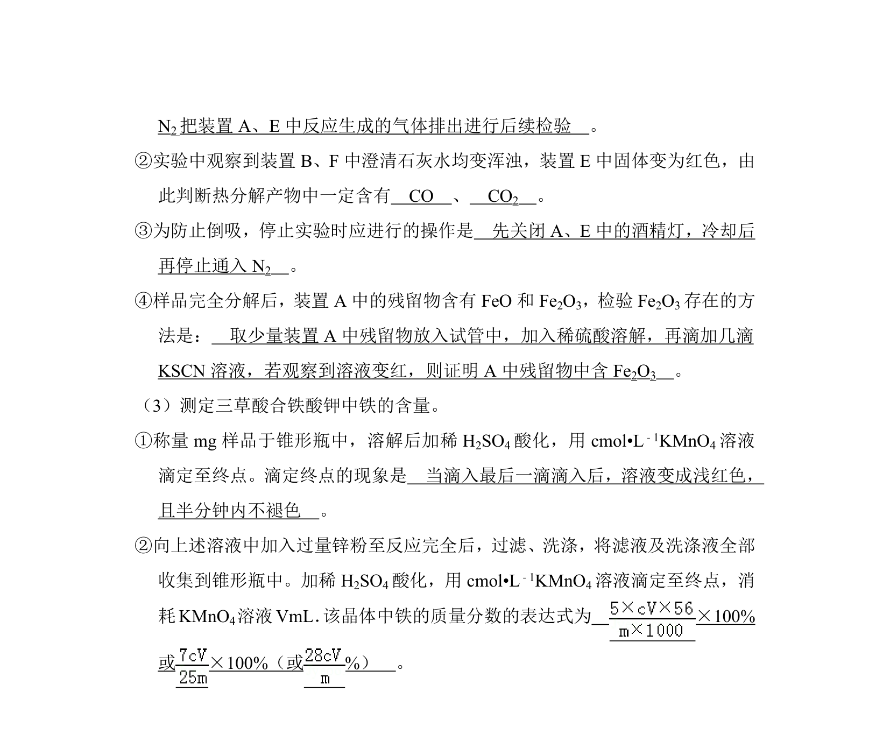
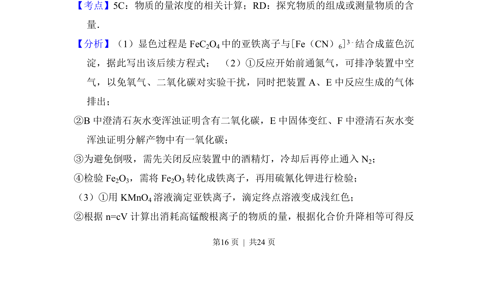
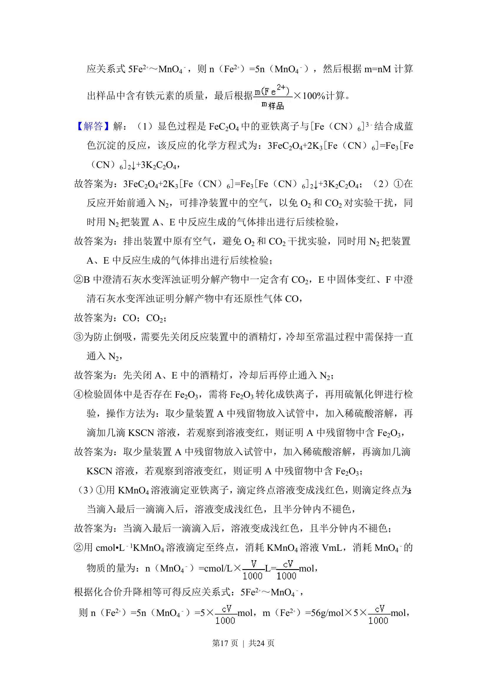
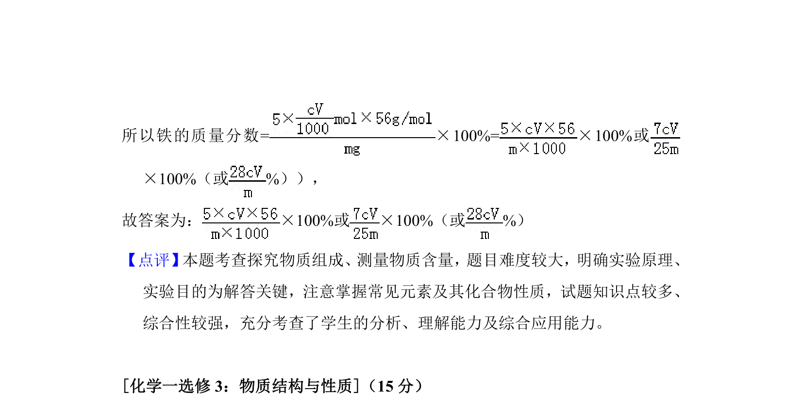

## 题面

## 摘要

考查三草酸合铁酸钾的光解与显色反应书写、热分解实验设计

## 关联考点

- [[622-化学方程式书写|化学方程式书写]]
- [[768-热分解实验|热分解实验]]
- [[668-实验操作与安全|实验操作与安全]]

## 答案与解析

> 📄 原 PDF 第 15 页：`素材/真题/吉林/2008-2024·（吉林）化学高考真题/2018年高考化学试卷（新课标Ⅱ）（解析卷）.pdf`
