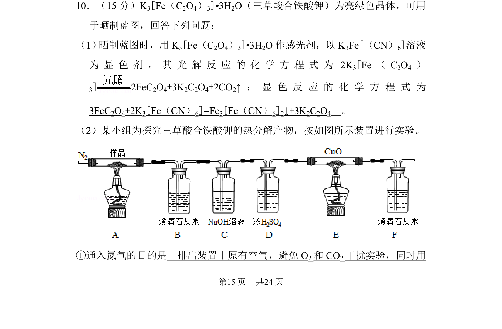
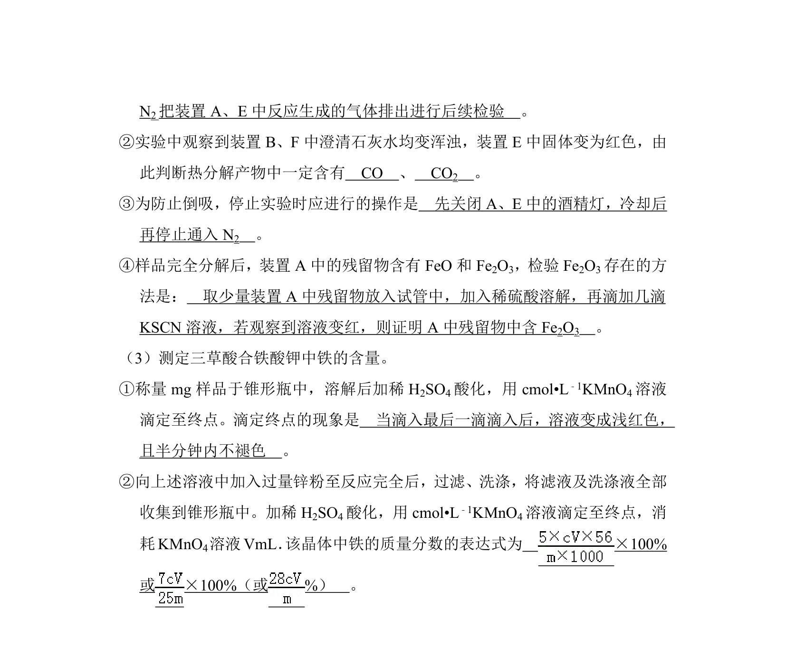
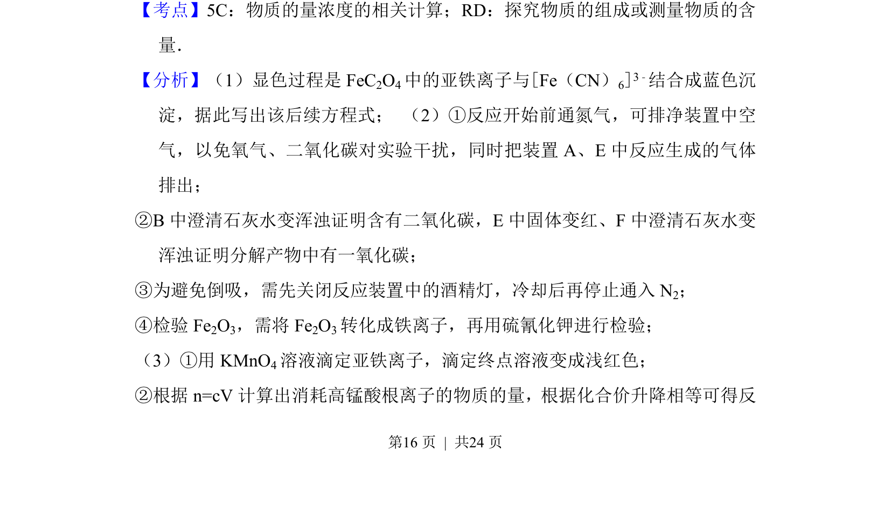
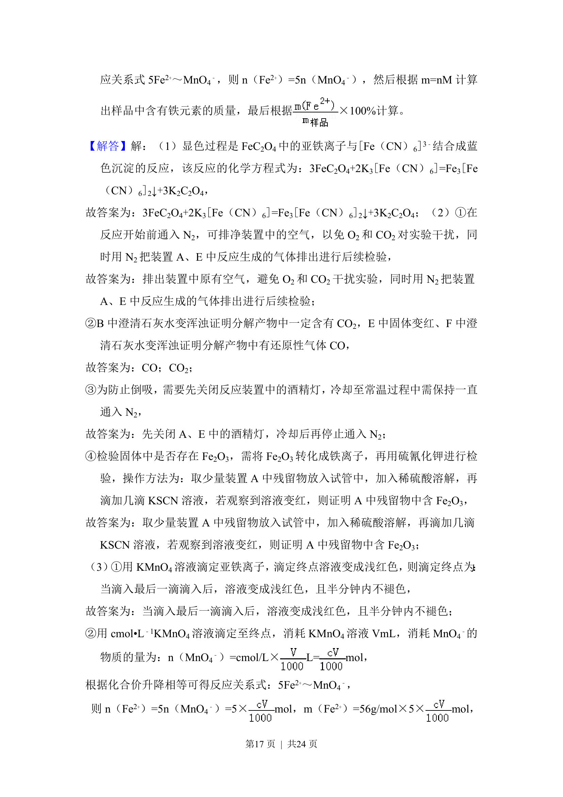
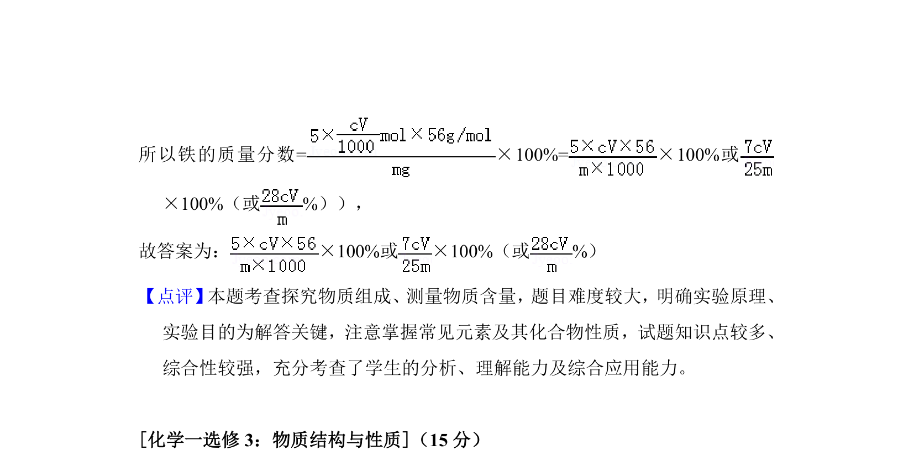

## 题面

## 摘要

考查三草酸合铁酸钾的光解与显色反应书写、热分解实验设计

## 关联考点

- [[976-化学方程式的书写|化学方程式书写]]
- [[767-热分解实验|热分解实验]]
- [[667-实验操作与安全|实验操作与安全]]

## 答案与解析

> 📄 原 PDF 第 15 页：`素材/真题/吉林/2008-2024·（吉林）化学高考真题/2018年高考化学试卷（新课标Ⅱ）（解析卷）.pdf`

<!-- 题干文本-start -->
## 题干文本
10．（15分）K 3[Fe（C2O4）3]•3H2O（三草酸合铁酸钾）为亮绿色晶体，可用
于晒制蓝图，回答下列问题：
（1） 晒制蓝图时，用K3[Fe（C2O4）3]•3H2O作感光剂，以K 3Fe[（CN）6]溶液
为 显 色 剂 。 其 光 解 反 应 的 化 学 方 程 式 为2K3[Fe（C 2O4 ）
3]2FeC 2O4+3K2C2O4+2CO2↑； 显 色 反 应 的 化 学 方 程 式 为 　
3FeC2O4+2K3[Fe（CN）6]=Fe3[Fe（CN）6]2↓+3K2C2O4　。
（2）某小组为探究三草酸合铁酸钾的热分解产物，按如图所示装置进行实验。
①通入氮气的目的是　排出装置中原有空气，避免O 2和CO 2干扰实验，同时用
<!-- 题干文本-end -->

<!-- 解析文本-start -->
## 解析文本

<!-- 解析文本-end -->
