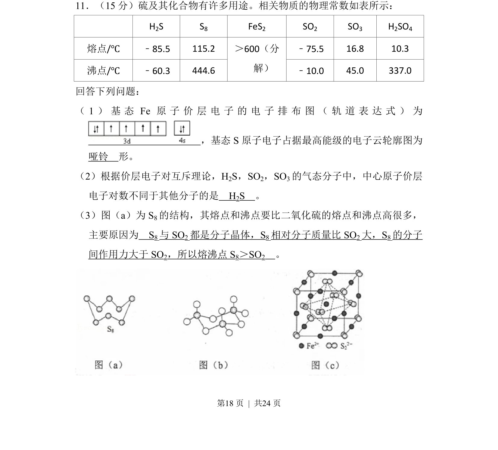

## 题面

## 摘要

该题考查物质结构与性质，涉及原子电子排布、价层电子对互斥理论和分子晶体熔沸点比较。

## 关联考点

- [[原子核外电子排布]]
- [[419-VSEPR|价层电子对互斥理论]]
- [[423-分子间作用力|分子间作用力]]
- [[晶体类型与熔沸点]]

## 答案与解析

> 📄 原 PDF 第 18 页：`素材/真题/吉林/2008-2024·（吉林）化学高考真题/2018年高考化学试卷（新课标Ⅱ）（解析卷）.pdf`
