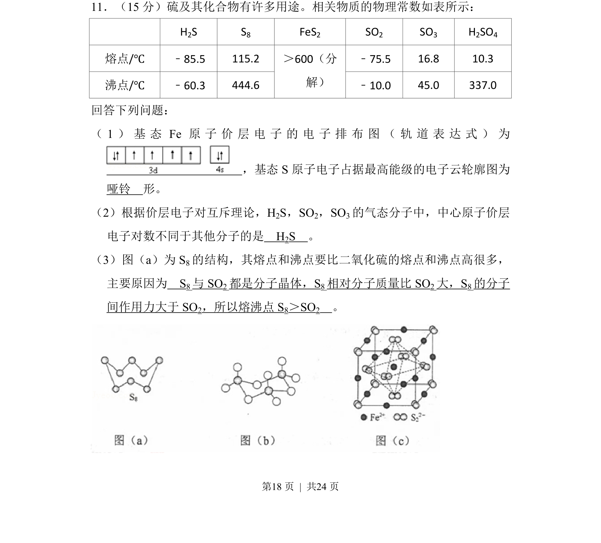
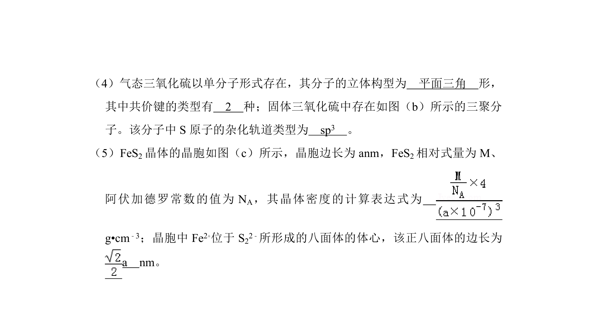
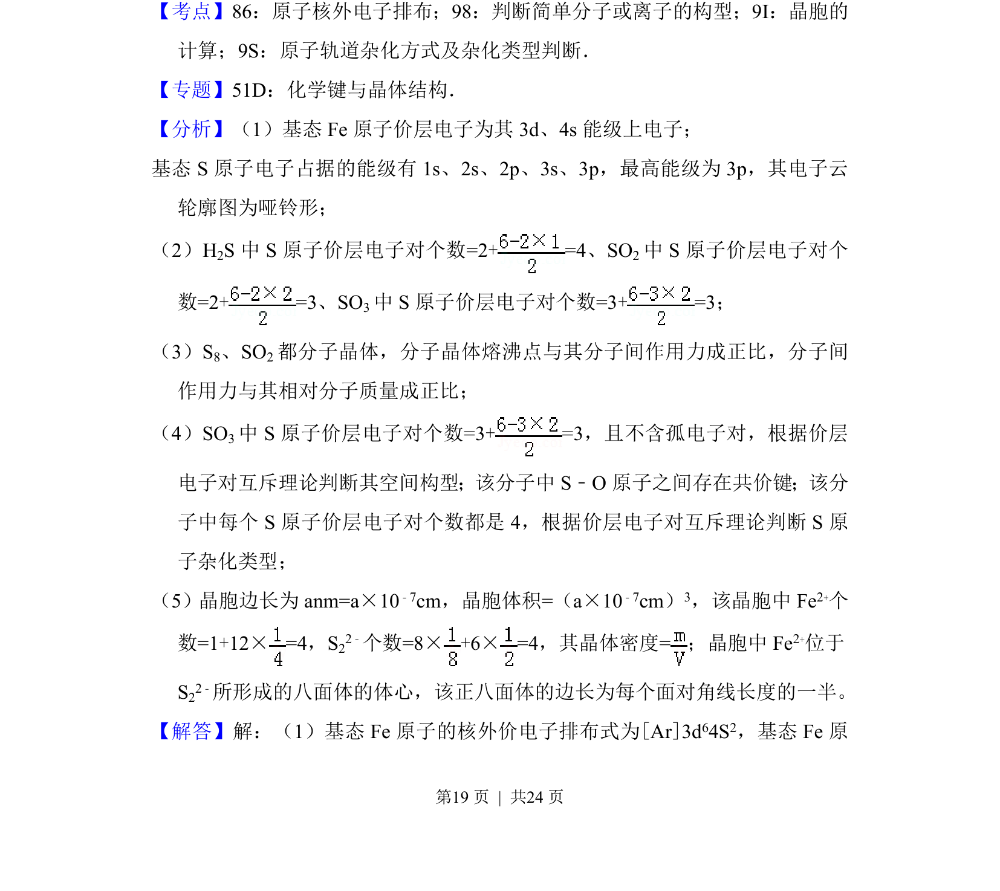
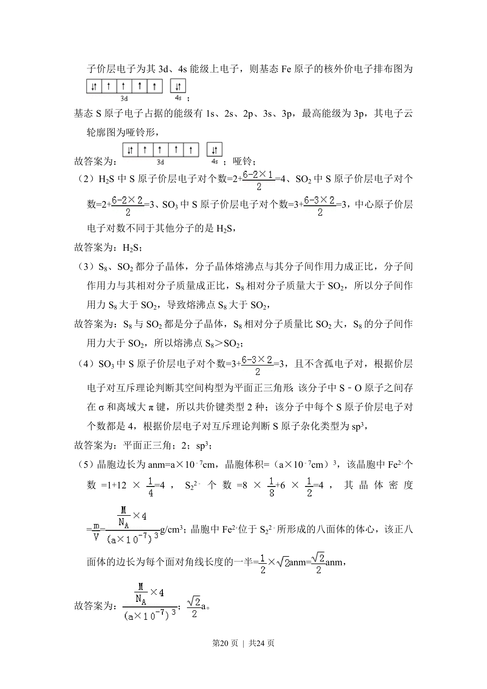
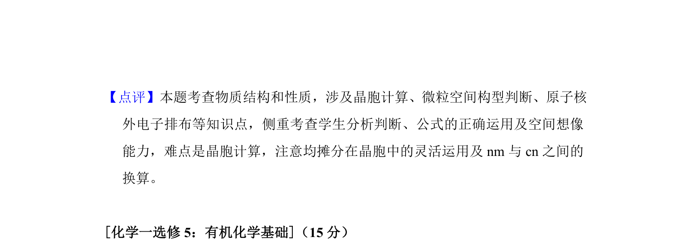

## 题面

## 摘要

该题考查物质结构与性质，涉及原子电子排布、价层电子对互斥理论和分子晶体熔沸点比较。

## 关联考点

- [[636-原子核外电子排布|原子核外电子排布]]
- [[419-VSEPR|价层电子对互斥理论]]
- [[423-分子间作用力|分子间作用力]]
- [[699-晶体类型与熔沸点|晶体类型与熔沸点]]

## 答案与解析

> 📄 原 PDF 第 18 页：`素材/真题/吉林/2008-2024·（吉林）化学高考真题/2018年高考化学试卷（新课标Ⅱ）（解析卷）.pdf`

<!-- 题干文本-start -->
## 题干文本
11．（15分）硫及其化合物有许多用途。相关物质的物理常数如表所示：
H2S S8 FeS2 SO2 SO3 H2SO4
熔点/℃ ﹣85.5 115.2 ﹣75.5 16.8 10.3
沸点/℃ ﹣60.3 444.6
＞600（分
解） ﹣10.0 45.0 337.0
回答下列问题：
（1） 基 态Fe原 子 价 层 电 子 的 电 子 排 布 图 （ 轨 道 表 达 式 ） 为　
　，基态S原子电子占据最高能级的电子云轮廓图为　
哑铃　形。
（2）根据价层电子对互斥理论，H2S，SO2，SO3的气态分子中，中心原子价层
电子对数不同于其他分子的是　H2S　。
（3）图（a）为S 8的结构，其熔点和沸点要比二氧化硫的熔点和沸点高很多，
主要原因为　S8与SO 2都是分子晶体，S8相对分子质量比SO 2大，S8的分子
间作用力大于SO 2，所以熔沸点S 8＞SO2　。
<!-- 题干文本-end -->

<!-- 解析文本-start -->
## 解析文本

<!-- 解析文本-end -->
